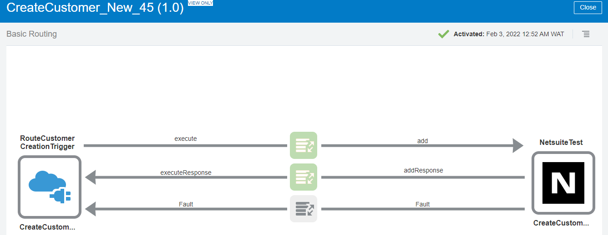
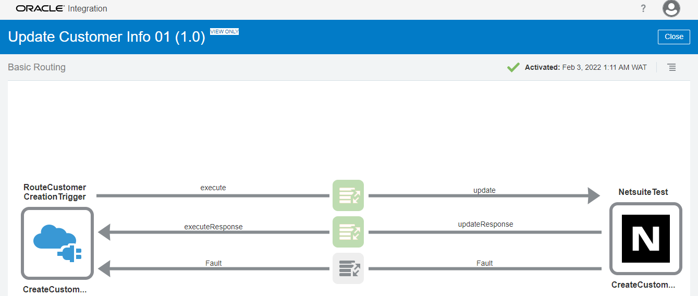
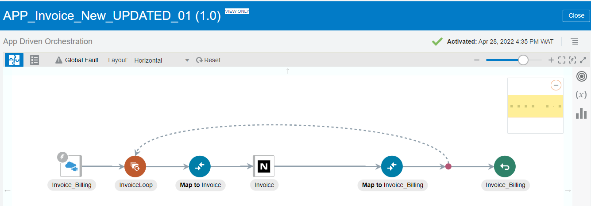
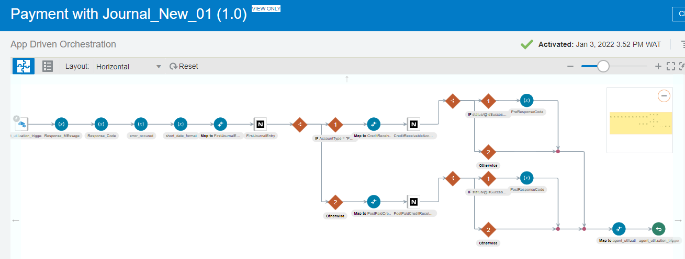
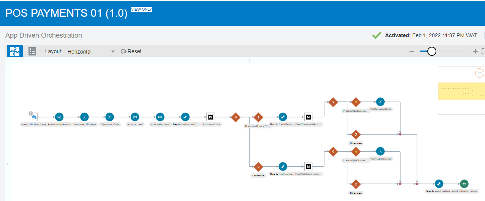
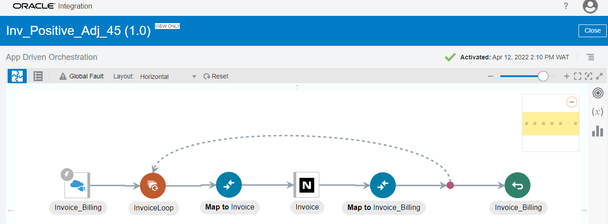
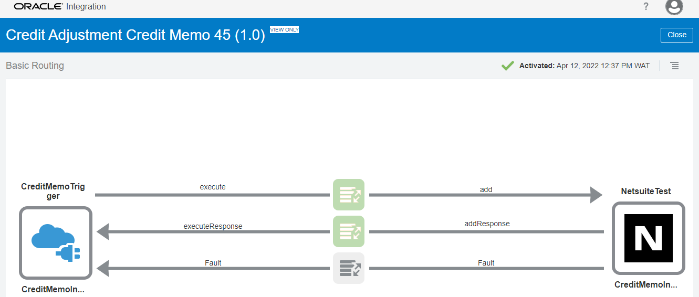

#  <center><u>ESB Detailed Mapping Architecture and Code</u></center><br/>
# 1.	Customer Creation



<details>
  <summary>View mapping code</summary> 
  
 ```xml 
  <xsl:stylesheet xmlns:ns1="http://xmlns.oracle.com/cloud/adapter/NetSuite/CreateCustomerNetSuiteEndpoint_REQUEST" xmlns:nstrgmpr="http://xmlns.oracle.com/cloud/adapter/NetSuite/CreateCustomerNetSuiteEndpoint_REQUEST/types" xmlns:nssrcmpr="http://xmlns.oracle.com/cloud/adapter/REST/CreateCustomerEndpoint_REQUEST/types" xmlns:platformMsgs="urn:messages_2018_2.platform.webservices.netsuite.com" xmlns:oraext="http://www.oracle.com/XSL/Transform/java/oracle.tip.pc.services.functions.ExtFunc" xmlns:xsd="http://www.w3.org/2001/XMLSchema" xmlns:xp20="http://www.oracle.com/XSL/Transform/java/oracle.tip.pc.services.functions.Xpath20" xmlns:tns="urn:platform_2018_2.webservices.netsuite.com" xmlns:wsdl="http://schemas.xmlsoap.org/wsdl/" xmlns:ora="http://schemas.oracle.com/xpath/extension" xmlns:ns22="http://xmlns.oracle.com/cloud/adapter/REST/CreateCustomerEndpoint_REQUEST" xmlns:oracle-xsl-mapper="http://www.oracle.com/xsl/mapper/schemas" xmlns:xsi="http://www.w3.org/2001/XMLSchema-instance" xmlns:ns2="http://xmlns.oracle.com/cloud/generic/rest/fault/REST/CreateCustomerEndpoint" xmlns:nssrcdfl="http://xmlns.oracle.com/cloud/adapter/REST/CreateCustomerEndpoint/types" xmlns:fn="http://www.w3.org/2005/xpath-functions" xmlns:xsl="http://www.w3.org/1999/XSL/Transform" xmlns:platformFaults="urn:faults_2018_2.platform.webservices.netsuite.com" xmlns:soap="http://schemas.xmlsoap.org/wsdl/soap/" xmlns:ignore01="http://www.oracle.com/XSL/Transform/java" xmlns:ns24="urn:core_2018_2.platform.webservices.netsuite.com" xmlns:ns26="urn:relationships_2018_2.lists.webservices.netsuite.com" xmlns:nxsd="http://xmlns.oracle.com/pcbpel/nxsd" xmlns:dvm="http://www.oracle.com/XSL/Transform/java/com.bea.wli.sb.functions.dvm.DVMFunctions" xmlns:ns23="http://xml.oracle.com/adapters/extension" xmlns:insQr="http://www.oracle.com/XSL/Transform/java/com.bea.wli.sb.resources.icsxpathfunctions.ICSInstanceTrackingFunctions" xmlns:ns25="urn:common_2018_2.platform.webservices.netsuite.com" version="2.0" xml:id="id_1" exclude-result-prefixes=" nssrcmpr oraext xsd xp20 ora ns22 oracle-xsl-mapper xsi ns2 nssrcdfl fn xsl ignore01" ignore01:ignorexmlids="true">
        <oracle-xsl-mapper:schema xml:id="id_2">
              <!--SPECIFICATION OF MAP SOURCES AND TARGETS, DO NOT MODIFY.-->
              <oracle-xsl-mapper:mapSources xml:id="id_3">
                    <oracle-xsl-mapper:source type="WSDL" xml:id="id_4">
                          <oracle-xsl-mapper:schema location="../../application_1/outbound_2/resourcegroup_3/CreateCustomerEndpoint_REQUEST.wsdl" xml:id="id_5"/>
                          <oracle-xsl-mapper:rootElement name="execute" namespace="http://xmlns.oracle.com/cloud/adapter/REST/CreateCustomerEndpoint_REQUEST/types" xml:id="id_6"/>
                    </oracle-xsl-mapper:source>
              </oracle-xsl-mapper:mapSources>
              <oracle-xsl-mapper:mapTargets xml:id="id_7">
                    <oracle-xsl-mapper:target type="WSDL" xml:id="id_8">
                          <oracle-xsl-mapper:schema location="../../application_175/inbound_176/resourcegroup_177/CreateCustomerNetSuiteEndpoint_REQUEST.wsdl" xml:id="id_9"/>
                          <oracle-xsl-mapper:rootElement name="add" namespace="http://xmlns.oracle.com/cloud/adapter/NetSuite/CreateCustomerNetSuiteEndpoint_REQUEST/types" xml:id="id_10"/>
                    </oracle-xsl-mapper:target>
              </oracle-xsl-mapper:mapTargets>
        </oracle-xsl-mapper:schema>
        <xsl:template match="/" xml:id="id_11">
              <nstrgmpr:add xml:id="id_12">
                    <nstrgmpr:Customer xml:id="id_13" externalId="{/nssrcmpr:execute/nssrcdfl:request-wrapper/nssrcdfl:GlobalAccountNumber}">
                          <ns26:isPerson xml:id="id_14">
                                <xsl:value-of xml:id="id_15" select="'true'"/>
                          </ns26:isPerson>
                          <ns26:salutation xml:id="id_16">
                                <xsl:value-of xml:id="id_17" select="/nssrcmpr:execute/nssrcdfl:request-wrapper/nssrcdfl:Title"/>
                          </ns26:salutation>
                          <ns26:firstName xml:id="id_18">
                                <xsl:value-of xml:id="id_19" select="/nssrcmpr:execute/nssrcdfl:request-wrapper/nssrcdfl:FirstName"/>
                          </ns26:firstName>
                          <ns26:middleName xml:id="id_20">
                                <xsl:value-of xml:id="id_21" select="/nssrcmpr:execute/nssrcdfl:request-wrapper/nssrcdfl:MiddleName"/>
                          </ns26:middleName>
                          <ns26:lastName xml:id="id_22">
                                <xsl:value-of xml:id="id_23" select="/nssrcmpr:execute/nssrcdfl:request-wrapper/nssrcdfl:LastName"/>
                          </ns26:lastName>
                          <ns26:companyName xml:id="id_24">
                                <xsl:value-of xml:id="id_25" select="'BEDC'"/>
                          </ns26:companyName>
                          <ns26:phone xml:id="id_26">
                                <xsl:value-of xml:id="id_27" select="/nssrcmpr:execute/nssrcdfl:request-wrapper/nssrcdfl:BusinessContactNo"/>
                          </ns26:phone>
                          <ns26:email xml:id="id_28">
                                <xsl:value-of xml:id="id_29" select="/nssrcmpr:execute/nssrcdfl:request-wrapper/nssrcdfl:EmailId"/>
                          </ns26:email>
                          <ns26:title xml:id="id_30">
                                <xsl:value-of xml:id="id_31" select="/nssrcmpr:execute/nssrcdfl:request-wrapper/nssrcdfl:Title"/>
                          </ns26:title>
                          <ns26:homePhone xml:id="id_32">
                                <xsl:value-of xml:id="id_33" select="/nssrcmpr:execute/nssrcdfl:request-wrapper/nssrcdfl:HomeContactNo"/>
                          </ns26:homePhone>
                          <ns26:mobilePhone xml:id="id_34">
                                <xsl:value-of xml:id="id_35" select="/nssrcmpr:execute/nssrcdfl:request-wrapper/nssrcdfl:BusinessContactNo"/>
                          </ns26:mobilePhone>
                          <ns26:accountNumber xml:id="id_36">
                                <xsl:value-of xml:id="id_37" select="/nssrcmpr:execute/nssrcdfl:request-wrapper/nssrcdfl:AccountNo"/>
                          </ns26:accountNumber>
                          <ns26:customFieldList xml:id="id_38">
                                <ns24:customField xml:id="id_39" xsi:type="ns24:StringCustomFieldRef" scriptId="{'custentity_known_as'}" internalId="{537}">
                                      <ns24:value xml:id="id_40">
                                            <xsl:value-of xml:id="id_41" select="/nssrcmpr:execute/nssrcdfl:request-wrapper/nssrcdfl:KnownAs"/>
                                      </ns24:value>
                                </ns24:customField>
                                <ns24:customField xml:id="id_42" xsi:type="ns24:StringCustomFieldRef" scriptId="{'custentity_outstanding_amount'}" internalId="{1586}">
                                      <ns24:value xml:id="id_43">
                                            <xsl:value-of xml:id="id_44" select="/nssrcmpr:execute/nssrcdfl:request-wrapper/nssrcdfl:OutstandingAmount"/>
                                      </ns24:value>
                                </ns24:customField>
                                <ns24:customField xml:id="id_45" xsi:type="ns24:StringCustomFieldRef" scriptId="{'custentity_modified_date'}" internalId="{1576}">
                                      <ns24:value xml:id="id_46">
                                            <xsl:value-of xml:id="id_47" select="/nssrcmpr:execute/nssrcdfl:request-wrapper/nssrcdfl:ModifiedDate"/>
                                      </ns24:value>
                                </ns24:customField>
                                <ns24:customField xml:id="id_48" xsi:type="ns24:StringCustomFieldRef" scriptId="{'custentity_created_date'}" internalId="{1578}">
                                      <ns24:value xml:id="id_49">
                                            <xsl:value-of xml:id="id_50" select="/nssrcmpr:execute/nssrcdfl:request-wrapper/nssrcdfl:CreatedDate"/>
                                      </ns24:value>
                                </ns24:customField>
                                <ns24:customField xml:id="id_51" xsi:type="ns24:StringCustomFieldRef" scriptId="{'custentity_active_status_id'}" internalId="{1564}">
                                      <ns24:value xml:id="id_52">
                                            <xsl:value-of xml:id="id_53" select="/nssrcmpr:execute/nssrcdfl:request-wrapper/nssrcdfl:ActiveStatusId"/>
                                      </ns24:value>
                                </ns24:customField>
                                <ns24:customField xml:id="id_54" xsi:type="ns24:StringCustomFieldRef" scriptId="{'custentity_pole_id'}" internalId="{1562}">
                                      <ns24:value xml:id="id_55">
                                            <xsl:value-of xml:id="id_56" select="/nssrcmpr:execute/nssrcdfl:request-wrapper/nssrcdfl:PoleID"/>
                                      </ns24:value>
                                </ns24:customField>
                                <ns24:customField xml:id="id_57" xsi:type="ns24:StringCustomFieldRef" scriptId="{'custentity_application_date'}" internalId="{546}">
                                      <ns24:value xml:id="id_58">
                                            <xsl:value-of xml:id="id_59" select="/nssrcmpr:execute/nssrcdfl:request-wrapper/nssrcdfl:ApplicationDate"/>
                                      </ns24:value>
                                </ns24:customField>
                                <ns24:customField xml:id="id_57" xsi:type="ns24:StringCustomFieldRef" scriptId="{'custentity_setup_date'}" internalId="{568}">
                                      <ns24:value xml:id="id_61">
                                            <xsl:value-of xml:id="id_62" select="/nssrcmpr:execute/nssrcdfl:request-wrapper/nssrcdfl:SetupDate"/>
                                      </ns24:value>
                                </ns24:customField>
                                <ns24:customField xml:id="id_57" xsi:type="ns24:StringCustomFieldRef" scriptId="{'custentity_read_code_id'}" internalId="{1572}">
                                      <ns24:value xml:id="id_64">
                                            <xsl:value-of xml:id="id_65" select="/nssrcmpr:execute/nssrcdfl:request-wrapper/nssrcdfl:ReadCodeID"/>
                                      </ns24:value>
                                </ns24:customField>
                                <ns24:customField xml:id="id_57" xsi:type="ns24:StringCustomFieldRef" scriptId="{'custentity_other_contact_num'}" internalId="{1567}">
                                      <ns24:value xml:id="id_67">
                                            <xsl:value-of xml:id="id_68" select="/nssrcmpr:execute/nssrcdfl:request-wrapper/nssrcdfl:OtherContactNo"/>
                                      </ns24:value>
                                </ns24:customField>
                                <ns24:customField xml:id="id_57" xsi:type="ns24:StringCustomFieldRef" scriptId="{'custentity_tariff_class_id'}" internalId="{547}">
                                      <ns24:value xml:id="id_70">
                                            <xsl:value-of xml:id="id_71" select="/nssrcmpr:execute/nssrcdfl:request-wrapper/nssrcdfl:TariffClassID"/>
                                      </ns24:value>
                                </ns24:customField>
                                <ns24:customField xml:id="id_57" xsi:type="ns24:StringCustomFieldRef" scriptId="{'custentity_meter_number'}" internalId="{535}">
                                      <ns24:value xml:id="id_73">
                                            <xsl:value-of xml:id="id_74" select="/nssrcmpr:execute/nssrcdfl:request-wrapper/nssrcdfl:MeterNumber"/>
                                      </ns24:value>
                                </ns24:customField>
                                <ns24:customField xml:id="id_57" xsi:type="ns24:StringCustomFieldRef" scriptId="{'custentity_phase_id'}" internalId="{1563}">
                                      <ns24:value xml:id="id_76">
                                            <xsl:value-of xml:id="id_77" select="/nssrcmpr:execute/nssrcdfl:request-wrapper/nssrcdfl:PhaseId"/>
                                      </ns24:value>
                                </ns24:customField>
                                <ns24:customField xml:id="id_57" xsi:type="ns24:StringCustomFieldRef" scriptId="{'custentity_lead_category'}" internalId="{515}">
                                      <ns24:value xml:id="id_79">
                                            <xsl:value-of xml:id="id_80" select="/nssrcmpr:execute/nssrcdfl:request-wrapper/nssrcdfl:ClusterCategoryId"/>
                                      </ns24:value>
                                </ns24:customField>
                                <ns24:customField xml:id="id_57" xsi:type="ns24:StringCustomFieldRef" scriptId="{'custentity_connection_date'}" internalId="{1573}">
                                      <ns24:value xml:id="id_82">
                                            <xsl:value-of xml:id="id_83" select="/nssrcmpr:execute/nssrcdfl:request-wrapper/nssrcdfl:ConnectionDate"/>
                                      </ns24:value>
                                </ns24:customField>
                                <ns24:customField xml:id="id_57" xsi:type="ns24:StringCustomFieldRef" scriptId="{'custentity_service_house_number'}" internalId="{539}">
                                      <ns24:value xml:id="id_85">
                                            <xsl:value-of xml:id="id_86" select="/nssrcmpr:execute/nssrcdfl:request-wrapper/nssrcdfl:Service_HouseNo"/>
                                      </ns24:value>
                                </ns24:customField>
                                <ns24:customField xml:id="id_57" xsi:type="ns24:StringCustomFieldRef" scriptId="{'custentity_service_street_name'}" internalId="{540}">
                                      <ns24:value xml:id="id_88">
                                            <xsl:value-of xml:id="id_89" select="/nssrcmpr:execute/nssrcdfl:request-wrapper/nssrcdfl:Service_StreetName"/>
                                      </ns24:value>
                                </ns24:customField>
                                <ns24:customField xml:id="id_57" xsi:type="ns24:StringCustomFieldRef" scriptId="{'custentity_service_city'}" internalId="{541}">
                                      <ns24:value xml:id="id_91">
                                            <xsl:value-of xml:id="id_92" select="/nssrcmpr:execute/nssrcdfl:request-wrapper/nssrcdfl:Service_City"/>
                                      </ns24:value>
                                </ns24:customField>
                                <ns24:customField xml:id="id_57" xsi:type="ns24:StringCustomFieldRef" scriptId="{'custentity_service_zip_code'}" internalId="{542}">
                                      <ns24:value xml:id="id_94">
                                            <xsl:value-of xml:id="id_95" select="/nssrcmpr:execute/nssrcdfl:request-wrapper/nssrcdfl:Service_ZipCode"/>
                                      </ns24:value>
                                </ns24:customField>
                                <ns24:customField xml:id="id_57" xsi:type="ns24:StringCustomFieldRef" scriptId="{'custentity_postal_zip'}" internalId="{1561}">
                                      <ns24:value xml:id="id_97">
                                            <xsl:value-of xml:id="id_98" select="/nssrcmpr:execute/nssrcdfl:request-wrapper/nssrcdfl:Postal_ZipCode"/>
                                      </ns24:value>
                                </ns24:customField>
                                <ns24:customField xml:id="id_57" xsi:type="ns24:StringCustomFieldRef" scriptId="{'custentity_postal_house_number'}" internalId="{543}">
                                      <ns24:value xml:id="id_100">
                                            <xsl:value-of xml:id="id_101" select="/nssrcmpr:execute/nssrcdfl:request-wrapper/nssrcdfl:Postal_HouseNo"/>
                                      </ns24:value>
                                </ns24:customField>
                                <ns24:customField xml:id="id_57" xsi:type="ns24:StringCustomFieldRef" scriptId="{'custentity_postal_street_name'}" internalId="{544}">
                                      <ns24:value xml:id="id_103">
                                            <xsl:value-of xml:id="id_104" select="/nssrcmpr:execute/nssrcdfl:request-wrapper/nssrcdfl:Postal_StreetName"/>
                                      </ns24:value>
                                </ns24:customField>
                                <ns24:customField xml:id="id_57" xsi:type="ns24:StringCustomFieldRef" scriptId="{'custentity_postal_city'}" internalId="{545}">
                                      <ns24:value xml:id="id_106">
                                            <xsl:value-of xml:id="id_107" select="/nssrcmpr:execute/nssrcdfl:request-wrapper/nssrcdfl:Postal_City"/>
                                      </ns24:value>
                                </ns24:customField>
                                <ns24:customField xml:id="id_57" xsi:type="ns24:StringCustomFieldRef" scriptId="{'custentity_postal_landmark'}" internalId="{1568}">
                                      <ns24:value xml:id="id_109">
                                            <xsl:value-of xml:id="id_110" select="/nssrcmpr:execute/nssrcdfl:request-wrapper/nssrcdfl:Postal_Landmark"/>
                                      </ns24:value>
                                </ns24:customField>
                                <ns24:customField xml:id="id_57" xsi:type="ns24:StringCustomFieldRef" scriptId="{'custentity_service_landmark'}" internalId="{1569}">
                                      <ns24:value xml:id="id_112">
                                            <xsl:value-of xml:id="id_113" select="/nssrcmpr:execute/nssrcdfl:request-wrapper/nssrcdfl:Service_Landmark"/>
                                      </ns24:value>
                                </ns24:customField>
                                <ns24:customField xml:id="id_57" xsi:type="ns24:StringCustomFieldRef" scriptId="{'custentity_is_vip_customer'}" internalId="{1574}">
                                      <ns24:value xml:id="id_115">
                                            <xsl:value-of xml:id="id_116" select="/nssrcmpr:execute/nssrcdfl:request-wrapper/nssrcdfl:IsVIPCustomer"/>
                                      </ns24:value>
                                </ns24:customField>
                                <ns24:customField xml:id="id_57" xsi:type="ns24:StringCustomFieldRef" scriptId="{'custentity_is_capmi'}" internalId="{1571}">
                                      <ns24:value xml:id="id_118">
                                            <xsl:value-of xml:id="id_119" select="/nssrcmpr:execute/nssrcdfl:request-wrapper/nssrcdfl:IsCAPMI"/>
                                      </ns24:value>
                                </ns24:customField>
                                <ns24:customField xml:id="id_57" xsi:type="ns24:StringCustomFieldRef" scriptId="{'custentity_is_bedc_emp'}" internalId="{1566}">
                                      <ns24:value xml:id="id_121">
                                            <xsl:value-of xml:id="id_122" select="/nssrcmpr:execute/nssrcdfl:request-wrapper/nssrcdfl:IsBEDCEmployee"/>
                                      </ns24:value>
                                </ns24:customField>
                                <ns24:customField xml:id="id_57" xsi:type="ns24:StringCustomFieldRef" scriptId="{'custentity_is_embassy_customer'}" internalId="{1570}">
                                      <ns24:value xml:id="id_124">
                                            <xsl:value-of xml:id="id_125" select="/nssrcmpr:execute/nssrcdfl:request-wrapper/nssrcdfl:IsEmbassyCustomer"/>
                                      </ns24:value>
                                </ns24:customField>
                                <ns24:customField xml:id="id_57" xsi:type="ns24:StringCustomFieldRef" scriptId="{'custentity_book_number_id'}" internalId="{554}">
                                      <ns24:value xml:id="id_127">
                                            <xsl:value-of xml:id="id_128" select="/nssrcmpr:execute/nssrcdfl:request-wrapper/nssrcdfl:BookId"/>
                                      </ns24:value>
                                </ns24:customField>
                                <ns24:customField xml:id="id_57" xsi:type="ns24:StringCustomFieldRef" scriptId="{'custentity_is_same_as_svc'}" internalId="{1565}">
                                      <ns24:value xml:id="id_130">
                                            <xsl:value-of xml:id="id_131" select="/nssrcmpr:execute/nssrcdfl:request-wrapper/nssrcdfl:IsSameAsService"/>
                                      </ns24:value>
                                </ns24:customField>
                                <ns24:customField xml:id="id_57" xsi:type="ns24:StringCustomFieldRef" scriptId="{'custentity_account_type_id'}" internalId="{1672}">
                                      <ns24:value xml:id="id_133">
                                            <xsl:value-of xml:id="id_134" select="/nssrcmpr:execute/nssrcdfl:request-wrapper/nssrcdfl:AccountTypeId"/>
                                      </ns24:value>
                                </ns24:customField>
                                <ns24:customField xml:id="id_57" xsi:type="ns24:StringCustomFieldRef" scriptId="{'custentity_takeover_balance'}" internalId="{1585}">
                                      <ns24:value xml:id="id_136">
                                            <xsl:value-of xml:id="id_137" select="/nssrcmpr:execute/nssrcdfl:request-wrapper/nssrcdfl:TakeoverBalance"/>
                                      </ns24:value>
                                </ns24:customField>
                                <ns24:customField xml:id="id_57" xsi:type="ns24:StringCustomFieldRef" scriptId="{'custentity_avr_account_number'}" internalId="{1584}">
                                      <ns24:value xml:id="id_139">
                                            <xsl:value-of xml:id="id_140" select="/nssrcmpr:execute/nssrcdfl:request-wrapper/nssrcdfl:AVRAccountNo"/>
                                      </ns24:value>
                                </ns24:customField>
                                <ns24:customField xml:id="id_57" xsi:type="ns24:StringCustomFieldRef" scriptId="{'custentity_enumeration_pin'}" internalId="{562}">
                                      <ns24:value xml:id="id_142">
                                            <xsl:value-of xml:id="id_143" select="/nssrcmpr:execute/nssrcdfl:request-wrapper/nssrcdfl:EnumerationPIN"/>
                                      </ns24:value>
                                </ns24:customField>
                                <ns24:customField xml:id="id_57" xsi:type="ns24:StringCustomFieldRef" scriptId="{'custentity_latitude'}" internalId="{563}">
                                      <ns24:value xml:id="id_145">
                                            <xsl:value-of xml:id="id_146" select="/nssrcmpr:execute/nssrcdfl:request-wrapper/nssrcdfl:Latitude"/>
                                      </ns24:value>
                                </ns24:customField>
                                <ns24:customField xml:id="id_57" xsi:type="ns24:StringCustomFieldRef" scriptId="{'custentity_longitude'}" internalId="{564}">
                                      <ns24:value xml:id="id_148">
                                            <xsl:value-of xml:id="id_149" select="/nssrcmpr:execute/nssrcdfl:request-wrapper/nssrcdfl:Longitude"/>
                                      </ns24:value>
                                </ns24:customField>
                                <ns24:customField xml:id="id_57" xsi:type="ns24:StringCustomFieldRef" scriptId="{'custentity_initial_billing_kwh'}" internalId="{1583}">
                                      <ns24:value xml:id="id_151">
                                            <xsl:value-of xml:id="id_152" select="/nssrcmpr:execute/nssrcdfl:request-wrapper/nssrcdfl:InitialBillingKWh"/>
                                      </ns24:value>
                                </ns24:customField>
                                <ns24:customField xml:id="id_57" xsi:type="ns24:StringCustomFieldRef" scriptId="{'custentity_map_code'}" internalId="{1582}">
                                      <ns24:value xml:id="id_154">
                                            <xsl:value-of xml:id="id_155" select="/nssrcmpr:execute/nssrcdfl:request-wrapper/nssrcdfl:MAPCode"/>
                                      </ns24:value>
                                </ns24:customField>
                                <ns24:customField xml:id="id_57" xsi:type="ns24:StringCustomFieldRef" scriptId="{'custentity_msp_code'}" internalId="{1581}">
                                      <ns24:value xml:id="id_157">
                                            <xsl:value-of xml:id="id_158" select="/nssrcmpr:execute/nssrcdfl:request-wrapper/nssrcdfl:MSPCode"/>
                                      </ns24:value>
                                </ns24:customField>
                                <ns24:customField xml:id="id_57" xsi:type="ns24:StringCustomFieldRef" scriptId="{'custentity_installer_code'}" internalId="{1580}">
                                      <ns24:value xml:id="id_160">
                                            <xsl:value-of xml:id="id_161" select="/nssrcmpr:execute/nssrcdfl:request-wrapper/nssrcdfl:InstallerCode"/>
                                      </ns24:value>
                                </ns24:customField>
                                <ns24:customField xml:id="id_57" xsi:type="ns24:StringCustomFieldRef" scriptId="{'custentity_account_type'}" internalId="{1575}">
                                      <ns24:value xml:id="id_163">
                                            <xsl:value-of xml:id="id_164" select="/nssrcmpr:execute/nssrcdfl:request-wrapper/nssrcdfl:AccountType"/>
                                      </ns24:value>
                                </ns24:customField>
                                <ns24:customField xml:id="id_57" xsi:type="ns24:StringCustomFieldRef" scriptId="{'custentitymarket_id'}" internalId="{1679}">
                                      <ns24:value xml:id="id_166">
                                            <xsl:value-of xml:id="id_167" select="/nssrcmpr:execute/nssrcdfl:request-wrapper/nssrcdfl:MarketerId"/>
                                      </ns24:value>
                                </ns24:customField>
                                <ns24:customField xml:id="id_57" xsi:type="ns24:StringCustomFieldRef" scriptId="{'custentity_created_by'}" internalId="{1579}">
                                      <ns24:value xml:id="id_169">
                                            <xsl:value-of xml:id="id_170" select="/nssrcmpr:execute/nssrcdfl:request-wrapper/nssrcdfl:CreatedBy"/>
                                      </ns24:value>
                                </ns24:customField>
                                <ns24:customField xml:id="id_57" xsi:type="ns24:StringCustomFieldRef" scriptId="{'custentity_modified_by'}" internalId="{1577}">
                                      <ns24:value xml:id="id_172">
                                            <xsl:value-of xml:id="id_173" select="/nssrcmpr:execute/nssrcdfl:request-wrapper/nssrcdfl:ModifiedBy"/>
                                      </ns24:value>
                                </ns24:customField>
                                <ns24:customField xml:id="id_57" xsi:type="ns24:StringCustomFieldRef" scriptId="{'custentity_old_account_number'}" internalId="{536}">
                                      <ns24:value xml:id="id_175">
                                            <xsl:value-of xml:id="id_176" select="/nssrcmpr:execute/nssrcdfl:request-wrapper/nssrcdfl:OldAccountNo"/>
                                      </ns24:value>
                                </ns24:customField>
                                <ns24:customField xml:id="id_57" xsi:type="ns24:StringCustomFieldRef" scriptId="{'custentity_service_unit_name'}" internalId="{553}">
                                      <ns24:value xml:id="id_178">
                                            <xsl:value-of xml:id="id_179" select="/nssrcmpr:execute/nssrcdfl:request-wrapper/nssrcdfl:ServiceUnitName"/>
                                      </ns24:value>
                                </ns24:customField>
                                <ns24:customField xml:id="id_57" xsi:type="ns24:StringCustomFieldRef" scriptId="{'custentity_business_unit_name'}" internalId="{551}">
                                      <ns24:value xml:id="id_181">
                                            <xsl:value-of xml:id="id_182" select="/nssrcmpr:execute/nssrcdfl:request-wrapper/nssrcdfl:BusinessUnitName"/>
                                      </ns24:value>
                                </ns24:customField>
                                <ns24:customField xml:id="id_57" xsi:type="ns24:StringCustomFieldRef" scriptId="{'custentity_customer_account_number'}" internalId="{534}">
                                      <ns24:value xml:id="id_184">
                                            <xsl:value-of xml:id="id_185" select="/nssrcmpr:execute/nssrcdfl:request-wrapper/nssrcdfl:GlobalAccountNumber"/>
                                      </ns24:value>
                                </ns24:customField>
                                <ns24:customField xml:id="id_57" xsi:type="ns24:StringCustomFieldRef" scriptId="{'custentity_feeder_11'}" internalId="{1670}">
                                      <ns24:value xml:id="id_187">
                                            <xsl:value-of xml:id="id_188" select="/nssrcmpr:execute/nssrcdfl:request-wrapper/nssrcdfl:Feeder11"/>
                                      </ns24:value>
                                </ns24:customField>
                                <ns24:customField xml:id="id_57" xsi:type="ns24:StringCustomFieldRef" scriptId="{'custentity_tariff_class_name'}" internalId="{548}">
                                      <ns24:value xml:id="id_190">
                                            <xsl:value-of xml:id="id_191" select="/nssrcmpr:execute/nssrcdfl:request-wrapper/nssrcdfl:TariffClassDescription"/>
                                      </ns24:value>
                                </ns24:customField>
                                <ns24:customField xml:id="id_57" xsi:type="ns24:StringCustomFieldRef" scriptId="{'custentity_feeder_13'}" internalId="{1671}">
                                      <ns24:value xml:id="id_194">
                                            <xsl:value-of xml:id="id_195" select="/nssrcmpr:execute/nssrcdfl:request-wrapper/nssrcdfl:Feeder33"/>
                                      </ns24:value>
                                </ns24:customField>
                                <ns24:customField xml:id="id_57" xsi:type="ns24:StringCustomFieldRef" scriptId="{'custentity_distribution_transformer'}" internalId="{1669}">
                                      <ns24:value xml:id="id_196">
                                            <xsl:value-of xml:id="id_197" select="/nssrcmpr:execute/nssrcdfl:request-wrapper/nssrcdfl:DistributionTransformer"/>
                                      </ns24:value>
                                </ns24:customField>
                          </ns26:customFieldList>
                    </nstrgmpr:Customer>
              </nstrgmpr:add>
        </xsl:template>
  </xsl:stylesheet> 
```
</details>


# 2.	Update Customer



<details>
  <summary>View mapping code</summary> 

```xml
  <!--User Editing Not Allowed for Sections: oracle-xsl-mapper:schema, top level xsl:params, version attribute of the stylesheet element. GENERATED BY OIC MAPPER, DO NOT DELETE THIS LINE-->
  <xsl:stylesheet xmlns:ns1="http://xmlns.oracle.com/cloud/adapter/NetSuite/CreateCustomerNetSuiteEndpoint_REQUEST" xmlns:nstrgmpr="http://xmlns.oracle.com/cloud/adapter/NetSuite/CreateCustomerNetSuiteEndpoint_REQUEST/types" xmlns:nssrcmpr="http://xmlns.oracle.com/cloud/adapter/REST/CreateCustomerEndpoint_REQUEST/types" xmlns:platformMsgs="urn:messages_2018_2.platform.webservices.netsuite.com" xmlns:oraext="http://www.oracle.com/XSL/Transform/java/oracle.tip.pc.services.functions.ExtFunc" xmlns:xsd="http://www.w3.org/2001/XMLSchema" xmlns:xp20="http://www.oracle.com/XSL/Transform/java/oracle.tip.pc.services.functions.Xpath20" xmlns:tns="urn:platform_2018_2.webservices.netsuite.com" xmlns:wsdl="http://schemas.xmlsoap.org/wsdl/" xmlns:ora="http://schemas.oracle.com/xpath/extension" xmlns:ns14="http://xmlns.oracle.com/cloud/adapter/REST/CreateCustomerEndpoint_REQUEST" xmlns:oracle-xsl-mapper="http://www.oracle.com/xsl/mapper/schemas" xmlns:xsi="http://www.w3.org/2001/XMLSchema-instance" xmlns:ns2="http://xmlns.oracle.com/cloud/generic/rest/fault/REST/CreateCustomerEndpoint" xmlns:nssrcdfl="http://xmlns.oracle.com/cloud/adapter/REST/CreateCustomerEndpoint/types" xmlns:fn="http://www.w3.org/2005/xpath-functions" xmlns:xsl="http://www.w3.org/1999/XSL/Transform" xmlns:platformFaults="urn:faults_2018_2.platform.webservices.netsuite.com" xmlns:soap="http://schemas.xmlsoap.org/wsdl/soap/" xmlns:ignore01="http://www.oracle.com/XSL/Transform/java" xmlns:nsmpr0="urn:relationships_2018_2.lists.webservices.netsuite.com" xmlns:nsmpr1="urn:core_2018_2.platform.webservices.netsuite.com" version="2.0" xml:id="id_1" exclude-result-prefixes=" nssrcmpr oraext xsd xp20 ora ns14 oracle-xsl-mapper xsi ns2 nssrcdfl fn xsl ignore01" ignore01:ignorexmlids="true">
        <oracle-xsl-mapper:schema xml:id="id_2">
              <!--SPECIFICATION OF MAP SOURCES AND TARGETS, DO NOT MODIFY.-->
              <oracle-xsl-mapper:mapSources xml:id="id_3">
                    <oracle-xsl-mapper:source type="WSDL" xml:id="id_4">
                          <oracle-xsl-mapper:schema location="../../application_1/outbound_2/resourcegroup_3/CreateCustomerEndpoint_REQUEST.wsdl" xml:id="id_5"/>
                          <oracle-xsl-mapper:rootElement name="execute" namespace="http://xmlns.oracle.com/cloud/adapter/REST/CreateCustomerEndpoint_REQUEST/types" xml:id="id_6"/>
                    </oracle-xsl-mapper:source>
              </oracle-xsl-mapper:mapSources>
              <oracle-xsl-mapper:mapTargets xml:id="id_7">
                    <oracle-xsl-mapper:target type="WSDL" xml:id="id_8">
                          <oracle-xsl-mapper:schema location="../../application_64/inbound_65/resourcegroup_66/CreateCustomerNetSuiteEndpoint_REQUEST.wsdl" xml:id="id_9"/>
                          <oracle-xsl-mapper:rootElement name="update" namespace="http://xmlns.oracle.com/cloud/adapter/NetSuite/CreateCustomerNetSuiteEndpoint_REQUEST/types" xml:id="id_10"/>
                    </oracle-xsl-mapper:target>
              </oracle-xsl-mapper:mapTargets>
        </oracle-xsl-mapper:schema>
        <xsl:template match="/" xml:id="id_11">
              <nstrgmpr:update xml:id="id_12">
                    <nstrgmpr:Customer xml:id="id_13">
                          <xsl:attribute name="externalId" xml:id="id_43">
                                <xsl:value-of select="/nssrcmpr:execute/nssrcdfl:request-wrapper/nssrcdfl:GlobalAccountNumber" xml:id="id_44"/>
                          </xsl:attribute>
                          <nsmpr0:isPerson xml:id="id_16">true</nsmpr0:isPerson>
                          <nsmpr0:salutation xml:id="id_17">
                                <xsl:value-of select="/nssrcmpr:execute/nssrcdfl:request-wrapper/nssrcdfl:Title" xml:id="id_18"/>
                          </nsmpr0:salutation>
                          <nsmpr0:firstName xml:id="id_19">
                                <xsl:value-of select="/nssrcmpr:execute/nssrcdfl:request-wrapper/nssrcdfl:FirstName" xml:id="id_20"/>
                          </nsmpr0:firstName>
                          <nsmpr0:middleName xml:id="id_21">
                                <xsl:value-of select="/nssrcmpr:execute/nssrcdfl:request-wrapper/nssrcdfl:MiddleName" xml:id="id_22"/>
                          </nsmpr0:middleName>
                          <nsmpr0:lastName xml:id="id_23">
                                <xsl:value-of select="/nssrcmpr:execute/nssrcdfl:request-wrapper/nssrcdfl:LastName" xml:id="id_24"/>
                          </nsmpr0:lastName>
                          <nsmpr0:companyName xml:id="id_25">BEDC</nsmpr0:companyName>
                          <nsmpr0:phone xml:id="id_26">
                                <xsl:value-of select="/nssrcmpr:execute/nssrcdfl:request-wrapper/nssrcdfl:BusinessContactNo" xml:id="id_27"/>
                          </nsmpr0:phone>
                          <nsmpr0:email xml:id="id_28">
                                <xsl:value-of select="/nssrcmpr:execute/nssrcdfl:request-wrapper/nssrcdfl:EmailId" xml:id="id_29"/>
                          </nsmpr0:email>
                          <nsmpr0:title xml:id="id_30">
                                <xsl:value-of select="/nssrcmpr:execute/nssrcdfl:request-wrapper/nssrcdfl:Title" xml:id="id_31"/>
                          </nsmpr0:title>
                          <nsmpr0:homePhone xml:id="id_32">
                                <xsl:value-of select="/nssrcmpr:execute/nssrcdfl:request-wrapper/nssrcdfl:HomeContactNo" xml:id="id_33"/>
                          </nsmpr0:homePhone>
                          <nsmpr0:mobilePhone xml:id="id_34">
                                <xsl:value-of select="/nssrcmpr:execute/nssrcdfl:request-wrapper/nssrcdfl:BusinessContactNo" xml:id="id_35"/>
                          </nsmpr0:mobilePhone>
                          <nsmpr0:accountNumber xml:id="id_36">
                                <xsl:value-of select="/nssrcmpr:execute/nssrcdfl:request-wrapper/nssrcdfl:AccountNo" xml:id="id_37"/>
                          </nsmpr0:accountNumber>
                          <nsmpr0:customFieldList xml:id="id_38">
                                <nsmpr1:customField xsi:type="nsmpr1:DateCustomFieldRef" xml:id="id_39">
                                      <xsl:attribute name="scriptId" xml:id="id_42">custentity_modified_date</xsl:attribute>
                                      <xsl:attribute name="internalId" xml:id="id_45">1576</xsl:attribute>
                                      <nsmpr1:value xml:id="id_40">
                                            <xsl:value-of select="/nssrcmpr:execute/nssrcdfl:request-wrapper/nssrcdfl:ModifiedDate" xml:id="id_41"/>
                                      </nsmpr1:value>
                                </nsmpr1:customField>
                                <nsmpr1:customField xsi:type="nsmpr1:DateCustomFieldRef" xml:id="id_46">
                                      <xsl:attribute name="scriptId" xml:id="id_50">custentity_created_date</xsl:attribute>
                                      <xsl:attribute name="internalId" xml:id="id_49">1578</xsl:attribute>
                                      <nsmpr1:value xml:id="id_47">
                                            <xsl:value-of select="/nssrcmpr:execute/nssrcdfl:request-wrapper/nssrcdfl:CreatedDate" xml:id="id_48"/>
                                      </nsmpr1:value>
                                </nsmpr1:customField>
                                <nsmpr1:customField xsi:type="nsmpr1:DoubleCustomFieldRef" xml:id="id_299">
                                      <xsl:attribute name="scriptId" xml:id="id_303">custentity_outstanding_amount</xsl:attribute>
                                      <xsl:attribute name="internalId" xml:id="id_302">1586</xsl:attribute>
                                      <nsmpr1:value xml:id="id_300">
                                            <xsl:value-of select="/nssrcmpr:execute/nssrcdfl:request-wrapper/nssrcdfl:OutstandingAmount" xml:id="id_301"/>
                                      </nsmpr1:value>
                                </nsmpr1:customField>
                                <nsmpr1:customField xsi:type="nsmpr1:StringCustomFieldRef" xml:id="id_51">
                                      <xsl:attribute name="scriptId" xml:id="id_54">custentity_known_as</xsl:attribute>
                                      <xsl:attribute name="internalId" xml:id="id_55">537</xsl:attribute>
                                      <nsmpr1:value xml:id="id_52">
                                            <xsl:value-of select="/nssrcmpr:execute/nssrcdfl:request-wrapper/nssrcdfl:KnownAs" xml:id="id_53"/>
                                      </nsmpr1:value>
                                </nsmpr1:customField>
                                <nsmpr1:customField xsi:type="nsmpr1:StringCustomFieldRef" xml:id="id_56">
                                      <xsl:attribute name="scriptId" xml:id="id_60">custentity_active_status_id</xsl:attribute>
                                      <xsl:attribute name="internalId" xml:id="id_59">1564</xsl:attribute>
                                      <nsmpr1:value xml:id="id_57">
                                            <xsl:value-of select="/nssrcmpr:execute/nssrcdfl:request-wrapper/nssrcdfl:ActiveStatusId" xml:id="id_58"/>
                                      </nsmpr1:value>
                                </nsmpr1:customField>
                                <nsmpr1:customField xsi:type="nsmpr1:StringCustomFieldRef" xml:id="id_61">
                                      <xsl:attribute name="scriptId" xml:id="id_65">custentity_pole_id</xsl:attribute>
                                      <xsl:attribute name="internalId" xml:id="id_64">1562</xsl:attribute>
                                      <nsmpr1:value xml:id="id_62">
                                            <xsl:value-of select="/nssrcmpr:execute/nssrcdfl:request-wrapper/nssrcdfl:PoleID" xml:id="id_63"/>
                                      </nsmpr1:value>
                                </nsmpr1:customField>
                                <nsmpr1:customField xsi:type="nsmpr1:StringCustomFieldRef" xml:id="id_66">
                                      <xsl:attribute name="scriptId" xml:id="id_70">custentity_application_date</xsl:attribute>
                                      <xsl:attribute name="internalId" xml:id="id_69">546</xsl:attribute>
                                      <nsmpr1:value xml:id="id_67">
                                            <xsl:value-of select="/nssrcmpr:execute/nssrcdfl:request-wrapper/nssrcdfl:ApplicationDate" xml:id="id_68"/>
                                      </nsmpr1:value>
                                </nsmpr1:customField>
                                <nsmpr1:customField xsi:type="nsmpr1:StringCustomFieldRef" xml:id="id_71">
                                      <xsl:attribute name="scriptId" xml:id="id_75">custentity_setup_date</xsl:attribute>
                                      <xsl:attribute name="internalId" xml:id="id_74">568</xsl:attribute>
                                      <nsmpr1:value xml:id="id_72">
                                            <xsl:value-of select="/nssrcmpr:execute/nssrcdfl:request-wrapper/nssrcdfl:SetupDate" xml:id="id_73"/>
                                      </nsmpr1:value>
                                </nsmpr1:customField>
                                <nsmpr1:customField xsi:type="nsmpr1:StringCustomFieldRef" xml:id="id_76">
                                      <xsl:attribute name="scriptId" xml:id="id_80">custentity_read_code_id</xsl:attribute>
                                      <xsl:attribute name="internalId" xml:id="id_79">1572</xsl:attribute>
                                      <nsmpr1:value xml:id="id_77">
                                            <xsl:value-of select="/nssrcmpr:execute/nssrcdfl:request-wrapper/nssrcdfl:ReadCodeID" xml:id="id_78"/>
                                      </nsmpr1:value>
                                </nsmpr1:customField>
                                <nsmpr1:customField xsi:type="nsmpr1:StringCustomFieldRef" xml:id="id_81">
                                      <xsl:attribute name="scriptId" xml:id="id_85">custentity_other_contact_num</xsl:attribute>
                                      <xsl:attribute name="internalId" xml:id="id_84">1567</xsl:attribute>
                                      <nsmpr1:value xml:id="id_82">
                                            <xsl:value-of select="/nssrcmpr:execute/nssrcdfl:request-wrapper/nssrcdfl:OtherContactNo" xml:id="id_83"/>
                                      </nsmpr1:value>
                                </nsmpr1:customField>
                                <nsmpr1:customField xsi:type="nsmpr1:StringCustomFieldRef" xml:id="id_86">
                                      <xsl:attribute name="scriptId" xml:id="id_90">custentity_tariff_class_id</xsl:attribute>
                                      <xsl:attribute name="internalId" xml:id="id_89">547</xsl:attribute>
                                      <nsmpr1:value xml:id="id_87">
                                            <xsl:value-of select="/nssrcmpr:execute/nssrcdfl:request-wrapper/nssrcdfl:TariffClassID" xml:id="id_88"/>
                                      </nsmpr1:value>
                                </nsmpr1:customField>
                                <nsmpr1:customField xsi:type="nsmpr1:StringCustomFieldRef" xml:id="id_261">
                                      <xsl:attribute name="scriptId" xml:id="id_265">custentity_tariff_class_name</xsl:attribute>
                                      <xsl:attribute name="internalId" xml:id="id_264">548</xsl:attribute>
                                      <nsmpr1:value xml:id="id_262">
                                            <xsl:value-of select="/nssrcmpr:execute/nssrcdfl:request-wrapper/nssrcdfl:TariffClassDescription" xml:id="id_263"/>
                                      </nsmpr1:value>
                                </nsmpr1:customField>
                                <nsmpr1:customField xsi:type="nsmpr1:StringCustomFieldRef" xml:id="id_91">
                                      <xsl:attribute name="scriptId" xml:id="id_95">custentity_meter_number</xsl:attribute>
                                      <xsl:attribute name="internalId" xml:id="id_94">535</xsl:attribute>
                                      <nsmpr1:value xml:id="id_92">
                                            <xsl:value-of select="/nssrcmpr:execute/nssrcdfl:request-wrapper/nssrcdfl:MeterNumber" xml:id="id_93"/>
                                      </nsmpr1:value>
                                </nsmpr1:customField>
                                <nsmpr1:customField xsi:type="nsmpr1:StringCustomFieldRef" xml:id="id_96">
                                      <xsl:attribute name="scriptId" xml:id="id_100">custentity_phase_id</xsl:attribute>
                                      <xsl:attribute name="internalId" xml:id="id_99">1563</xsl:attribute>
                                      <nsmpr1:value xml:id="id_97">
                                            <xsl:value-of select="/nssrcmpr:execute/nssrcdfl:request-wrapper/nssrcdfl:PhaseId" xml:id="id_98"/>
                                      </nsmpr1:value>
                                </nsmpr1:customField>
                                <nsmpr1:customField xsi:type="nsmpr1:StringCustomFieldRef" xml:id="id_101">
                                      <xsl:attribute name="scriptId" xml:id="id_105">custentity_lead_category</xsl:attribute>
                                      <xsl:attribute name="internalId" xml:id="id_104">515</xsl:attribute>
                                      <nsmpr1:value xml:id="id_102">
                                            <xsl:value-of select="/nssrcmpr:execute/nssrcdfl:request-wrapper/nssrcdfl:ClusterCategoryId" xml:id="id_103"/>
                                      </nsmpr1:value>
                                </nsmpr1:customField>
                                <nsmpr1:customField xsi:type="nsmpr1:StringCustomFieldRef" xml:id="id_106">
                                      <xsl:attribute name="scriptId" xml:id="id_110">custentity_connection_date</xsl:attribute>
                                      <xsl:attribute name="internalId" xml:id="id_109">1573</xsl:attribute>
                                      <nsmpr1:value xml:id="id_107">
                                            <xsl:value-of select="/nssrcmpr:execute/nssrcdfl:request-wrapper/nssrcdfl:ConnectionDate" xml:id="id_108"/>
                                      </nsmpr1:value>
                                </nsmpr1:customField>
                                <nsmpr1:customField xsi:type="nsmpr1:StringCustomFieldRef" xml:id="id_111">
                                      <xsl:attribute name="scriptId" xml:id="id_115">custentity_service_house_number</xsl:attribute>
                                      <xsl:attribute name="internalId" xml:id="id_114">539</xsl:attribute>
                                      <nsmpr1:value xml:id="id_112">
                                            <xsl:value-of select="/nssrcmpr:execute/nssrcdfl:request-wrapper/nssrcdfl:Service_HouseNo" xml:id="id_113"/>
                                      </nsmpr1:value>
                                </nsmpr1:customField>
                                <nsmpr1:customField xsi:type="nsmpr1:StringCustomFieldRef" xml:id="id_116">
                                      <xsl:attribute name="scriptId" xml:id="id_120">custentity_service_street_name</xsl:attribute>
                                      <xsl:attribute name="internalId" xml:id="id_119">540</xsl:attribute>
                                      <nsmpr1:value xml:id="id_117">
                                            <xsl:value-of select="/nssrcmpr:execute/nssrcdfl:request-wrapper/nssrcdfl:Service_StreetName" xml:id="id_118"/>
                                      </nsmpr1:value>
                                </nsmpr1:customField>
                                <nsmpr1:customField xsi:type="nsmpr1:StringCustomFieldRef" xml:id="id_121">
                                      <xsl:attribute name="scriptId" xml:id="id_125">custentity_service_city</xsl:attribute>
                                      <xsl:attribute name="internalId" xml:id="id_124">541</xsl:attribute>
                                      <nsmpr1:value xml:id="id_122">
                                            <xsl:value-of select="/nssrcmpr:execute/nssrcdfl:request-wrapper/nssrcdfl:Service_City" xml:id="id_123"/>
                                      </nsmpr1:value>
                                </nsmpr1:customField>
                                <nsmpr1:customField xsi:type="nsmpr1:StringCustomFieldRef" xml:id="id_126">
                                      <xsl:attribute name="scriptId" xml:id="id_130">custentity_service_zip_code</xsl:attribute>
                                      <xsl:attribute name="internalId" xml:id="id_129">542</xsl:attribute>
                                      <nsmpr1:value xml:id="id_127">
                                            <xsl:value-of select="/nssrcmpr:execute/nssrcdfl:request-wrapper/nssrcdfl:Service_ZipCode" xml:id="id_128"/>
                                      </nsmpr1:value>
                                </nsmpr1:customField>
                                <nsmpr1:customField xsi:type="nsmpr1:StringCustomFieldRef" xml:id="id_131">
                                      <xsl:attribute name="scriptId" xml:id="id_135">custentity_postal_zip</xsl:attribute>
                                      <xsl:attribute name="internalId" xml:id="id_134">1561</xsl:attribute>
                                      <nsmpr1:value xml:id="id_132">
                                            <xsl:value-of select="/nssrcmpr:execute/nssrcdfl:request-wrapper/nssrcdfl:Postal_ZipCode" xml:id="id_133"/>
                                      </nsmpr1:value>
                                </nsmpr1:customField>
                                <nsmpr1:customField xsi:type="nsmpr1:StringCustomFieldRef" xml:id="id_136">
                                      <xsl:attribute name="scriptId" xml:id="id_140">custentity_postal_house_number</xsl:attribute>
                                      <xsl:attribute name="internalId" xml:id="id_139">543</xsl:attribute>
                                      <nsmpr1:value xml:id="id_137">
                                            <xsl:value-of select="/nssrcmpr:execute/nssrcdfl:request-wrapper/nssrcdfl:Postal_HouseNo" xml:id="id_138"/>
                                      </nsmpr1:value>
                                </nsmpr1:customField>
                                <nsmpr1:customField xsi:type="nsmpr1:StringCustomFieldRef" xml:id="id_141">
                                      <xsl:attribute name="scriptId" xml:id="id_145">custentity_postal_street_name</xsl:attribute>
                                      <xsl:attribute name="internalId" xml:id="id_144">544</xsl:attribute>
                                      <nsmpr1:value xml:id="id_142">
                                            <xsl:value-of select="/nssrcmpr:execute/nssrcdfl:request-wrapper/nssrcdfl:Postal_StreetName" xml:id="id_143"/>
                                      </nsmpr1:value>
                                </nsmpr1:customField>
                                <nsmpr1:customField xsi:type="nsmpr1:StringCustomFieldRef" xml:id="id_146">
                                      <xsl:attribute name="scriptId" xml:id="id_150">custentity_postal_city</xsl:attribute>
                                      <xsl:attribute name="internalId" xml:id="id_149">545</xsl:attribute>
                                      <nsmpr1:value xml:id="id_147">
                                            <xsl:value-of select="/nssrcmpr:execute/nssrcdfl:request-wrapper/nssrcdfl:Postal_City" xml:id="id_148"/>
                                      </nsmpr1:value>
                                </nsmpr1:customField>
                                <nsmpr1:customField xsi:type="nsmpr1:StringCustomFieldRef" xml:id="id_151">
                                      <xsl:attribute name="scriptId" xml:id="id_155">custentity_postal_landmark</xsl:attribute>
                                      <xsl:attribute name="internalId" xml:id="id_154">1568</xsl:attribute>
                                      <nsmpr1:value xml:id="id_152">
                                            <xsl:value-of select="/nssrcmpr:execute/nssrcdfl:request-wrapper/nssrcdfl:Postal_Landmark" xml:id="id_153"/>
                                      </nsmpr1:value>
                                </nsmpr1:customField>
                                <nsmpr1:customField xsi:type="nsmpr1:StringCustomFieldRef" xml:id="id_156">
                                      <xsl:attribute name="scriptId" xml:id="id_160">custentity_service_landmark</xsl:attribute>
                                      <xsl:attribute name="internalId" xml:id="id_159">1569</xsl:attribute>
                                      <nsmpr1:value xml:id="id_157">
                                            <xsl:value-of select="/nssrcmpr:execute/nssrcdfl:request-wrapper/nssrcdfl:Service_Landmark" xml:id="id_158"/>
                                      </nsmpr1:value>
                                </nsmpr1:customField>
                                <nsmpr1:customField xsi:type="nsmpr1:StringCustomFieldRef" xml:id="id_161">
                                      <xsl:attribute name="scriptId" xml:id="id_165">custentity_is_vip_customer</xsl:attribute>
                                      <xsl:attribute name="internalId" xml:id="id_164">1574</xsl:attribute>
                                      <nsmpr1:value xml:id="id_162">
                                            <xsl:value-of select="/nssrcmpr:execute/nssrcdfl:request-wrapper/nssrcdfl:IsVIPCustomer" xml:id="id_163"/>
                                      </nsmpr1:value>
                                </nsmpr1:customField>
                                <nsmpr1:customField xsi:type="nsmpr1:StringCustomFieldRef" xml:id="id_166">
                                      <xsl:attribute name="scriptId" xml:id="id_170">custentity_is_capmi</xsl:attribute>
                                      <xsl:attribute name="internalId" xml:id="id_169">1571</xsl:attribute>
                                      <nsmpr1:value xml:id="id_167">
                                            <xsl:value-of select="/nssrcmpr:execute/nssrcdfl:request-wrapper/nssrcdfl:IsCAPMI" xml:id="id_168"/>
                                      </nsmpr1:value>
                                </nsmpr1:customField>
                                <nsmpr1:customField xsi:type="nsmpr1:StringCustomFieldRef" xml:id="id_171">
                                      <xsl:attribute name="scriptId" xml:id="id_175">custentity_is_bedc_emp</xsl:attribute>
                                      <xsl:attribute name="internalId" xml:id="id_174">1566</xsl:attribute>
                                      <nsmpr1:value xml:id="id_172">
                                            <xsl:value-of select="/nssrcmpr:execute/nssrcdfl:request-wrapper/nssrcdfl:IsBEDCEmployee" xml:id="id_173"/>
                                      </nsmpr1:value>
                                </nsmpr1:customField>
                                <nsmpr1:customField xsi:type="nsmpr1:StringCustomFieldRef" xml:id="id_176">
                                      <xsl:attribute name="scriptId" xml:id="id_179">custentity_is_embassy_customer</xsl:attribute>
                                      <xsl:attribute name="internalId" xml:id="id_180">1570</xsl:attribute>
                                      <nsmpr1:value xml:id="id_177">
                                            <xsl:value-of select="/nssrcmpr:execute/nssrcdfl:request-wrapper/nssrcdfl:IsEmbassyCustomer" xml:id="id_178"/>
                                      </nsmpr1:value>
                                </nsmpr1:customField>
                                <nsmpr1:customField xsi:type="nsmpr1:StringCustomFieldRef" xml:id="id_181">
                                      <xsl:attribute name="scriptId" xml:id="id_185">custentity_book_number_id</xsl:attribute>
                                      <xsl:attribute name="internalId" xml:id="id_184">554</xsl:attribute>
                                      <nsmpr1:value xml:id="id_182">
                                            <xsl:value-of select="/nssrcmpr:execute/nssrcdfl:request-wrapper/nssrcdfl:BookId" xml:id="id_183"/>
                                      </nsmpr1:value>
                                </nsmpr1:customField>
                                <nsmpr1:customField xsi:type="nsmpr1:StringCustomFieldRef" xml:id="id_186">
                                      <xsl:attribute name="scriptId" xml:id="id_190">custentity_is_same_as_svc</xsl:attribute>
                                      <xsl:attribute name="internalId" xml:id="id_189">1565</xsl:attribute>
                                      <nsmpr1:value xml:id="id_187">
                                            <xsl:value-of select="/nssrcmpr:execute/nssrcdfl:request-wrapper/nssrcdfl:IsSameAsService" xml:id="id_188"/>
                                      </nsmpr1:value>
                                </nsmpr1:customField>
                                <nsmpr1:customField xsi:type="nsmpr1:StringCustomFieldRef" xml:id="id_191">
                                      <xsl:attribute name="scriptId" xml:id="id_195">custentity_account_type</xsl:attribute>
                                      <xsl:attribute name="internalId" xml:id="id_194">800</xsl:attribute>
                                      <nsmpr1:value xml:id="id_192">
                                            <xsl:value-of select="/nssrcmpr:execute/nssrcdfl:request-wrapper/nssrcdfl:AccountTypeId" xml:id="id_193"/>
                                      </nsmpr1:value>
                                </nsmpr1:customField>
                                <nsmpr1:customField xsi:type="nsmpr1:StringCustomFieldRef" xml:id="id_196">
                                      <xsl:attribute name="scriptId" xml:id="id_200">custentity_takeover_balance</xsl:attribute>
                                      <xsl:attribute name="internalId" xml:id="id_199">1585</xsl:attribute>
                                      <nsmpr1:value xml:id="id_197">
                                            <xsl:value-of select="/nssrcmpr:execute/nssrcdfl:request-wrapper/nssrcdfl:TakeoverBalance" xml:id="id_198"/>
                                      </nsmpr1:value>
                                </nsmpr1:customField>
                                <nsmpr1:customField xsi:type="nsmpr1:StringCustomFieldRef" xml:id="id_201">
                                      <xsl:attribute name="scriptId" xml:id="id_205">custentity_avr_account_number</xsl:attribute>
                                      <xsl:attribute name="internalId" xml:id="id_204">1584</xsl:attribute>
                                      <nsmpr1:value xml:id="id_202">
                                            <xsl:value-of select="/nssrcmpr:execute/nssrcdfl:request-wrapper/nssrcdfl:AVRAccountNo" xml:id="id_203"/>
                                      </nsmpr1:value>
                                </nsmpr1:customField>
                                <nsmpr1:customField xsi:type="nsmpr1:StringCustomFieldRef" xml:id="id_206">
                                      <xsl:attribute name="scriptId" xml:id="id_210">custentity_enumeration_pin</xsl:attribute>
                                      <xsl:attribute name="internalId" xml:id="id_209">562</xsl:attribute>
                                      <nsmpr1:value xml:id="id_207">
                                            <xsl:value-of select="/nssrcmpr:execute/nssrcdfl:request-wrapper/nssrcdfl:EnumerationPIN" xml:id="id_208"/>
                                      </nsmpr1:value>
                                </nsmpr1:customField>
                                <nsmpr1:customField xsi:type="nsmpr1:StringCustomFieldRef" xml:id="id_211">
                                      <xsl:attribute name="scriptId" xml:id="id_215">custentity_latitude</xsl:attribute>
                                      <xsl:attribute name="internalId" xml:id="id_214">563</xsl:attribute>
                                      <nsmpr1:value xml:id="id_212">
                                            <xsl:value-of select="/nssrcmpr:execute/nssrcdfl:request-wrapper/nssrcdfl:Latitude" xml:id="id_213"/>
                                      </nsmpr1:value>
                                </nsmpr1:customField>
                                <nsmpr1:customField xsi:type="nsmpr1:StringCustomFieldRef" xml:id="id_216">
                                      <xsl:attribute name="scriptId" xml:id="id_220">custentity_longitude</xsl:attribute>
                                      <xsl:attribute name="internalId" xml:id="id_219">564</xsl:attribute>
                                      <nsmpr1:value xml:id="id_217">
                                            <xsl:value-of select="/nssrcmpr:execute/nssrcdfl:request-wrapper/nssrcdfl:Longitude" xml:id="id_218"/>
                                      </nsmpr1:value>
                                </nsmpr1:customField>
                                <nsmpr1:customField xsi:type="nsmpr1:StringCustomFieldRef" xml:id="id_221">
                                      <xsl:attribute name="scriptId" xml:id="id_225">custentity_initial_billing_kwh</xsl:attribute>
                                      <xsl:attribute name="internalId" xml:id="id_224">1583</xsl:attribute>
                                      <nsmpr1:value xml:id="id_222">
                                            <xsl:value-of select="/nssrcmpr:execute/nssrcdfl:request-wrapper/nssrcdfl:InitialBillingKWh" xml:id="id_223"/>
                                      </nsmpr1:value>
                                </nsmpr1:customField>
                                <nsmpr1:customField xsi:type="nsmpr1:StringCustomFieldRef" xml:id="id_226">
                                      <xsl:attribute name="scriptId" xml:id="id_230">custentity_map_code</xsl:attribute>
                                      <xsl:attribute name="internalId" xml:id="id_229">1582</xsl:attribute>
                                      <nsmpr1:value xml:id="id_227">
                                            <xsl:value-of select="/nssrcmpr:execute/nssrcdfl:request-wrapper/nssrcdfl:MAPCode" xml:id="id_228"/>
                                      </nsmpr1:value>
                                </nsmpr1:customField>
                                <nsmpr1:customField xsi:type="nsmpr1:StringCustomFieldRef" xml:id="id_231">
                                      <xsl:attribute name="scriptId" xml:id="id_235">custentity_msp_code</xsl:attribute>
                                      <xsl:attribute name="internalId" xml:id="id_234">1581</xsl:attribute>
                                      <nsmpr1:value xml:id="id_232">
                                            <xsl:value-of select="/nssrcmpr:execute/nssrcdfl:request-wrapper/nssrcdfl:MSPCode" xml:id="id_233"/>
                                      </nsmpr1:value>
                                </nsmpr1:customField>
                                <nsmpr1:customField xsi:type="nsmpr1:StringCustomFieldRef" xml:id="id_236">
                                      <xsl:attribute name="scriptId" xml:id="id_240">custentity_installer_code</xsl:attribute>
                                      <xsl:attribute name="internalId" xml:id="id_239">1580</xsl:attribute>
                                      <nsmpr1:value xml:id="id_237">
                                            <xsl:value-of select="/nssrcmpr:execute/nssrcdfl:request-wrapper/nssrcdfl:InstallerCode" xml:id="id_238"/>
                                      </nsmpr1:value>
                                </nsmpr1:customField>
                                <nsmpr1:customField xsi:type="nsmpr1:StringCustomFieldRef" xml:id="id_241">
                                      <xsl:attribute name="scriptId" xml:id="id_245">custentity_account_type</xsl:attribute>
                                      <xsl:attribute name="internalId" xml:id="id_244">1575</xsl:attribute>
                                      <nsmpr1:value xml:id="id_242">
                                            <xsl:value-of select="/nssrcmpr:execute/nssrcdfl:request-wrapper/nssrcdfl:AccountType" xml:id="id_243"/>
                                      </nsmpr1:value>
                                </nsmpr1:customField>
                                <nsmpr1:customField xsi:type="nsmpr1:StringCustomFieldRef" xml:id="id_246">
                                      <xsl:attribute name="scriptId" xml:id="id_250">custentity_created_by</xsl:attribute>
                                      <xsl:attribute name="internalId" xml:id="id_249">1579</xsl:attribute>
                                      <nsmpr1:value xml:id="id_247">
                                            <xsl:value-of select="/nssrcmpr:execute/nssrcdfl:request-wrapper/nssrcdfl:CreatedBy" xml:id="id_248"/>
                                      </nsmpr1:value>
                                </nsmpr1:customField>
                                <nsmpr1:customField xsi:type="nsmpr1:StringCustomFieldRef" xml:id="id_251">
                                      <xsl:attribute name="scriptId" xml:id="id_254">custentity_modified_by</xsl:attribute>
                                      <xsl:attribute name="internalId" xml:id="id_255">1577</xsl:attribute>
                                      <nsmpr1:value xml:id="id_252">
                                            <xsl:value-of select="/nssrcmpr:execute/nssrcdfl:request-wrapper/nssrcdfl:ModifiedBy" xml:id="id_253"/>
                                      </nsmpr1:value>
                                </nsmpr1:customField>
                                <nsmpr1:customField xsi:type="nsmpr1:StringCustomFieldRef" xml:id="id_256">
                                      <xsl:attribute name="scriptId" xml:id="id_259">custentity_old_account_number</xsl:attribute>
                                      <xsl:attribute name="internalId" xml:id="id_260">536</xsl:attribute>
                                      <nsmpr1:value xml:id="id_257">
                                            <xsl:value-of select="/nssrcmpr:execute/nssrcdfl:request-wrapper/nssrcdfl:OldAccountNo" xml:id="id_258"/>
                                      </nsmpr1:value>
                                </nsmpr1:customField>
                                <nsmpr1:customField xsi:type="nsmpr1:StringCustomFieldRef" xml:id="id_266">
                                      <xsl:attribute name="scriptId" xml:id="id_270">custentity_customer_account_number</xsl:attribute>
                                      <xsl:attribute name="internalId" xml:id="id_269">534</xsl:attribute>
                                      <nsmpr1:value xml:id="id_267">
                                            <xsl:value-of select="/nssrcmpr:execute/nssrcdfl:request-wrapper/nssrcdfl:GlobalAccountNumber" xml:id="id_268"/>
                                      </nsmpr1:value>
                                </nsmpr1:customField>
                                <nsmpr1:customField xsi:type="nsmpr1:StringCustomFieldRef" xml:id="id_271">
                                      <xsl:attribute name="scriptId" xml:id="id_275">custentity_service_unit_name</xsl:attribute>
                                      <xsl:attribute name="internalId" xml:id="id_274">553</xsl:attribute>
                                      <nsmpr1:value xml:id="id_272">
                                            <xsl:value-of select="/nssrcmpr:execute/nssrcdfl:request-wrapper/nssrcdfl:ServiceUnitName" xml:id="id_273"/>
                                      </nsmpr1:value>
                                </nsmpr1:customField>
                                <nsmpr1:customField xsi:type="nsmpr1:StringCustomFieldRef" xml:id="id_276">
                                      <xsl:attribute name="scriptId" xml:id="id_280">custentity_business_unit_name</xsl:attribute>
                                      <xsl:attribute name="internalId" xml:id="id_279">551</xsl:attribute>
                                      <nsmpr1:value xml:id="id_277">
                                            <xsl:value-of select="/nssrcmpr:execute/nssrcdfl:request-wrapper/nssrcdfl:BusinessUnitName" xml:id="id_278"/>
                                      </nsmpr1:value>
                                </nsmpr1:customField>
                                <nsmpr1:customField xsi:type="nsmpr1:StringCustomFieldRef" xml:id="id_284">
                                      <xsl:attribute name="scriptId" xml:id="id_290">custentity_feeder_11</xsl:attribute>
                                      <xsl:attribute name="internalId" xml:id="id_291">1670</xsl:attribute>
                                      <nsmpr1:value xml:id="id_285">
                                            <xsl:value-of select="/nssrcmpr:execute/nssrcdfl:request-wrapper/nssrcdfl:Feeder11" xml:id="id_286"/>
                                      </nsmpr1:value>
                                </nsmpr1:customField>
                                <nsmpr1:customField xsi:type="nsmpr1:StringCustomFieldRef" xml:id="id_281">
                                      <xsl:attribute name="scriptId" xml:id="id_292">custentity_feeder_13</xsl:attribute>
                                      <xsl:attribute name="internalId" xml:id="id_293">1671</xsl:attribute>
                                      <nsmpr1:value xml:id="id_297">
                                            <xsl:value-of select="/nssrcmpr:execute/nssrcdfl:request-wrapper/nssrcdfl:Feeder33" xml:id="id_298"/>
                                      </nsmpr1:value>
                                </nsmpr1:customField>
                                <nsmpr1:customField xsi:type="nsmpr1:StringCustomFieldRef" xml:id="id_287">
                                      <xsl:attribute name="scriptId" xml:id="id_294">custentity_distribution_transformer</xsl:attribute>
                                      <xsl:attribute name="internalId" xml:id="id_295">1669</xsl:attribute>
                                      <nsmpr1:value xml:id="id_288">
                                            <xsl:value-of select="/nssrcmpr:execute/nssrcdfl:request-wrapper/nssrcdfl:DistributionTransformer" xml:id="id_289"/>
                                      </nsmpr1:value>
                                </nsmpr1:customField>
                          </nsmpr0:customFieldList>
                    </nstrgmpr:Customer>
              </nstrgmpr:update>
        </xsl:template>
  </xsl:stylesheet>
```
</details>
  
# 3.	Bills/invoice



<details>
  <summary>View mapping code</summary> 
  
```xml
  <!--User Editing Not Allowed for Sections: oracle-xsl-mapper:schema, top level xsl:params, version attribute of the stylesheet element. GENERATED BY OIC MAPPER, DO NOT DELETE THIS LINE-->
  <xsl:stylesheet xmlns:nssrcdfl="http://xmlns.oracle.com/cloud/adapter/REST/Invoice_Billing/types" xmlns:ns2="http://xmlns.oracle.com/cloud/generic/rest/fault/REST/Invoice_Billing" xmlns:platformMsgs="urn:messages_2018_2.platform.webservices.netsuite.com" xmlns:oraext="http://www.oracle.com/XSL/Transform/java/oracle.tip.pc.services.functions.ExtFunc" xmlns:xsd="http://www.w3.org/2001/XMLSchema" xmlns:xp20="http://www.oracle.com/XSL/Transform/java/oracle.tip.pc.services.functions.Xpath20" xmlns:tns="urn:platform_2018_2.webservices.netsuite.com" xmlns:wsdl="http://schemas.xmlsoap.org/wsdl/" xmlns:nssrcmpr="http://xmlns.oracle.com/cloud/adapter/REST/Invoice_Billing_REQUEST/types" xmlns:ns1="http://xmlns.oracle.com/cloud/adapter/NetSuite/Invoice_REQUEST" xmlns:ora="http://schemas.oracle.com/xpath/extension" xmlns:oracle-xsl-mapper="http://www.oracle.com/xsl/mapper/schemas" xmlns:nstrgmpr="http://xmlns.oracle.com/cloud/adapter/NetSuite/Invoice_REQUEST/types" xmlns:xsi="http://www.w3.org/2001/XMLSchema-instance" xmlns:fn="http://www.w3.org/2005/xpath-functions" xmlns:nsmpr0="http://xmlns.oracle.com/cloud/adapter/REST/Invoice_Billing_REQUEST" xmlns:xsl="http://www.w3.org/1999/XSL/Transform" xmlns:platformFaults="urn:faults_2018_2.platform.webservices.netsuite.com" xmlns:soap="http://schemas.xmlsoap.org/wsdl/soap/" xmlns:ignore01="http://www.oracle.com/XSL/Transform/java" xmlns:nsmpr1="urn:sales_2018_2.transactions.webservices.netsuite.com" xmlns:nsmpr2="urn:core_2018_2.platform.webservices.netsuite.com" xmlns:nsmpr3="http://www.oracle.com/2014/03/ic/integration/metadata" xmlns:nxsd="http://xmlns.oracle.com/pcbpel/nxsd" xmlns:plnk="http://schemas.xmlsoap.org/ws/2003/05/partner-link/" xmlns:dvm="http://www.oracle.com/XSL/Transform/java/com.bea.wli.sb.functions.dvm.DVMFunctions" xmlns:ns27="http://xml.oracle.com/adapters/extension" xmlns:orajs0="http://www.oracle.com/XSL/Transform/java/oracle.tip.pc.services.functions.JsExecutor_xpath86288" xmlns:ns3="http://www.oracle.com/XSL/Transform/java/com.bea.wli.sb.resources.icsxpathfunctions.ICSInstanceTrackingFunctions" xmlns:ns28="urn:common_2018_2.platform.webservices.netsuite.com" xmlns:ns0="http://www.oracle.com/XSL/Transform/java/oracle.tip.dvm.LookupValue" xmlns:ns33="http://xmlns.oracle.com/procmon" xmlns:ns34="http://xmlns.oracle.com/ics/tracking/ics_tracking_context.xsd" xmlns:connprop="http://xmlns.oracle.com/cloud/adapter/connectivityproperties" xmlns:ns37="http://xmlns.oracle.com/cloud/adapter/connectivityproperties/REST/Invoice_Billing_REQUEST/RESTINRES" xmlns:ns35="http://xmlns.oracle.com/cloud/adapter/connectivityproperties/REST/Invoice_Billing_REQUEST/RESTINREQ" version="2.0" xml:id="id_1" exclude-result-prefixes=" nssrcdfl ns2 oraext xsd xp20 nssrcmpr ora oracle-xsl-mapper xsi fn nsmpr0 xsl ignore01" ignore01:ignorexmlids="true">
        <oracle-xsl-mapper:schema xml:id="id_2">
              <!--SPECIFICATION OF MAP SOURCES AND TARGETS, DO NOT MODIFY.-->
              <oracle-xsl-mapper:mapSources xml:id="id_3">
                    <oracle-xsl-mapper:source type="WSDL" xml:id="id_4">
                          <oracle-xsl-mapper:schema location="../../application_8/outbound_9/resourcegroup_10/Invoice_Billing_REQUEST.wsdl" xml:id="id_5"/>
                          <oracle-xsl-mapper:rootElement name="execute" namespace="http://xmlns.oracle.com/cloud/adapter/REST/Invoice_Billing_REQUEST/types" xml:id="id_6"/>
                    </oracle-xsl-mapper:source>
                    <oracle-xsl-mapper:source type="WSDL" xml:id="id_13">
                          <oracle-xsl-mapper:schema location="../../processor_24/resourcegroup_31/generated.wsdl" xml:id="id_14"/>
                          <oracle-xsl-mapper:rootElement name="topLevelArray" namespace="http://xmlns.oracle.com/cloud/adapter/REST/Invoice_Billing/types" xml:id="id_15"/>
                          <oracle-xsl-mapper:param name="LoopInvoice" xml:id="id_16"/>
                    </oracle-xsl-mapper:source>
              </oracle-xsl-mapper:mapSources>
              <oracle-xsl-mapper:mapTargets xml:id="id_7">
                    <oracle-xsl-mapper:target type="WSDL" xml:id="id_8">
                          <oracle-xsl-mapper:schema location="../../application_37/inbound_38/resourcegroup_39/Invoice_REQUEST.wsdl" xml:id="id_9"/>
                          <oracle-xsl-mapper:rootElement name="add" namespace="http://xmlns.oracle.com/cloud/adapter/NetSuite/Invoice_REQUEST/types" xml:id="id_10"/>
                    </oracle-xsl-mapper:target>
              </oracle-xsl-mapper:mapTargets>
        </oracle-xsl-mapper:schema>
        <xsl:param name="LoopInvoice" xml:id="id_17"/>
        <xsl:template match="/" xml:id="id_11">
              <nstrgmpr:add xml:id="id_12">
                    <nstrgmpr:Invoice xml:id="id_21">
                          <xsl:attribute name="externalId" xml:id="id_274">
                                <xsl:value-of select="$LoopInvoice/nssrcdfl:topLevelArray/nssrcdfl:UniqueId" xml:id="id_275"/>
                          </xsl:attribute>
                          <nsmpr1:entity xml:id="id_258">
                                <xsl:attribute name="externalId" xml:id="id_259">
                                      <xsl:value-of select="$LoopInvoice/nssrcdfl:topLevelArray/nssrcdfl:GlobalAccountnumber" xml:id="id_260"/>
                                </xsl:attribute>
                          </nsmpr1:entity>
                          <nsmpr1:tranDate xml:id="id_424">
                                <xsl:value-of xml:id="id_425" select="xsd:dateTime (dvm:lookupValue (&quot;tenant/resources/dvms/BILLMONTH_TO_PERIOD&quot;, &quot;EBMS&quot;, $LoopInvoice/nssrcdfl:topLevelArray/nssrcdfl:BillMonth, &quot;TRANSACTION_DATE&quot;, &quot;&quot; ) )"/>
                          </nsmpr1:tranDate>
                          <nsmpr1:tranId xml:id="id_272">
                                <xsl:value-of select="$LoopInvoice/nssrcdfl:topLevelArray/nssrcdfl:UniqueId" xml:id="id_273"/>
                          </nsmpr1:tranId>
                          <nsmpr1:postingPeriod xml:id="id_413" internalId="{dvm:lookupValue (&quot;tenant/resources/dvms/BILLMONTH_TO_PERIOD&quot;, &quot;EBMS&quot;, $LoopInvoice/nssrcdfl:topLevelArray/nssrcdfl:BillMonth, &quot;NETSUITE_PERIOD&quot;, &quot;1&quot; )}"/>
                          <nsmpr1:location xml:id="id_333">
                                <xsl:attribute name="externalId" xml:id="id_334">
                                      <xsl:value-of select="$LoopInvoice/nssrcdfl:topLevelArray/nssrcdfl:BusinessUnitId" xml:id="id_335"/>
                                </xsl:attribute>
                          </nsmpr1:location>
                          <nsmpr1:account xml:id="id_346" internalId="{dvm:lookupValue (&quot;tenant/resources/dvms/customer_category_to_sub_account&quot;, &quot;EBMS&quot;, $LoopInvoice/nssrcdfl:topLevelArray/nssrcdfl:Category, &quot;NETSUITE_ACCOUNT&quot;, &quot;&quot; )}"/>
                          <nsmpr1:itemList xml:id="id_27">
                                <nsmpr1:item xml:id="id_28">
                                      <nsmpr1:item xml:id="id_29" internalId="{dvm:lookupValue (&quot;tenant/resources/dvms/Traffic_Class_to_Account&quot;, &quot;EBMS&quot;, $LoopInvoice/nssrcdfl:topLevelArray/nssrcdfl:TariffClassID, &quot;NETSUITE_ITEM_ID&quot;, &quot;3535&quot; )}"/>
                                      <nsmpr1:amount xml:id="id_261">
                                            <xsl:value-of xml:id="id_370" select="$LoopInvoice/nssrcdfl:topLevelArray/nssrcdfl:EnergyCharges"/>
                                      </nsmpr1:amount>
                                      <nsmpr1:taxCode xml:id="id_436" internalId="{24}"/>
                                </nsmpr1:item>
                          </nsmpr1:itemList>
                          <nsmpr1:customFieldList xml:id="id_45">
                                <nsmpr2:customField xsi:type="nsmpr2:DoubleCustomFieldRef" xml:id="id_46">
                                      <xsl:attribute name="scriptId" xml:id="id_50">custbody_previous_balance</xsl:attribute>
                                      <xsl:attribute name="internalId" xml:id="id_49">1608</xsl:attribute>
                                      <nsmpr2:value xml:id="id_47">
                                            <xsl:value-of select="$LoopInvoice/nssrcdfl:topLevelArray/nssrcdfl:PreviousBalance" xml:id="id_48"/>
                                      </nsmpr2:value>
                                </nsmpr2:customField>
                                <nsmpr2:customField xsi:type="nsmpr2:DoubleCustomFieldRef" xml:id="id_51">
                                      <xsl:attribute name="scriptId" xml:id="id_55">custbody_previous_payments</xsl:attribute>
                                      <xsl:attribute name="internalId" xml:id="id_54">1609</xsl:attribute>
                                      <nsmpr2:value xml:id="id_52">
                                            <xsl:value-of select="$LoopInvoice/nssrcdfl:topLevelArray/nssrcdfl:PreviousPayments" xml:id="id_53"/>
                                      </nsmpr2:value>
                                </nsmpr2:customField>
                                <nsmpr2:customField xsi:type="nsmpr2:DoubleCustomFieldRef" xml:id="id_56">
                                      <xsl:attribute name="scriptId" xml:id="id_60">custbody_esp_energy_charges</xsl:attribute>
                                      <xsl:attribute name="internalId" xml:id="id_59">1673</xsl:attribute>
                                      <nsmpr2:value xml:id="id_57">
                                            <xsl:value-of select="$LoopInvoice/nssrcdfl:topLevelArray/nssrcdfl:EnergyCharges" xml:id="id_58"/>
                                      </nsmpr2:value>
                                </nsmpr2:customField>
                                <nsmpr2:customField xsi:type="nsmpr2:DoubleCustomFieldRef" xml:id="id_61">
                                      <xsl:attribute name="scriptId" xml:id="id_65">custbody_net_arrears</xsl:attribute>
                                      <xsl:attribute name="internalId" xml:id="id_64">1610</xsl:attribute>
                                      <nsmpr2:value xml:id="id_62">
                                            <xsl:value-of select="$LoopInvoice/nssrcdfl:topLevelArray/nssrcdfl:NetArrears" xml:id="id_63"/>
                                      </nsmpr2:value>
                                </nsmpr2:customField>
                                <nsmpr2:customField xsi:type="nsmpr2:DoubleCustomFieldRef" xml:id="id_66">
                                      <xsl:attribute name="scriptId" xml:id="id_70">custbody_net_payable_amount</xsl:attribute>
                                      <xsl:attribute name="internalId" xml:id="id_69">1612</xsl:attribute>
                                      <nsmpr2:value xml:id="id_67">
                                            <xsl:value-of xml:id="id_369" select="$LoopInvoice/nssrcdfl:topLevelArray/nssrcdfl:NetPayableAmount"/>
                                      </nsmpr2:value>
                                </nsmpr2:customField>
                                <nsmpr2:customField xsi:type="nsmpr2:StringCustomFieldRef" xml:id="id_74">
                                      <xsl:attribute name="scriptId" xml:id="id_78">custbody_tenant_name</xsl:attribute>
                                      <xsl:attribute name="internalId" xml:id="id_77">1599</xsl:attribute>
                                      <nsmpr2:value xml:id="id_75">
                                            <xsl:value-of select="$LoopInvoice/nssrcdfl:topLevelArray/nssrcdfl:TenantName" xml:id="id_76"/>
                                      </nsmpr2:value>
                                </nsmpr2:customField>
                                <nsmpr2:customField xsi:type="nsmpr2:StringCustomFieldRef" xml:id="id_79">
                                      <xsl:attribute name="scriptId" xml:id="id_83">custbody_actual_usage</xsl:attribute>
                                      <xsl:attribute name="internalId" xml:id="id_82">1627</xsl:attribute>
                                      <nsmpr2:value xml:id="id_80">
                                            <xsl:value-of select="$LoopInvoice/nssrcdfl:topLevelArray/nssrcdfl:ActualUsage" xml:id="id_81"/>
                                      </nsmpr2:value>
                                </nsmpr2:customField>
                                <nsmpr2:customField xsi:type="nsmpr2:StringCustomFieldRef" xml:id="id_84">
                                      <xsl:attribute name="scriptId" xml:id="id_88">custbody_service_house_no</xsl:attribute>
                                      <xsl:attribute name="internalId" xml:id="id_87">1588</xsl:attribute>
                                      <nsmpr2:value xml:id="id_85">
                                            <xsl:value-of select="$LoopInvoice/nssrcdfl:topLevelArray/nssrcdfl:ServiceHouseNo" xml:id="id_86"/>
                                      </nsmpr2:value>
                                </nsmpr2:customField>
                                <nsmpr2:customField xsi:type="nsmpr2:StringCustomFieldRef" xml:id="id_92">
                                      <xsl:attribute name="scriptId" xml:id="id_96">custbody_service_city</xsl:attribute>
                                      <xsl:attribute name="internalId" xml:id="id_95">1590</xsl:attribute>
                                      <nsmpr2:value xml:id="id_93">
                                            <xsl:value-of select="$LoopInvoice/nssrcdfl:topLevelArray/nssrcdfl:ServiceCity" xml:id="id_94"/>
                                      </nsmpr2:value>
                                </nsmpr2:customField>
                                <nsmpr2:customField xsi:type="nsmpr2:StringCustomFieldRef" xml:id="id_97">
                                      <xsl:attribute name="scriptId" xml:id="id_101">custbody_postal_house</xsl:attribute>
                                      <xsl:attribute name="internalId" xml:id="id_100">1593</xsl:attribute>
                                      <nsmpr2:value xml:id="id_98">
                                            <xsl:value-of select="$LoopInvoice/nssrcdfl:topLevelArray/nssrcdfl:PostalHouse" xml:id="id_99"/>
                                      </nsmpr2:value>
                                </nsmpr2:customField>
                                <nsmpr2:customField xsi:type="nsmpr2:StringCustomFieldRef" xml:id="id_102">
                                      <xsl:attribute name="scriptId" xml:id="id_106">custbody_postal_city</xsl:attribute>
                                      <xsl:attribute name="internalId" xml:id="id_105">1595</xsl:attribute>
                                      <nsmpr2:value xml:id="id_103">
                                            <xsl:value-of select="$LoopInvoice/nssrcdfl:topLevelArray/nssrcdfl:PostalCity" xml:id="id_104"/>
                                      </nsmpr2:value>
                                </nsmpr2:customField>
                                <nsmpr2:customField xsi:type="nsmpr2:StringCustomFieldRef" xml:id="id_107">
                                      <xsl:attribute name="scriptId" xml:id="id_111">custbody_old_acct_number</xsl:attribute>
                                      <xsl:attribute name="internalId" xml:id="id_110">1598</xsl:attribute>
                                      <nsmpr2:value xml:id="id_108">
                                            <xsl:value-of select="$LoopInvoice/nssrcdfl:topLevelArray/nssrcdfl:OldAccountNumber" xml:id="id_109"/>
                                      </nsmpr2:value>
                                </nsmpr2:customField>
                                <nsmpr2:customField xsi:type="nsmpr2:StringCustomFieldRef" xml:id="id_112">
                                      <xsl:attribute name="scriptId" xml:id="id_116">custbody_usage</xsl:attribute>
                                      <xsl:attribute name="internalId" xml:id="id_115">1625</xsl:attribute>
                                      <nsmpr2:value xml:id="id_113">
                                            <xsl:value-of select="$LoopInvoice/nssrcdfl:topLevelArray/nssrcdfl:Usage" xml:id="id_114"/>
                                      </nsmpr2:value>
                                </nsmpr2:customField>
                                <nsmpr2:customField xsi:type="nsmpr2:StringCustomFieldRef" xml:id="id_117">
                                      <xsl:attribute name="scriptId" xml:id="id_121">custbody_global_acct_num</xsl:attribute>
                                      <xsl:attribute name="internalId" xml:id="id_120">1587</xsl:attribute>
                                      <nsmpr2:value xml:id="id_118">
                                            <xsl:value-of select="$LoopInvoice/nssrcdfl:topLevelArray/nssrcdfl:GlobalAccountnumber" xml:id="id_119"/>
                                      </nsmpr2:value>
                                </nsmpr2:customField>
                                <nsmpr2:customField xsi:type="nsmpr2:StringCustomFieldRef" xml:id="id_122">
                                      <xsl:attribute name="scriptId" xml:id="id_126">custbody_balance_usage</xsl:attribute>
                                      <xsl:attribute name="internalId" xml:id="id_125">1626</xsl:attribute>
                                      <nsmpr2:value xml:id="id_123">
                                            <xsl:value-of select="$LoopInvoice/nssrcdfl:topLevelArray/nssrcdfl:BalanceUsage" xml:id="id_124"/>
                                      </nsmpr2:value>
                                </nsmpr2:customField>
                                <nsmpr2:customField xsi:type="nsmpr2:StringCustomFieldRef" xml:id="id_127">
                                      <xsl:attribute name="scriptId" xml:id="id_131">custbody_bill_month</xsl:attribute>
                                      <xsl:attribute name="internalId" xml:id="id_130">1613</xsl:attribute>
                                      <nsmpr2:value xml:id="id_128">
                                            <xsl:value-of select="$LoopInvoice/nssrcdfl:topLevelArray/nssrcdfl:BillMonth" xml:id="id_129"/>
                                      </nsmpr2:value>
                                </nsmpr2:customField>
                                <nsmpr2:customField xsi:type="nsmpr2:StringCustomFieldRef" xml:id="id_132">
                                      <xsl:attribute name="scriptId" xml:id="id_136">custbody_bill_year</xsl:attribute>
                                      <xsl:attribute name="internalId" xml:id="id_135">1614</xsl:attribute>
                                      <nsmpr2:value xml:id="id_133">
                                            <xsl:value-of select="$LoopInvoice/nssrcdfl:topLevelArray/nssrcdfl:BillYear" xml:id="id_134"/>
                                      </nsmpr2:value>
                                </nsmpr2:customField>
                                <nsmpr2:customField xsi:type="nsmpr2:StringCustomFieldRef" xml:id="id_137">
                                      <xsl:attribute name="scriptId" xml:id="id_141">custbody_landlord_phone_number</xsl:attribute>
                                      <xsl:attribute name="internalId" xml:id="id_140">1600</xsl:attribute>
                                      <nsmpr2:value xml:id="id_138">
                                            <xsl:value-of select="$LoopInvoice/nssrcdfl:topLevelArray/nssrcdfl:LandLordPhoneNumber" xml:id="id_139"/>
                                      </nsmpr2:value>
                                </nsmpr2:customField>
                                <nsmpr2:customField xsi:type="nsmpr2:StringCustomFieldRef" xml:id="id_145">
                                      <xsl:attribute name="scriptId" xml:id="id_149">custbody_phase_id</xsl:attribute>
                                      <xsl:attribute name="internalId" xml:id="id_148">1602</xsl:attribute>
                                      <nsmpr2:value xml:id="id_146">
                                            <xsl:value-of select="$LoopInvoice/nssrcdfl:topLevelArray/nssrcdfl:PhaseID" xml:id="id_147"/>
                                      </nsmpr2:value>
                                </nsmpr2:customField>
                                <nsmpr2:customField xsi:type="nsmpr2:StringCustomFieldRef" xml:id="id_150">
                                      <xsl:attribute name="scriptId" xml:id="id_154">custbody_phase_details</xsl:attribute>
                                      <xsl:attribute name="internalId" xml:id="id_153">1603</xsl:attribute>
                                      <nsmpr2:value xml:id="id_151">
                                            <xsl:value-of select="$LoopInvoice/nssrcdfl:topLevelArray/nssrcdfl:PhaseDetails" xml:id="id_152"/>
                                      </nsmpr2:value>
                                </nsmpr2:customField>
                                <nsmpr2:customField xsi:type="nsmpr2:StringCustomFieldRef" xml:id="id_155">
                                      <xsl:attribute name="scriptId" xml:id="id_159">custbody_read_date</xsl:attribute>
                                      <xsl:attribute name="internalId" xml:id="id_158">1604</xsl:attribute>
                                      <nsmpr2:value xml:id="id_156">
                                            <xsl:value-of select="$LoopInvoice/nssrcdfl:topLevelArray/nssrcdfl:ReadDate" xml:id="id_157"/>
                                      </nsmpr2:value>
                                </nsmpr2:customField>
                                <nsmpr2:customField xsi:type="nsmpr2:StringCustomFieldRef" xml:id="id_160">
                                      <xsl:attribute name="scriptId" xml:id="id_164">custbody_previous_reading</xsl:attribute>
                                      <xsl:attribute name="internalId" xml:id="id_163">1605</xsl:attribute>
                                      <nsmpr2:value xml:id="id_161">
                                            <xsl:value-of select="$LoopInvoice/nssrcdfl:topLevelArray/nssrcdfl:PreviousReading" xml:id="id_162"/>
                                      </nsmpr2:value>
                                </nsmpr2:customField>
                                <nsmpr2:customField xsi:type="nsmpr2:StringCustomFieldRef" xml:id="id_165">
                                      <xsl:attribute name="scriptId" xml:id="id_169">custbody_present_reading</xsl:attribute>
                                      <xsl:attribute name="internalId" xml:id="id_168">1606</xsl:attribute>
                                      <nsmpr2:value xml:id="id_166">
                                            <xsl:value-of select="$LoopInvoice/nssrcdfl:topLevelArray/nssrcdfl:PresentReading" xml:id="id_167"/>
                                      </nsmpr2:value>
                                </nsmpr2:customField>
                                <nsmpr2:customField xsi:type="nsmpr2:StringCustomFieldRef" xml:id="id_170">
                                      <xsl:attribute name="scriptId" xml:id="id_174">custbody_meter_number</xsl:attribute>
                                      <xsl:attribute name="internalId" xml:id="id_173">1607</xsl:attribute>
                                      <nsmpr2:value xml:id="id_171">
                                            <xsl:value-of select="$LoopInvoice/nssrcdfl:topLevelArray/nssrcdfl:MeterNumber" xml:id="id_172"/>
                                      </nsmpr2:value>
                                </nsmpr2:customField>
                                <nsmpr2:customField xsi:type="nsmpr2:StringCustomFieldRef" xml:id="id_175">
                                      <xsl:attribute name="scriptId" xml:id="id_179">custbody_bill_generated_date</xsl:attribute>
                                      <xsl:attribute name="internalId" xml:id="id_178">1616</xsl:attribute>
                                      <nsmpr2:value xml:id="id_176">
                                            <xsl:value-of select="$LoopInvoice/nssrcdfl:topLevelArray/nssrcdfl:BillGeneratedDate" xml:id="id_177"/>
                                      </nsmpr2:value>
                                </nsmpr2:customField>
                                <nsmpr2:customField xsi:type="nsmpr2:StringCustomFieldRef" xml:id="id_180">
                                      <xsl:attribute name="scriptId" xml:id="id_184">custbody_business_unit_id</xsl:attribute>
                                      <xsl:attribute name="internalId" xml:id="id_183">1617</xsl:attribute>
                                      <nsmpr2:value xml:id="id_181">
                                            <xsl:value-of select="$LoopInvoice/nssrcdfl:topLevelArray/nssrcdfl:BusinessUnitId" xml:id="id_182"/>
                                      </nsmpr2:value>
                                </nsmpr2:customField>
                                <nsmpr2:customField xsi:type="nsmpr2:StringCustomFieldRef" xml:id="id_185">
                                      <xsl:attribute name="scriptId" xml:id="id_189">custbody_business_unit_name</xsl:attribute>
                                      <xsl:attribute name="internalId" xml:id="id_188">1618</xsl:attribute>
                                      <nsmpr2:value xml:id="id_186">
                                            <xsl:value-of select="$LoopInvoice/nssrcdfl:topLevelArray/nssrcdfl:BusinessUnitName" xml:id="id_187"/>
                                      </nsmpr2:value>
                                </nsmpr2:customField>
                                <nsmpr2:customField xsi:type="nsmpr2:StringCustomFieldRef" xml:id="id_190">
                                      <xsl:attribute name="scriptId" xml:id="id_194">custbody_service_unit_id</xsl:attribute>
                                      <xsl:attribute name="internalId" xml:id="id_193">1619</xsl:attribute>
                                      <nsmpr2:value xml:id="id_191">
                                            <xsl:value-of select="$LoopInvoice/nssrcdfl:topLevelArray/nssrcdfl:ServiceUnitId" xml:id="id_192"/>
                                      </nsmpr2:value>
                                </nsmpr2:customField>
                                <nsmpr2:customField xsi:type="nsmpr2:StringCustomFieldRef" xml:id="id_195">
                                      <xsl:attribute name="scriptId" xml:id="id_199">custbody_service_unit_center_id</xsl:attribute>
                                      <xsl:attribute name="internalId" xml:id="id_198">1620</xsl:attribute>
                                      <nsmpr2:value xml:id="id_196">
                                            <xsl:value-of select="$LoopInvoice/nssrcdfl:topLevelArray/nssrcdfl:ServiceCenterId" xml:id="id_197"/>
                                      </nsmpr2:value>
                                </nsmpr2:customField>
                                <nsmpr2:customField xsi:type="nsmpr2:StringCustomFieldRef" xml:id="id_200">
                                      <xsl:attribute name="scriptId" xml:id="id_204">custbody_book_number</xsl:attribute>
                                      <xsl:attribute name="internalId" xml:id="id_203">1621</xsl:attribute>
                                      <nsmpr2:value xml:id="id_201">
                                            <xsl:value-of select="$LoopInvoice/nssrcdfl:topLevelArray/nssrcdfl:BookNumber" xml:id="id_202"/>
                                      </nsmpr2:value>
                                </nsmpr2:customField>
                                <nsmpr2:customField xsi:type="nsmpr2:StringCustomFieldRef" xml:id="id_205">
                                      <xsl:attribute name="scriptId" xml:id="id_209">custbody_read_code_id</xsl:attribute>
                                      <xsl:attribute name="internalId" xml:id="id_208">1623</xsl:attribute>
                                      <nsmpr2:value xml:id="id_206">
                                            <xsl:value-of select="$LoopInvoice/nssrcdfl:topLevelArray/nssrcdfl:ReadCodeId" xml:id="id_207"/>
                                      </nsmpr2:value>
                                </nsmpr2:customField>
                                <nsmpr2:customField xsi:type="nsmpr2:StringCustomFieldRef" xml:id="id_210">
                                      <xsl:attribute name="scriptId" xml:id="id_214">custbody_service_address</xsl:attribute>
                                      <xsl:attribute name="internalId" xml:id="id_213">1629</xsl:attribute>
                                      <nsmpr2:value xml:id="id_211">
                                            <xsl:value-of select="$LoopInvoice/nssrcdfl:topLevelArray/nssrcdfl:ServiceAddress" xml:id="id_212"/>
                                      </nsmpr2:value>
                                </nsmpr2:customField>
                                <nsmpr2:customField xsi:type="nsmpr2:StringCustomFieldRef" xml:id="id_215">
                                      <xsl:attribute name="scriptId" xml:id="id_219">custbody_tariff_class_id</xsl:attribute>
                                      <xsl:attribute name="internalId" xml:id="id_218">1630</xsl:attribute>
                                      <nsmpr2:value xml:id="id_216">
                                            <xsl:value-of select="$LoopInvoice/nssrcdfl:topLevelArray/nssrcdfl:TariffClassID" xml:id="id_217"/>
                                      </nsmpr2:value>
                                </nsmpr2:customField>
                                <nsmpr2:customField xsi:type="nsmpr2:StringCustomFieldRef" xml:id="id_220">
                                      <xsl:attribute name="scriptId" xml:id="id_224">custbody_tariff_name</xsl:attribute>
                                      <xsl:attribute name="internalId" xml:id="id_223">1631</xsl:attribute>
                                      <nsmpr2:value xml:id="id_221">
                                            <xsl:value-of select="$LoopInvoice/nssrcdfl:topLevelArray/nssrcdfl:TariffName" xml:id="id_222"/>
                                      </nsmpr2:value>
                                </nsmpr2:customField>
                                <nsmpr2:customField xsi:type="nsmpr2:StringCustomFieldRef" xml:id="id_225">
                                      <xsl:attribute name="scriptId" xml:id="id_229">custbody_tariff_rates</xsl:attribute>
                                      <xsl:attribute name="internalId" xml:id="id_228">1632</xsl:attribute>
                                      <nsmpr2:value xml:id="id_226">
                                            <xsl:value-of select="$LoopInvoice/nssrcdfl:topLevelArray/nssrcdfl:TariffRates" xml:id="id_227"/>
                                      </nsmpr2:value>
                                </nsmpr2:customField>
                                <nsmpr2:customField xsi:type="nsmpr2:StringCustomFieldRef" xml:id="id_230">
                                      <xsl:attribute name="scriptId" xml:id="id_234">custbody_active_status_id</xsl:attribute>
                                      <xsl:attribute name="internalId" xml:id="id_233">1628</xsl:attribute>
                                      <nsmpr2:value xml:id="id_231">
                                            <xsl:value-of select="$LoopInvoice/nssrcdfl:topLevelArray/nssrcdfl:ActiveStatusId" xml:id="id_232"/>
                                      </nsmpr2:value>
                                </nsmpr2:customField>
                                <nsmpr2:customField xsi:type="nsmpr2:StringCustomFieldRef" xml:id="id_235">
                                      <xsl:attribute name="scriptId" xml:id="id_239">custbody_created_by</xsl:attribute>
                                      <xsl:attribute name="internalId" xml:id="id_238">1633</xsl:attribute>
                                      <nsmpr2:value xml:id="id_236">
                                            <xsl:value-of select="$LoopInvoice/nssrcdfl:topLevelArray/nssrcdfl:CreatedBy" xml:id="id_237"/>
                                      </nsmpr2:value>
                                </nsmpr2:customField>
                                <nsmpr2:customField xsi:type="nsmpr2:StringCustomFieldRef" xml:id="id_240">
                                      <xsl:attribute name="scriptId" xml:id="id_244">custbody_created_date</xsl:attribute>
                                      <xsl:attribute name="internalId" xml:id="id_243">1634</xsl:attribute>
                                      <nsmpr2:value xml:id="id_241">
                                            <xsl:value-of select="$LoopInvoice/nssrcdfl:topLevelArray/nssrcdfl:CreatedDate" xml:id="id_242"/>
                                      </nsmpr2:value>
                                </nsmpr2:customField>
                                <nsmpr2:customField xsi:type="nsmpr2:StringCustomFieldRef" xml:id="id_245">
                                      <xsl:attribute name="scriptId" xml:id="id_249">custbody_account_type</xsl:attribute>
                                      <xsl:attribute name="internalId" xml:id="id_248">1656</xsl:attribute>
                                      <nsmpr2:value xml:id="id_246">
                                            <xsl:value-of select="$LoopInvoice/nssrcdfl:topLevelArray/nssrcdfl:AccountType" xml:id="id_247"/>
                                      </nsmpr2:value>
                                </nsmpr2:customField>
                                <nsmpr2:customField xsi:type="nsmpr2:StringCustomFieldRef" xml:id="id_284">
                                      <xsl:attribute name="scriptId" xml:id="id_288">custbody_service_unit_name</xsl:attribute>
                                      <xsl:attribute name="internalId" xml:id="id_287">1674</xsl:attribute>
                                      <nsmpr2:value xml:id="id_285">
                                            <xsl:value-of select="$LoopInvoice/nssrcdfl:topLevelArray/nssrcdfl:ServiceUnitName" xml:id="id_286"/>
                                      </nsmpr2:value>
                                </nsmpr2:customField>
                                <nsmpr2:customField xml:id="id_284" xsi:type="nsmpr2:StringCustomFieldRef" scriptId="{&quot;custbodycustbody_consumption_type_id&quot;}" internalId="{1921}">
                                      <nsmpr2:value xml:id="id_474">
                                            <xsl:value-of xml:id="id_475" select="$LoopInvoice/nssrcdfl:topLevelArray/nssrcdfl:ConsumptionTypeId"/>
                                      </nsmpr2:value>
                                </nsmpr2:customField>
                                <nsmpr2:customField xml:id="id_284" xsi:type="nsmpr2:StringCustomFieldRef" scriptId="{&quot;custbodycustomer_type&quot;}" internalId="{573}">
                                      <nsmpr2:value xml:id="id_485">
                                            <xsl:value-of xml:id="id_506" select="$LoopInvoice/nssrcdfl:topLevelArray/nssrcdfl:CustomerTypeId"/>
                                      </nsmpr2:value>
                                </nsmpr2:customField>
                                <nsmpr2:customField xml:id="id_284" xsi:type="nsmpr2:StringCustomFieldRef" scriptId="{&quot;custbodycustomer_category&quot;}" internalId="{574}">
                                      <nsmpr2:value xml:id="id_496">
                                            <xsl:value-of xml:id="id_507" select="$LoopInvoice/nssrcdfl:topLevelArray/nssrcdfl:CategoryInternalId"/>
                                      </nsmpr2:value>
                                </nsmpr2:customField>
                          </nsmpr1:customFieldList>
                    </nstrgmpr:Invoice>
              </nstrgmpr:add>
        </xsl:template>
  </xsl:stylesheet>

```
</details>


# 4.	Payments



<details>
  <summary>View mapping code - 1st transation</summary> 
  
```xml
  <!--User Editing Not Allowed for Sections: oracle-xsl-mapper:schema, top level xsl:params, version attribute of the stylesheet element. GENERATED BY OIC MAPPER, DO NOT DELETE THIS LINE-->
  <xsl:stylesheet xmlns:nssrcdfl="http://xmlns.oracle.com/cloud/adapter/REST/agent_utilization_trigger/types" xmlns:ns1="http://xmlns.oracle.com/cloud/adapter/NetSuite/FirstJournalEntry_REQUEST" xmlns:nssrcmpr="http://xmlns.oracle.com/cloud/adapter/REST/agent_utilization_trigger_REQUEST/types" xmlns:platformMsgs="urn:messages_2018_2.platform.webservices.netsuite.com" xmlns:oraext="http://www.oracle.com/XSL/Transform/java/oracle.tip.pc.services.functions.ExtFunc" xmlns:xsd="http://www.w3.org/2001/XMLSchema" xmlns:xp20="http://www.oracle.com/XSL/Transform/java/oracle.tip.pc.services.functions.Xpath20" xmlns:tns="urn:platform_2018_2.webservices.netsuite.com" xmlns:wsdl="http://schemas.xmlsoap.org/wsdl/" xmlns:ns2="http://xmlns.oracle.com/cloud/generic/rest/fault/REST/agent_utilization_trigger" xmlns:ora="http://schemas.oracle.com/xpath/extension" xmlns:oracle-xsl-mapper="http://www.oracle.com/xsl/mapper/schemas" xmlns:nsmpr0="http://xmlns.oracle.com/cloud/adapter/REST/agent_utilization_trigger_REQUEST" xmlns:nstrgmpr="http://xmlns.oracle.com/cloud/adapter/NetSuite/FirstJournalEntry_REQUEST/types" xmlns:xsi="http://www.w3.org/2001/XMLSchema-instance" xmlns:fn="http://www.w3.org/2005/xpath-functions" xmlns:xsl="http://www.w3.org/1999/XSL/Transform" xmlns:platformFaults="urn:faults_2018_2.platform.webservices.netsuite.com" xmlns:soap="http://schemas.xmlsoap.org/wsdl/soap/" xmlns:ignore01="http://www.oracle.com/XSL/Transform/java" xmlns:nsmpr1="http://www.oracle.com/2014/03/ic/integration/metadata" xmlns:ns26="urn:core_2018_2.platform.webservices.netsuite.com" xmlns:nxsd="http://xmlns.oracle.com/pcbpel/nxsd" xmlns:ns28="urn:general_2018_2.transactions.webservices.netsuite.com" xmlns:dvm="http://www.oracle.com/XSL/Transform/java/com.bea.wli.sb.functions.dvm.DVMFunctions" xmlns:ns25="http://xml.oracle.com/adapters/extension" xmlns:orajs0="http://www.oracle.com/XSL/Transform/java/oracle.tip.pc.services.functions.JsExecutor_xpath86288" xmlns:ns3="http://www.oracle.com/XSL/Transform/java/com.bea.wli.sb.resources.icsxpathfunctions.ICSInstanceTrackingFunctions" xmlns:ns24="http://xml.oracle.com/types/REST/agent_utilization_trigger_REQUEST" xmlns:ns27="urn:common_2018_2.platform.webservices.netsuite.com" xmlns:ns0="http://www.oracle.com/XSL/Transform/java/oracle.tip.dvm.LookupValue" xmlns:plnk="http://schemas.xmlsoap.org/ws/2003/05/partner-link/" xmlns:ns34="http://xmlns.oracle.com/procmon" xmlns:ns35="http://xmlns.oracle.com/ics/tracking/ics_tracking_context.xsd" xmlns:ns36="http://xmlns.oracle.com/cloud/adapter/connectivityproperties/REST/agent_utilization_trigger_REQUEST/RESTINREQ" xmlns:ns37="http://xmlns.oracle.com/cloud/adapter/connectivityproperties/REST/agent_utilization_trigger_REQUEST/RESTINRES" xmlns:ns38="https://xmlns.oracle.com/NETSUTE_ADAPTER/list" xmlns:ns39="https://xmlns.oracle.com/NETSUTE_ADAPTER/complexTypeCustomField" version="2.0" xml:id="id_1" exclude-result-prefixes=" nssrcdfl nssrcmpr oraext xsd xp20 ns2 ora oracle-xsl-mapper nsmpr0 xsi fn xsl ignore01" ignore01:ignorexmlids="true">
        <oracle-xsl-mapper:schema xml:id="id_2">
              <!--SPECIFICATION OF MAP SOURCES AND TARGETS, DO NOT MODIFY.-->
              <oracle-xsl-mapper:mapSources xml:id="id_3">
                    <oracle-xsl-mapper:source type="WSDL" xml:id="id_4">
                          <oracle-xsl-mapper:schema location="../../application_18/outbound_19/resourcegroup_20/agent_utilization_trigger_REQUEST.wsdl" xml:id="id_5"/>
                          <oracle-xsl-mapper:rootElement name="execute" namespace="http://xmlns.oracle.com/cloud/adapter/REST/agent_utilization_trigger_REQUEST/types" xml:id="id_6"/>
                    </oracle-xsl-mapper:source>
              </oracle-xsl-mapper:mapSources>
              <oracle-xsl-mapper:mapTargets xml:id="id_7">
                    <oracle-xsl-mapper:target type="WSDL" xml:id="id_8">
                          <oracle-xsl-mapper:schema location="../../application_39/inbound_40/resourcegroup_41/FirstJournalEntry_REQUEST.wsdl" xml:id="id_9"/>
                          <oracle-xsl-mapper:rootElement name="add" namespace="http://xmlns.oracle.com/cloud/adapter/NetSuite/FirstJournalEntry_REQUEST/types" xml:id="id_10"/>
                    </oracle-xsl-mapper:target>
              </oracle-xsl-mapper:mapTargets>
        </oracle-xsl-mapper:schema>
        <xsl:param name="short_date_format_assignment_1" xml:id="id_79"/>
        <xsl:template match="/" xml:id="id_11">
              <nstrgmpr:add xml:id="id_12">
                    <nstrgmpr:JournalEntry xml:id="id_21" externalId="{concat (/nssrcmpr:execute/nssrcdfl:request-wrapper/nssrcdfl:UniqueId, &quot; 1_&quot;, /nssrcmpr:execute/nssrcmpr:QueryParameters/ns24:AccountType )}">
                          <ns28:tranDate xml:id="id_22">
                                <xsl:value-of xml:id="id_84" select="xsd:dateTime (concat ($short_date_format_assignment_1, &quot;T06:07:37.611Z&quot; ) )"/>
                          </ns28:tranDate>
                          <ns28:currency xml:id="id_24">
                                <ns26:name xml:id="id_25">
                                      <xsl:value-of xml:id="id_26" select="&quot;NGR&quot;"/>
                                </ns26:name>
                          </ns28:currency>
                          <ns28:memo xml:id="id_59">
                                <xsl:value-of xml:id="id_60" select="concat (&quot;Being Payment of &quot;, /nssrcmpr:execute/nssrcdfl:request-wrapper/nssrcdfl:PaidAmount, &quot; Through &quot;, /nssrcmpr:execute/nssrcdfl:request-wrapper/nssrcdfl:PaymentModeDescription )"/>
                          </ns28:memo>
                          <ns28:customForm xml:id="id_153" internalId="{162}"/>
                          <ns28:lineList xml:id="id_27">
                                <ns28:line xml:id="id_28">
                                      <xsl:choose xml:id="id_109">
                                            <xsl:when xml:id="id_110" test="/nssrcmpr:execute/nssrcdfl:request-wrapper/nssrcdfl:PaymentModeId = 16">
                                                  <ns28:account xml:id="id_70" internalId="{dvm:lookupValue (&quot;tenant/resources/dvms/GL_Account_Name&quot;, &quot;GL_Account_Name&quot;, /nssrcmpr:execute/nssrcdfl:request-wrapper/nssrcdfl:BankAccountNumber, &quot;Internal_ID&quot;, &quot;&quot; )}"/>
                                            </xsl:when>
                                            <xsl:otherwise xml:id="id_112">
                                                  <ns28:account xml:id="id_70" internalId="{dvm:lookupValue (&quot;tenant/resources/dvms/Payment_Mode_To_Account_1&quot;, &quot;EBMS_PAYMENTMODE&quot;, /nssrcmpr:execute/nssrcdfl:request-wrapper/nssrcdfl:PaymentModeId, &quot;NETSUITE_ACCOUNT&quot;, &quot;316&quot; )}"/>
                                            </xsl:otherwise>
                                      </xsl:choose>
                                      <ns28:debit xml:id="id_29">
                                            <xsl:value-of xml:id="id_30" select="/nssrcmpr:execute/nssrcdfl:request-wrapper/nssrcdfl:PaidAmount"/>
                                      </ns28:debit>
                                      <ns28:credit xml:id="id_31">
                                            <xsl:value-of xml:id="id_32" select="0.00"/>
                                      </ns28:credit>
                                      <xsl:choose xml:id="id_124">
                                            <xsl:when xml:id="id_125" test="/nssrcmpr:execute/nssrcdfl:request-wrapper/nssrcdfl:PaymentModeId = 8">
                                                  <ns28:memo xml:id="id_39">
                                                        <xsl:value-of xml:id="id_40" select="concat (&quot;Being customer payment of  &quot;, /nssrcmpr:execute/nssrcdfl:request-wrapper/nssrcdfl:PaidAmount, &quot; through Agent of TID &quot;, /nssrcmpr:execute/nssrcdfl:request-wrapper/nssrcdfl:TerminalId )"/>
                                                  </ns28:memo>
                                            </xsl:when>
                                            <xsl:otherwise xml:id="id_128">
                                                  <ns28:memo xml:id="id_39">
                                                        <xsl:value-of xml:id="id_40" select="concat (&quot;Being customer payment of  &quot;, /nssrcmpr:execute/nssrcdfl:request-wrapper/nssrcdfl:PaidAmount, &quot; through &quot;, /nssrcmpr:execute/nssrcdfl:request-wrapper/nssrcdfl:PaymentModeDescription )"/>
                                                  </ns28:memo>
                                            </xsl:otherwise>
                                      </xsl:choose>
                                      <xsl:choose xml:id="id_229">
                                            <xsl:when xml:id="id_230" test="/nssrcmpr:execute/nssrcdfl:request-wrapper/nssrcdfl:PaymentModeId = 8">
                                                  <ns28:entity xml:id="id_217" externalId="{/nssrcmpr:execute/nssrcdfl:request-wrapper/nssrcdfl:TerminalId}" type="{&quot;employee&quot;}"/>
                                            </xsl:when>
                                      </xsl:choose>
                                      <xsl:choose xml:id="id_165">
                                            <xsl:when xml:id="id_166" test="/nssrcmpr:execute/nssrcdfl:request-wrapper/nssrcdfl:PaymentModeId = 16">
                                                  <ns28:location xml:id="id_42" internalId="{dvm:lookupValue (&quot;tenant/resources/dvms/GL_Account_Name&quot;, &quot;GL_Account_Name&quot;, /nssrcmpr:execute/nssrcdfl:request-wrapper/nssrcdfl:BankAccountNumber, &quot;Bank_Location&quot;, &quot;710&quot; )}"/>
                                            </xsl:when>
                                            <xsl:otherwise xml:id="id_168">
                                                  <ns28:location xml:id="id_42" internalId="{710}"/>
                                            </xsl:otherwise>
                                      </xsl:choose>
                                </ns28:line>
                                <ns28:line xml:id="id_43">
                                      <ns28:account xml:id="id_44" internalId="{1122}"/>
                                      <ns28:debit xml:id="id_47">
                                            <xsl:value-of xml:id="id_48" select="0.00"/>
                                      </ns28:debit>
                                      <ns28:credit xml:id="id_45">
                                            <xsl:value-of xml:id="id_46" select="/nssrcmpr:execute/nssrcdfl:request-wrapper/nssrcdfl:PaidAmount"/>
                                      </ns28:credit>
                                      <xsl:choose xml:id="id_185">
                                            <xsl:when xml:id="id_186" test="/nssrcmpr:execute/nssrcdfl:request-wrapper/nssrcdfl:PaymentModeId = 8">
                                                  <ns28:memo xml:id="id_96">
                                                        <xsl:value-of xml:id="id_97" select="concat (&quot;Being customer payment of  &quot;, /nssrcmpr:execute/nssrcdfl:request-wrapper/nssrcdfl:PaidAmount, &quot; through Agent of TID &quot;, /nssrcmpr:execute/nssrcdfl:request-wrapper/nssrcdfl:TerminalId )"/>
                                                  </ns28:memo>
                                            </xsl:when>
                                            <xsl:otherwise xml:id="id_189">
                                                  <ns28:memo xml:id="id_96">
                                                        <xsl:value-of xml:id="id_97" select="concat (&quot;Being customer payment of  &quot;, /nssrcmpr:execute/nssrcdfl:request-wrapper/nssrcdfl:PaidAmount, &quot; through &quot;, /nssrcmpr:execute/nssrcdfl:request-wrapper/nssrcdfl:PaymentModeDescription )"/>
                                                  </ns28:memo>
                                            </xsl:otherwise>
                                      </xsl:choose>
                                      <xsl:choose xml:id="id_170">
                                            <xsl:when xml:id="id_171" test="/nssrcmpr:execute/nssrcdfl:request-wrapper/nssrcdfl:PaymentModeId = 16">
                                                  <ns28:location xml:id="id_50" internalId="{dvm:lookupValue (&quot;tenant/resources/dvms/GL_Account_Name&quot;, &quot;GL_Account_Name&quot;, /nssrcmpr:execute/nssrcdfl:request-wrapper/nssrcdfl:BankAccountNumber, &quot;Bank_Location&quot;, &quot;710&quot; )}"/>
                                            </xsl:when>
                                            <xsl:otherwise xml:id="id_173">
                                                  <ns28:location xml:id="id_50" internalId="{710}"/>
                                            </xsl:otherwise>
                                      </xsl:choose>
                                </ns28:line>
                          </ns28:lineList>
                          <ns28:customFieldList xml:id="id_243">
                                <ns26:TypeofJournal xml:id="id_273">
                                      <ns39:ListItem xml:id="id_274">
                                            <ns38:listItemId xml:id="id_275">
                                                  <xsl:value-of xml:id="id_276" select="dvm:lookupValue (&quot;tenant/resources/dvms/Payment_Channels&quot;, &quot;payment_mode&quot;, /nssrcmpr:execute/nssrcdfl:request-wrapper/nssrcdfl:PaymentModeDescription, &quot;list_item_id&quot;, &quot;&quot; )"/>
                                            </ns38:listItemId>
                                      </ns39:ListItem>
                                </ns26:TypeofJournal>
                          </ns28:customFieldList>
                    </nstrgmpr:JournalEntry>
              </nstrgmpr:add>
        </xsl:template>
  </xsl:stylesheet>

```
</details>

<details>
  <summary>View mapping code- 2nd transation(Credit Receivable account)</summary> 
  
```xml
  <!--User Editing Not Allowed for Sections: oracle-xsl-mapper:schema, top level xsl:params, version attribute of the stylesheet element. GENERATED BY OIC MAPPER, DO NOT DELETE THIS LINE-->
  <xsl:stylesheet xmlns:nssrcmpr="http://xmlns.oracle.com/cloud/adapter/REST/agent_utilization_trigger_REQUEST/types" xmlns:platformMsgs="urn:messages_2018_2.platform.webservices.netsuite.com" xmlns:ns1="http://xmlns.oracle.com/cloud/adapter/NetSuite/CreditReceivableAccount_REQUEST" xmlns:oraext="http://www.oracle.com/XSL/Transform/java/oracle.tip.pc.services.functions.ExtFunc" xmlns:plnk="http://schemas.xmlsoap.org/ws/2003/05/partner-link/" xmlns:xsd="http://www.w3.org/2001/XMLSchema" xmlns:xp20="http://www.oracle.com/XSL/Transform/java/oracle.tip.pc.services.functions.Xpath20" xmlns:tns="urn:platform_2018_2.webservices.netsuite.com" xmlns:wsdl="http://schemas.xmlsoap.org/wsdl/" xmlns:ns2="http://xmlns.oracle.com/cloud/generic/rest/fault/REST/agent_utilization_trigger" xmlns:ora="http://schemas.oracle.com/xpath/extension" xmlns:oracle-xsl-mapper="http://www.oracle.com/xsl/mapper/schemas" xmlns:ns4="http://xmlns.oracle.com/cloud/adapter/REST/agent_utilization_trigger_REQUEST" xmlns:nssrcdfl="http://xmlns.oracle.com/procmon" xmlns:xsi="http://www.w3.org/2001/XMLSchema-instance" xmlns:fn="http://www.w3.org/2005/xpath-functions" xmlns:nstrgmpr="http://xmlns.oracle.com/cloud/adapter/NetSuite/CreditReceivableAccount_REQUEST/types" xmlns:xsl="http://www.w3.org/1999/XSL/Transform" xmlns:platformFaults="urn:faults_2018_2.platform.webservices.netsuite.com" xmlns:soap="http://schemas.xmlsoap.org/wsdl/soap/" xmlns:ignore01="http://www.oracle.com/XSL/Transform/java" xmlns:nsmpr0="http://xmlns.oracle.com/cloud/adapter/NetSuite/FirstJournalEntry_REQUEST/types" xmlns:nsmpr1="http://www.oracle.com/2014/03/ic/integration/metadata" xmlns:ns27="http://xmlns.oracle.com/cloud/adapter/REST/agent_utilization_trigger/types" xmlns:ns30="urn:core_2018_2.platform.webservices.netsuite.com" xmlns:nxsd="http://xmlns.oracle.com/pcbpel/nxsd" xmlns:ns32="urn:general_2018_2.transactions.webservices.netsuite.com" xmlns:dvm="http://www.oracle.com/XSL/Transform/java/com.bea.wli.sb.functions.dvm.DVMFunctions" xmlns:ns29="http://xml.oracle.com/adapters/extension" xmlns:orajs0="http://www.oracle.com/XSL/Transform/java/oracle.tip.pc.services.functions.JsExecutor_xpath86288" xmlns:ns3="http://www.oracle.com/XSL/Transform/java/com.bea.wli.sb.resources.icsxpathfunctions.ICSInstanceTrackingFunctions" xmlns:ns26="http://xml.oracle.com/types/REST/agent_utilization_trigger_REQUEST" xmlns:ns31="urn:common_2018_2.platform.webservices.netsuite.com" xmlns:ns0="http://www.oracle.com/XSL/Transform/java/oracle.tip.dvm.LookupValue" xmlns:ns28="http://xmlns.oracle.com/ics/tracking/ics_tracking_context.xsd" xmlns:ns37="http://xmlns.oracle.com/cloud/adapter/connectivityproperties/REST/agent_utilization_trigger_REQUEST/RESTINREQ" xmlns:ns38="http://xmlns.oracle.com/cloud/adapter/connectivityproperties/REST/agent_utilization_trigger_REQUEST/RESTINRES" xmlns:ns39="http://xmlns.oracle.com/cloud/adapter/NetSuite/FirstJournalEntry_REQUEST" xmlns:ns40="https://xmlns.oracle.com/NETSUTE_ADAPTER/list" xmlns:ns41="https://xmlns.oracle.com/NETSUTE_ADAPTER/complexTypeCustomField" version="2.0" xml:id="id_1" exclude-result-prefixes=" nssrcmpr oraext plnk xsd xp20 ns2 ora oracle-xsl-mapper ns4 nssrcdfl xsi fn xsl ignore01" ignore01:ignorexmlids="true">
        <oracle-xsl-mapper:schema xml:id="id_2">
              <!--SPECIFICATION OF MAP SOURCES AND TARGETS, DO NOT MODIFY.-->
              <oracle-xsl-mapper:mapSources xml:id="id_3">
                    <oracle-xsl-mapper:source type="WSDL" xml:id="id_4">
                          <oracle-xsl-mapper:schema location="../../application_18/outbound_19/resourcegroup_20/agent_utilization_trigger_REQUEST.wsdl" xml:id="id_5"/>
                          <oracle-xsl-mapper:rootElement name="execute" namespace="http://xmlns.oracle.com/cloud/adapter/REST/agent_utilization_trigger_REQUEST/types" xml:id="id_6"/>
                    </oracle-xsl-mapper:source>
              </oracle-xsl-mapper:mapSources>
              <oracle-xsl-mapper:mapTargets xml:id="id_7">
                    <oracle-xsl-mapper:target type="WSDL" xml:id="id_8">
                          <oracle-xsl-mapper:schema location="../../application_168/inbound_169/resourcegroup_170/CreditReceivableAccount_REQUEST.wsdl" xml:id="id_9"/>
                          <oracle-xsl-mapper:rootElement name="add" namespace="http://xmlns.oracle.com/cloud/adapter/NetSuite/CreditReceivableAccount_REQUEST/types" xml:id="id_10"/>
                    </oracle-xsl-mapper:target>
              </oracle-xsl-mapper:mapTargets>
        </oracle-xsl-mapper:schema>
        <xsl:param name="short_date_format_assignment_1" xml:id="id_421"/>
        <xsl:template match="/" xml:id="id_11">
              <nstrgmpr:add xml:id="id_12">
                    <nstrgmpr:JournalEntry xml:id="id_35" externalId="{concat (/nssrcmpr:execute/ns27:request-wrapper/ns27:UniqueId, &quot; 2_&quot;, /nssrcmpr:execute/nssrcmpr:QueryParameters/ns26:AccountType )}">
                          <ns32:tranDate xml:id="id_58">
                                <xsl:value-of xml:id="id_329" select="xsd:dateTime (concat ($short_date_format_assignment_1, &quot;T06:07:37.611Z&quot; ) )"/>
                          </ns32:tranDate>
                          <ns32:currency xml:id="id_61">
                                <ns30:name xml:id="id_62">
                                      <xsl:value-of xml:id="id_63" select="&quot;NGR&quot;"/>
                                </ns30:name>
                          </ns32:currency>
                          <ns32:memo xml:id="id_182">
                                <xsl:value-of xml:id="id_401" select="concat (&quot;Being customer payment of &quot;, /nssrcmpr:execute/ns27:request-wrapper/ns27:PaidAmount )"/>
                          </ns32:memo>
                          <ns32:lineList xml:id="id_64">
                                <ns32:line xml:id="id_65">
                                      <ns32:account xml:id="id_66" internalId="{1122}"/>
                                      <ns32:debit xml:id="id_67">
                                            <xsl:value-of xml:id="id_68" select="/nssrcmpr:execute/ns27:request-wrapper/ns27:PaidAmount"/>
                                      </ns32:debit>
                                      <ns32:credit xml:id="id_69">
                                            <xsl:value-of xml:id="id_70" select="0.00"/>
                                      </ns32:credit>
                                      <ns32:memo xml:id="id_84">
                                            <xsl:value-of xml:id="id_451" select="concat (&quot;Being customer payment of &quot;, /nssrcmpr:execute/ns27:request-wrapper/ns27:PaidAmount )"/>
                                      </ns32:memo>
                                      <ns32:location xml:id="id_72" externalId="{/nssrcmpr:execute/ns27:request-wrapper/ns27:BusinessUnitName}"/>
                                </ns32:line>
                                <ns32:line xml:id="id_73">
                                      <ns32:account xml:id="id_353" internalId="{dvm:lookupValue (&quot;tenant/resources/dvms/Traffic_Class_to_Account&quot;, &quot;EBMS&quot;, /nssrcmpr:execute/ns27:request-wrapper/ns27:TariffClassId, &quot;Netsuite_Prepaid_Account&quot;, &quot;&quot; )}"/>
                                      <ns32:debit xml:id="id_76">
                                            <xsl:value-of xml:id="id_77" select="0.00"/>
                                      </ns32:debit>
                                      <ns32:credit xml:id="id_74">
                                            <xsl:value-of xml:id="id_75" select="(/nssrcmpr:execute/ns27:request-wrapper/ns27:PaidAmount - round ((/nssrcmpr:execute/ns27:request-wrapper/ns27:PaidAmount * (7.5 div 100)) ))"/>
                                      </ns32:credit>
                                      <ns32:memo xml:id="id_449">
                                            <xsl:value-of xml:id="id_450" select="concat (&quot;Being customer payment of &quot;, /nssrcmpr:execute/ns27:request-wrapper/ns27:PaidAmount )"/>
                                      </ns32:memo>
                                      <ns32:entity xml:id="id_425" type="{&quot;customer&quot;}" externalId="{/nssrcmpr:execute/ns27:request-wrapper/ns27:GlobalAccountNumber}"/>
                                      <ns32:location xml:id="id_426" externalId="{/nssrcmpr:execute/ns27:request-wrapper/ns27:BusinessUnitName}"/>
                                </ns32:line>
                                <ns32:line xml:id="id_73">
                                      <ns32:account xml:id="id_377" internalId="{111}"/>
                                      <ns32:debit xml:id="id_299">
                                            <xsl:value-of xml:id="id_300" select="0.00"/>
                                      </ns32:debit>
                                      <ns32:credit xml:id="id_301">
                                            <xsl:value-of xml:id="id_302" select="round ((/nssrcmpr:execute/ns27:request-wrapper/ns27:PaidAmount * (7.5 div 100)) )"/>
                                      </ns32:credit>
                                      <ns32:memo xml:id="id_304">
                                            <xsl:value-of xml:id="id_305" select="&quot;VAT OUTPUT&quot;"/>
                                      </ns32:memo>
                                      <ns32:location xml:id="id_452" externalId="{/nssrcmpr:execute/ns27:request-wrapper/ns27:BusinessUnitName}"/>
                                </ns32:line>
                          </ns32:lineList>
                          <ns32:customFieldList xml:id="id_475">
                                <ns30:TypeofJournal xml:id="id_502">
                                      <ns41:ListItem xml:id="id_503">
                                            <ns40:listItemId xml:id="id_504">
                                                  <xsl:value-of xml:id="id_505" select="dvm:lookupValue (&quot;tenant/resources/dvms/Payment_Channels&quot;, &quot;payment_mode&quot;, /nssrcmpr:execute/ns27:request-wrapper/ns27:PaymentModeDescription, &quot;list_item_id&quot;, &quot;&quot; )"/>
                                            </ns40:listItemId>
                                      </ns41:ListItem>
                                </ns30:TypeofJournal>
                          </ns32:customFieldList>
                    </nstrgmpr:JournalEntry>
              </nstrgmpr:add>
        </xsl:template>
  </xsl:stylesheet>

```
</details>

<details>
  <summary>View mapping code- 2nd transation (Postpaid credit recievable)</summary> 
  
```xml
  <!--User Editing Not Allowed for Sections: oracle-xsl-mapper:schema, top level xsl:params, version attribute of the stylesheet element. GENERATED BY OIC MAPPER, DO NOT DELETE THIS LINE-->
  <xsl:stylesheet xmlns:nstrgmpr="http://xmlns.oracle.com/cloud/adapter/NetSuite/PostPaidCreditReceivable_REQUEST/types" xmlns:nssrcmpr="http://xmlns.oracle.com/cloud/adapter/REST/agent_utilization_trigger_REQUEST/types" xmlns:platformMsgs="urn:messages_2018_2.platform.webservices.netsuite.com" xmlns:oraext="http://www.oracle.com/XSL/Transform/java/oracle.tip.pc.services.functions.ExtFunc" xmlns:plnk="http://schemas.xmlsoap.org/ws/2003/05/partner-link/" xmlns:xsd="http://www.w3.org/2001/XMLSchema" xmlns:xp20="http://www.oracle.com/XSL/Transform/java/oracle.tip.pc.services.functions.Xpath20" xmlns:tns="urn:platform_2018_2.webservices.netsuite.com" xmlns:wsdl="http://schemas.xmlsoap.org/wsdl/" xmlns:ns2="http://xmlns.oracle.com/cloud/generic/rest/fault/REST/agent_utilization_trigger" xmlns:ora="http://schemas.oracle.com/xpath/extension" xmlns:oracle-xsl-mapper="http://www.oracle.com/xsl/mapper/schemas" xmlns:ns4="http://xmlns.oracle.com/cloud/adapter/REST/agent_utilization_trigger_REQUEST" xmlns:nssrcdfl="http://xmlns.oracle.com/procmon" xmlns:xsi="http://www.w3.org/2001/XMLSchema-instance" xmlns:ns1="http://xmlns.oracle.com/cloud/adapter/NetSuite/PostPaidCreditReceivable_REQUEST" xmlns:fn="http://www.w3.org/2005/xpath-functions" xmlns:xsl="http://www.w3.org/1999/XSL/Transform" xmlns:platformFaults="urn:faults_2018_2.platform.webservices.netsuite.com" xmlns:soap="http://schemas.xmlsoap.org/wsdl/soap/" xmlns:ignore01="http://www.oracle.com/XSL/Transform/java" xmlns:nsmpr0="http://xmlns.oracle.com/cloud/adapter/NetSuite/FirstJournalEntry_REQUEST/types" xmlns:nsmpr1="http://www.oracle.com/2014/03/ic/integration/metadata" xmlns:ns27="http://xmlns.oracle.com/cloud/adapter/REST/agent_utilization_trigger/types" xmlns:ns30="urn:core_2018_2.platform.webservices.netsuite.com" xmlns:nxsd="http://xmlns.oracle.com/pcbpel/nxsd" xmlns:ns32="urn:general_2018_2.transactions.webservices.netsuite.com" xmlns:dvm="http://www.oracle.com/XSL/Transform/java/com.bea.wli.sb.functions.dvm.DVMFunctions" xmlns:ns29="http://xml.oracle.com/adapters/extension" xmlns:orajs0="http://www.oracle.com/XSL/Transform/java/oracle.tip.pc.services.functions.JsExecutor_xpath86288" xmlns:ns3="http://www.oracle.com/XSL/Transform/java/com.bea.wli.sb.resources.icsxpathfunctions.ICSInstanceTrackingFunctions" xmlns:ns26="http://xml.oracle.com/types/REST/agent_utilization_trigger_REQUEST" xmlns:ns31="urn:common_2018_2.platform.webservices.netsuite.com" xmlns:ns0="http://www.oracle.com/XSL/Transform/java/oracle.tip.dvm.LookupValue" xmlns:ns28="http://xmlns.oracle.com/ics/tracking/ics_tracking_context.xsd" xmlns:ns37="http://xmlns.oracle.com/cloud/adapter/connectivityproperties/REST/agent_utilization_trigger_REQUEST/RESTINREQ" xmlns:ns38="http://xmlns.oracle.com/cloud/adapter/connectivityproperties/REST/agent_utilization_trigger_REQUEST/RESTINRES" xmlns:ns39="http://xmlns.oracle.com/cloud/adapter/NetSuite/FirstJournalEntry_REQUEST" xmlns:ns40="https://xmlns.oracle.com/NETSUTE_ADAPTER/list" xmlns:ns41="https://xmlns.oracle.com/NETSUTE_ADAPTER/complexTypeCustomField" version="2.0" xml:id="id_1" exclude-result-prefixes=" nssrcmpr oraext plnk xsd xp20 ns2 ora oracle-xsl-mapper ns4 nssrcdfl xsi fn xsl ignore01" ignore01:ignorexmlids="true">
        <oracle-xsl-mapper:schema xml:id="id_2">
              <!--SPECIFICATION OF MAP SOURCES AND TARGETS, DO NOT MODIFY.-->
              <oracle-xsl-mapper:mapSources xml:id="id_3">
                    <oracle-xsl-mapper:source type="WSDL" xml:id="id_4">
                          <oracle-xsl-mapper:schema location="../../application_18/outbound_19/resourcegroup_20/agent_utilization_trigger_REQUEST.wsdl" xml:id="id_5"/>
                          <oracle-xsl-mapper:rootElement name="execute" namespace="http://xmlns.oracle.com/cloud/adapter/REST/agent_utilization_trigger_REQUEST/types" xml:id="id_6"/>
                    </oracle-xsl-mapper:source>
              </oracle-xsl-mapper:mapSources>
              <oracle-xsl-mapper:mapTargets xml:id="id_7">
                    <oracle-xsl-mapper:target type="WSDL" xml:id="id_8">
                          <oracle-xsl-mapper:schema location="../../application_207/inbound_208/resourcegroup_209/PostPaidCreditReceivable_REQUEST.wsdl" xml:id="id_9"/>
                          <oracle-xsl-mapper:rootElement name="add" namespace="http://xmlns.oracle.com/cloud/adapter/NetSuite/PostPaidCreditReceivable_REQUEST/types" xml:id="id_10"/>
                    </oracle-xsl-mapper:target>
              </oracle-xsl-mapper:mapTargets>
        </oracle-xsl-mapper:schema>
        <xsl:param name="short_date_format_assignment_1" xml:id="id_97"/>
        <xsl:template match="/" xml:id="id_11">
              <nstrgmpr:add xml:id="id_12">
                    <nstrgmpr:JournalEntry xml:id="id_32" externalId="{concat (/nssrcmpr:execute/ns27:request-wrapper/ns27:UniqueId, &quot;_2_&quot;, /nssrcmpr:execute/nssrcmpr:QueryParameters/ns26:AccountType )}">
                          <ns32:tranDate xml:id="id_33">
                                <xsl:value-of xml:id="id_101" select="xsd:dateTime (concat ($short_date_format_assignment_1, &quot;T06:07:37.611Z&quot; ) )"/>
                          </ns32:tranDate>
                          <ns32:memo xml:id="id_48">
                                <xsl:value-of xml:id="id_49" select="concat (&quot; Payment through &quot;, /nssrcmpr:execute/ns27:request-wrapper/ns27:PaymentModeDescription )"/>
                          </ns32:memo>
                          <ns32:lineList xml:id="id_35">
                                <ns32:line xml:id="id_36">
                                      <ns32:account xml:id="id_38" internalId="{1122}"/>
                                      <ns32:debit xml:id="id_39">
                                            <xsl:value-of xml:id="id_40" select="/nssrcmpr:execute/ns27:request-wrapper/ns27:PaidAmount"/>
                                      </ns32:debit>
                                      <ns32:credit xml:id="id_41">
                                            <xsl:value-of xml:id="id_42" select="0.00"/>
                                      </ns32:credit>
                                      <xsl:choose xml:id="id_148">
                                            <xsl:when xml:id="id_149" test="/nssrcmpr:execute/ns27:request-wrapper/ns27:PaymentModeId = 8">
                                                  <ns32:memo xml:id="id_46">
                                                        <xsl:value-of xml:id="id_47" select="concat (&quot;Being customer payment of &quot;, /nssrcmpr:execute/ns27:request-wrapper/ns27:PaidAmount, &quot; through Agent of TID  &quot;, /nssrcmpr:execute/ns27:request-wrapper/ns27:TerminalId )"/>
                                                  </ns32:memo>
                                            </xsl:when>
                                            <xsl:otherwise xml:id="id_152">
                                                  <ns32:memo xml:id="id_46">
                                                        <xsl:value-of xml:id="id_155" select="concat (&quot;Being customer payment of  &quot;, /nssrcmpr:execute/ns27:request-wrapper/ns27:PaidAmount, &quot; through &quot;, /nssrcmpr:execute/ns27:request-wrapper/ns27:PaymentModeDescription )"/>
                                                  </ns32:memo>
                                            </xsl:otherwise>
                                      </xsl:choose>
                                      <ns32:location xml:id="id_44" externalId="{/nssrcmpr:execute/ns27:request-wrapper/ns27:BusinessUnitName}"/>
                                </ns32:line>
                                <ns32:line xml:id="id_45">
                                      <ns32:account xml:id="id_50" internalId="{dvm:lookupValue (&quot;tenant/resources/dvms/customer_category_to_sub_account&quot;, &quot;EBMS&quot;, /nssrcmpr:execute/ns27:request-wrapper/ns27:Category, &quot;NETSUITE_ACCOUNT&quot;, &quot;&quot; )}"/>
                                      <ns32:debit xml:id="id_76">
                                            <xsl:value-of xml:id="id_77" select="0.00"/>
                                      </ns32:debit>
                                      <ns32:credit xml:id="id_74">
                                            <xsl:value-of xml:id="id_75" select="/nssrcmpr:execute/ns27:request-wrapper/ns27:PaidAmount"/>
                                      </ns32:credit>
                                      <xsl:choose xml:id="id_156">
                                            <xsl:when xml:id="id_157" test="/nssrcmpr:execute/ns27:request-wrapper/ns27:PaymentModeId = 8">
                                                  <ns32:memo xml:id="id_51">
                                                        <xsl:value-of xml:id="id_52" select="concat (&quot;Being customer payment of  &quot;, /nssrcmpr:execute/ns27:request-wrapper/ns27:PaidAmount, &quot; through Agent of TID  &quot;, /nssrcmpr:execute/ns27:request-wrapper/ns27:TerminalId )"/>
                                                  </ns32:memo>
                                            </xsl:when>
                                            <xsl:otherwise xml:id="id_160">
                                                  <ns32:memo xml:id="id_51">
                                                        <xsl:value-of xml:id="id_52" select="concat (&quot;Being customer payment of  &quot;, /nssrcmpr:execute/ns27:request-wrapper/ns27:PaidAmount, &quot; through &quot;, /nssrcmpr:execute/ns27:request-wrapper/ns27:PaymentModeDescription )"/>
                                                  </ns32:memo>
                                            </xsl:otherwise>
                                      </xsl:choose>
                                      <ns32:entity xml:id="id_53" type="{&quot;customer&quot;}" externalId="{/nssrcmpr:execute/ns27:request-wrapper/ns27:GlobalAccountNumber}"/>
                                      <ns32:location xml:id="id_54" externalId="{/nssrcmpr:execute/ns27:request-wrapper/ns27:BusinessUnitName}"/>
                                </ns32:line>
                          </ns32:lineList>
                          <ns32:customFieldList xml:id="id_183">
                                <ns30:TypeofJournal xml:id="id_184">
                                      <ns41:ListItem xml:id="id_185">
                                            <ns40:listItemId xml:id="id_186">
                                                  <xsl:value-of xml:id="id_187" select="dvm:lookupValue (&quot;tenant/resources/dvms/Payment_Channels&quot;, &quot;payment_mode&quot;, /nssrcmpr:execute/ns27:request-wrapper/ns27:PaymentModeDescription, &quot;list_item_id&quot;, &quot;&quot; )"/>
                                            </ns40:listItemId>
                                      </ns41:ListItem>
                                </ns30:TypeofJournal>
                          </ns32:customFieldList>
                    </nstrgmpr:JournalEntry>
              </nstrgmpr:add>
        </xsl:template>
  </xsl:stylesheet>

```
</details>


# 5.	POS payments



<details>
  <summary>View mapping code- 1st transation</summary> 
  
```xml
  <!--User Editing Not Allowed for Sections: oracle-xsl-mapper:schema, top level xsl:params, version attribute of the stylesheet element. GENERATED BY OIC MAPPER, DO NOT DELETE THIS LINE-->
  <xsl:stylesheet xmlns:nssrcdfl="http://xmlns.oracle.com/cloud/adapter/REST/agent_utilization_trigger/types" xmlns:ns1="http://xmlns.oracle.com/cloud/adapter/NetSuite/FirstJournalEntry_REQUEST" xmlns:nssrcmpr="http://xmlns.oracle.com/cloud/adapter/REST/agent_utilization_trigger_REQUEST/types" xmlns:platformMsgs="urn:messages_2018_2.platform.webservices.netsuite.com" xmlns:oraext="http://www.oracle.com/XSL/Transform/java/oracle.tip.pc.services.functions.ExtFunc" xmlns:xsd="http://www.w3.org/2001/XMLSchema" xmlns:xp20="http://www.oracle.com/XSL/Transform/java/oracle.tip.pc.services.functions.Xpath20" xmlns:tns="urn:platform_2018_2.webservices.netsuite.com" xmlns:wsdl="http://schemas.xmlsoap.org/wsdl/" xmlns:ns2="http://xmlns.oracle.com/cloud/generic/rest/fault/REST/agent_utilization_trigger" xmlns:ora="http://schemas.oracle.com/xpath/extension" xmlns:oracle-xsl-mapper="http://www.oracle.com/xsl/mapper/schemas" xmlns:nsmpr0="http://xmlns.oracle.com/cloud/adapter/REST/agent_utilization_trigger_REQUEST" xmlns:nstrgmpr="http://xmlns.oracle.com/cloud/adapter/NetSuite/FirstJournalEntry_REQUEST/types" xmlns:xsi="http://www.w3.org/2001/XMLSchema-instance" xmlns:fn="http://www.w3.org/2005/xpath-functions" xmlns:xsl="http://www.w3.org/1999/XSL/Transform" xmlns:platformFaults="urn:faults_2018_2.platform.webservices.netsuite.com" xmlns:soap="http://schemas.xmlsoap.org/wsdl/soap/" xmlns:ignore01="http://www.oracle.com/XSL/Transform/java" xmlns:nsmpr1="http://www.oracle.com/2014/03/ic/integration/metadata" xmlns:ns26="urn:core_2018_2.platform.webservices.netsuite.com" xmlns:nxsd="http://xmlns.oracle.com/pcbpel/nxsd" xmlns:ns28="urn:general_2018_2.transactions.webservices.netsuite.com" xmlns:dvm="http://www.oracle.com/XSL/Transform/java/com.bea.wli.sb.functions.dvm.DVMFunctions" xmlns:ns25="http://xml.oracle.com/adapters/extension" xmlns:orajs0="http://www.oracle.com/XSL/Transform/java/oracle.tip.pc.services.functions.JsExecutor_xpath86288" xmlns:ns3="http://www.oracle.com/XSL/Transform/java/com.bea.wli.sb.resources.icsxpathfunctions.ICSInstanceTrackingFunctions" xmlns:ns24="http://xml.oracle.com/types/REST/agent_utilization_trigger_REQUEST" xmlns:ns27="urn:common_2018_2.platform.webservices.netsuite.com" xmlns:ns0="http://www.oracle.com/XSL/Transform/java/oracle.tip.dvm.LookupValue" xmlns:plnk="http://schemas.xmlsoap.org/ws/2003/05/partner-link/" xmlns:ns34="http://xmlns.oracle.com/procmon" xmlns:ns35="http://xmlns.oracle.com/ics/tracking/ics_tracking_context.xsd" xmlns:ns36="https://xmlns.oracle.com/NETSUTE_ADAPTER/list" xmlns:ns37="https://xmlns.oracle.com/NETSUTE_ADAPTER/complexTypeCustomField" version="2.0" xml:id="id_1" exclude-result-prefixes=" nssrcdfl nssrcmpr oraext xsd xp20 ns2 ora oracle-xsl-mapper nsmpr0 xsi fn xsl ignore01" ignore01:ignorexmlids="true">
        <oracle-xsl-mapper:schema xml:id="id_2">
              <!--SPECIFICATION OF MAP SOURCES AND TARGETS, DO NOT MODIFY.-->
              <oracle-xsl-mapper:mapSources xml:id="id_3">
                    <oracle-xsl-mapper:source type="WSDL" xml:id="id_4">
                          <oracle-xsl-mapper:schema location="../../application_18/outbound_19/resourcegroup_20/agent_utilization_trigger_REQUEST.wsdl" xml:id="id_5"/>
                          <oracle-xsl-mapper:rootElement name="execute" namespace="http://xmlns.oracle.com/cloud/adapter/REST/agent_utilization_trigger_REQUEST/types" xml:id="id_6"/>
                    </oracle-xsl-mapper:source>
              </oracle-xsl-mapper:mapSources>
              <oracle-xsl-mapper:mapTargets xml:id="id_7">
                    <oracle-xsl-mapper:target type="WSDL" xml:id="id_8">
                          <oracle-xsl-mapper:schema location="../../application_39/inbound_40/resourcegroup_41/FirstJournalEntry_REQUEST.wsdl" xml:id="id_9"/>
                          <oracle-xsl-mapper:rootElement name="add" namespace="http://xmlns.oracle.com/cloud/adapter/NetSuite/FirstJournalEntry_REQUEST/types" xml:id="id_10"/>
                    </oracle-xsl-mapper:target>
              </oracle-xsl-mapper:mapTargets>
        </oracle-xsl-mapper:schema>
        <xsl:param name="AgentLiabilityAccount_assignment_1" xml:id="id_65"/>
        <xsl:param name="short_date_format_assignment_1" xml:id="id_79"/>
        <xsl:template match="/" xml:id="id_11">
              <nstrgmpr:add xml:id="id_12">
                    <nstrgmpr:JournalEntry xml:id="id_21" externalId="{concat (/nssrcmpr:execute/nssrcdfl:request-wrapper/nssrcdfl:UniqueId, &quot; 1_&quot;, /nssrcmpr:execute/nssrcmpr:QueryParameters/ns24:AccountType )}">
                          <ns28:tranDate xml:id="id_22">
                                <xsl:value-of xml:id="id_84" select="xsd:dateTime (concat ($short_date_format_assignment_1, &quot;T06:07:37.611Z&quot; ) )"/>
                          </ns28:tranDate>
                          <ns28:currency xml:id="id_24">
                                <ns26:name xml:id="id_25">
                                      <xsl:value-of xml:id="id_26" select="&quot;NGR&quot;"/>
                                </ns26:name>
                          </ns28:currency>
                          <ns28:memo xml:id="id_59">
                                <xsl:value-of xml:id="id_60" select="concat (&quot;Being Payment of &quot;, /nssrcmpr:execute/nssrcdfl:request-wrapper/nssrcdfl:PaidAmount, &quot;By Agent &quot;, /nssrcmpr:execute/nssrcdfl:request-wrapper/nssrcdfl:TerminalId )"/>
                          </ns28:memo>
                          <ns28:lineList xml:id="id_27">
                                <ns28:line xml:id="id_28">
                                      <ns28:account xml:id="id_70" internalId="{dvm:lookupValue (&quot;tenant/resources/dvms/liability_code_to_account&quot;, &quot;EBMS&quot;, $AgentLiabilityAccount_assignment_1, &quot;NETSUITE_ACCOUNT&quot;, &quot;&quot; )}"/>
                                      <ns28:debit xml:id="id_29">
                                            <xsl:value-of xml:id="id_30" select="/nssrcmpr:execute/nssrcdfl:request-wrapper/nssrcdfl:PaidAmount"/>
                                      </ns28:debit>
                                      <ns28:credit xml:id="id_31">
                                            <xsl:value-of xml:id="id_32" select="0.00"/>
                                      </ns28:credit>
                                      <ns28:memo xml:id="id_39">
                                            <xsl:value-of xml:id="id_40" select="concat (&quot;Being customer payment of  &quot;, /nssrcmpr:execute/nssrcdfl:request-wrapper/nssrcdfl:PaidAmount, &quot; through Agent of TID &quot;, /nssrcmpr:execute/nssrcdfl:request-wrapper/nssrcdfl:TerminalId )"/>
                                      </ns28:memo>
                                      <ns28:entity xml:id="id_41" type="{&quot;employee&quot;}" externalId="{/nssrcmpr:execute/nssrcdfl:request-wrapper/nssrcdfl:TerminalId}"/>
                                      <ns28:location xml:id="id_42" internalId="{710}"/>
                                </ns28:line>
                                <ns28:line xml:id="id_43">
                                      <ns28:account xml:id="id_44" internalId="{1122}"/>
                                      <ns28:debit xml:id="id_47">
                                            <xsl:value-of xml:id="id_48" select="0.00"/>
                                      </ns28:debit>
                                      <ns28:credit xml:id="id_45">
                                            <xsl:value-of xml:id="id_46" select="/nssrcmpr:execute/nssrcdfl:request-wrapper/nssrcdfl:PaidAmount"/>
                                      </ns28:credit>
                                      <ns28:memo xml:id="id_96">
                                            <xsl:value-of xml:id="id_97" select="concat (&quot;Being customer payment of  &quot;, /nssrcmpr:execute/nssrcdfl:request-wrapper/nssrcdfl:PaidAmount, &quot; through Agent of TID &quot;, /nssrcmpr:execute/nssrcdfl:request-wrapper/nssrcdfl:TerminalId )"/>
                                      </ns28:memo>
                                      <ns28:location xml:id="id_50" internalId="{710}"/>
                                </ns28:line>
                          </ns28:lineList>
                          <ns28:customFieldList xml:id="id_109">
                                <ns26:TypeofJournal xml:id="id_110">
                                      <ns37:ListItem xml:id="id_111">
                                            <ns36:listItemId xml:id="id_112">
                                                  <xsl:value-of xml:id="id_113" select="dvm:lookupValue (&quot;tenant/resources/dvms/Payment_Channels&quot;, &quot;payment_mode&quot;, /nssrcmpr:execute/nssrcdfl:request-wrapper/nssrcdfl:PaymentModeDescription, &quot;list_item_id&quot;, &quot;&quot; )"/>
                                            </ns36:listItemId>
                                      </ns37:ListItem>
                                </ns26:TypeofJournal>
                          </ns28:customFieldList>
                    </nstrgmpr:JournalEntry>
              </nstrgmpr:add>
        </xsl:template>
  </xsl:stylesheet>
```
</details>

<details>
  <summary>View mapping code- (credit receivable)</summary> 
  
```xml
  <!--User Editing Not Allowed for Sections: oracle-xsl-mapper:schema, top level xsl:params, version attribute of the stylesheet element. GENERATED BY OIC MAPPER, DO NOT DELETE THIS LINE-->
  <xsl:stylesheet xmlns:nssrcmpr="http://xmlns.oracle.com/cloud/adapter/REST/agent_utilization_trigger_REQUEST/types" xmlns:platformMsgs="urn:messages_2018_2.platform.webservices.netsuite.com" xmlns:ns1="http://xmlns.oracle.com/cloud/adapter/NetSuite/CreditReceivableAccount_REQUEST" xmlns:oraext="http://www.oracle.com/XSL/Transform/java/oracle.tip.pc.services.functions.ExtFunc" xmlns:plnk="http://schemas.xmlsoap.org/ws/2003/05/partner-link/" xmlns:xsd="http://www.w3.org/2001/XMLSchema" xmlns:xp20="http://www.oracle.com/XSL/Transform/java/oracle.tip.pc.services.functions.Xpath20" xmlns:tns="urn:platform_2018_2.webservices.netsuite.com" xmlns:wsdl="http://schemas.xmlsoap.org/wsdl/" xmlns:ns2="http://xmlns.oracle.com/cloud/generic/rest/fault/REST/agent_utilization_trigger" xmlns:ora="http://schemas.oracle.com/xpath/extension" xmlns:oracle-xsl-mapper="http://www.oracle.com/xsl/mapper/schemas" xmlns:ns4="http://xmlns.oracle.com/cloud/adapter/REST/agent_utilization_trigger_REQUEST" xmlns:nssrcdfl="http://xmlns.oracle.com/procmon" xmlns:xsi="http://www.w3.org/2001/XMLSchema-instance" xmlns:fn="http://www.w3.org/2005/xpath-functions" xmlns:nstrgmpr="http://xmlns.oracle.com/cloud/adapter/NetSuite/CreditReceivableAccount_REQUEST/types" xmlns:xsl="http://www.w3.org/1999/XSL/Transform" xmlns:platformFaults="urn:faults_2018_2.platform.webservices.netsuite.com" xmlns:soap="http://schemas.xmlsoap.org/wsdl/soap/" xmlns:ignore01="http://www.oracle.com/XSL/Transform/java" xmlns:nsmpr0="http://xmlns.oracle.com/cloud/adapter/NetSuite/FirstJournalEntry_REQUEST/types" xmlns:nsmpr1="http://www.oracle.com/2014/03/ic/integration/metadata" xmlns:ns27="http://xmlns.oracle.com/cloud/adapter/REST/agent_utilization_trigger/types" xmlns:ns30="urn:core_2018_2.platform.webservices.netsuite.com" xmlns:nxsd="http://xmlns.oracle.com/pcbpel/nxsd" xmlns:ns32="urn:general_2018_2.transactions.webservices.netsuite.com" xmlns:dvm="http://www.oracle.com/XSL/Transform/java/com.bea.wli.sb.functions.dvm.DVMFunctions" xmlns:ns29="http://xml.oracle.com/adapters/extension" xmlns:orajs0="http://www.oracle.com/XSL/Transform/java/oracle.tip.pc.services.functions.JsExecutor_xpath86288" xmlns:ns3="http://www.oracle.com/XSL/Transform/java/com.bea.wli.sb.resources.icsxpathfunctions.ICSInstanceTrackingFunctions" xmlns:ns26="http://xml.oracle.com/types/REST/agent_utilization_trigger_REQUEST" xmlns:ns31="urn:common_2018_2.platform.webservices.netsuite.com" xmlns:ns0="http://www.oracle.com/XSL/Transform/java/oracle.tip.dvm.LookupValue" xmlns:ns28="http://xmlns.oracle.com/ics/tracking/ics_tracking_context.xsd" xmlns:ns37="http://xmlns.oracle.com/cloud/adapter/NetSuite/FirstJournalEntry_REQUEST" xmlns:ns38="https://xmlns.oracle.com/NETSUTE_ADAPTER/list" xmlns:ns39="https://xmlns.oracle.com/NETSUTE_ADAPTER/complexTypeCustomField" xmlns:ns40="http://xmlns.oracle.com/cloud/adapter/connectivityproperties/REST/agent_utilization_trigger_REQUEST/RESTINREQ" xmlns:ns41="http://xmlns.oracle.com/cloud/adapter/connectivityproperties/REST/agent_utilization_trigger_REQUEST/RESTINRES" version="2.0" xml:id="id_1" exclude-result-prefixes=" nssrcmpr oraext plnk xsd xp20 ns2 ora oracle-xsl-mapper ns4 nssrcdfl xsi fn xsl ignore01 ns40 ns41" ignore01:ignorexmlids="true">
        <oracle-xsl-mapper:schema xml:id="id_2">
              <!--SPECIFICATION OF MAP SOURCES AND TARGETS, DO NOT MODIFY.-->
              <oracle-xsl-mapper:mapSources xml:id="id_3">
                    <oracle-xsl-mapper:source type="WSDL" xml:id="id_4">
                          <oracle-xsl-mapper:schema location="../../application_18/outbound_19/resourcegroup_20/agent_utilization_trigger_REQUEST.wsdl" xml:id="id_5"/>
                          <oracle-xsl-mapper:rootElement name="execute" namespace="http://xmlns.oracle.com/cloud/adapter/REST/agent_utilization_trigger_REQUEST/types" xml:id="id_6"/>
                    </oracle-xsl-mapper:source>
              </oracle-xsl-mapper:mapSources>
              <oracle-xsl-mapper:mapTargets xml:id="id_7">
                    <oracle-xsl-mapper:target type="WSDL" xml:id="id_8">
                          <oracle-xsl-mapper:schema location="../../application_168/inbound_169/resourcegroup_170/CreditReceivableAccount_REQUEST.wsdl" xml:id="id_9"/>
                          <oracle-xsl-mapper:rootElement name="add" namespace="http://xmlns.oracle.com/cloud/adapter/NetSuite/CreditReceivableAccount_REQUEST/types" xml:id="id_10"/>
                    </oracle-xsl-mapper:target>
              </oracle-xsl-mapper:mapTargets>
        </oracle-xsl-mapper:schema>
        <xsl:param name="short_date_format_assignment_1" xml:id="id_421"/>
        <xsl:template match="/" xml:id="id_11">
              <nstrgmpr:add xml:id="id_12">
                    <nstrgmpr:JournalEntry xml:id="id_35" externalId="{concat (/nssrcmpr:execute/ns27:request-wrapper/ns27:UniqueId, &quot; 2_&quot;, /nssrcmpr:execute/nssrcmpr:QueryParameters/ns26:AccountType )}">
                          <ns32:tranDate xml:id="id_58">
                                <xsl:value-of xml:id="id_329" select="xsd:dateTime (concat ($short_date_format_assignment_1, &quot;T06:07:37.611Z&quot; ) )"/>
                          </ns32:tranDate>
                          <ns32:currency xml:id="id_61">
                                <ns30:name xml:id="id_62">
                                      <xsl:value-of xml:id="id_63" select="&quot;NGR&quot;"/>
                                </ns30:name>
                          </ns32:currency>
                          <ns32:memo xml:id="id_182">
                                <xsl:value-of xml:id="id_401" select="concat (&quot;Being customer payment of &quot;, /nssrcmpr:execute/ns27:request-wrapper/ns27:PaidAmount, &quot; through Agent of TID  &quot;, /nssrcmpr:execute/ns27:request-wrapper/ns27:TerminalId )"/>
                          </ns32:memo>
                          <ns32:lineList xml:id="id_64">
                                <ns32:line xml:id="id_65">
                                      <ns32:account xml:id="id_66" internalId="{1122}"/>
                                      <ns32:debit xml:id="id_67">
                                            <xsl:value-of xml:id="id_68" select="/nssrcmpr:execute/ns27:request-wrapper/ns27:PaidAmount"/>
                                      </ns32:debit>
                                      <ns32:credit xml:id="id_69">
                                            <xsl:value-of xml:id="id_70" select="0.00"/>
                                      </ns32:credit>
                                      <ns32:memo xml:id="id_84">
                                            <xsl:value-of xml:id="id_451" select="concat (&quot;Being customer payment of &quot;, /nssrcmpr:execute/ns27:request-wrapper/ns27:PaidAmount, &quot; through Agent of TID  &quot;, /nssrcmpr:execute/ns27:request-wrapper/ns27:TerminalId )"/>
                                      </ns32:memo>
                                      <ns32:location xml:id="id_72" externalId="{/nssrcmpr:execute/ns27:request-wrapper/ns27:ServiceCenterId}"/>
                                </ns32:line>
                                <ns32:line xml:id="id_73">
                                      <ns32:account xml:id="id_353" internalId="{dvm:lookupValue (&quot;tenant/resources/dvms/Traffic_Class_to_Account&quot;, &quot;EBMS&quot;, /nssrcmpr:execute/ns27:request-wrapper/ns27:TariffClassId, &quot;Netsuite_Prepaid_Account&quot;, &quot;1158&quot; )}"/>
                                      <ns32:debit xml:id="id_76">
                                            <xsl:value-of xml:id="id_77" select="0.00"/>
                                      </ns32:debit>
                                      <ns32:credit xml:id="id_74">
                                            <xsl:value-of xml:id="id_75" select="/nssrcmpr:execute/ns27:request-wrapper/ns27:NoVat"/>
                                      </ns32:credit>
                                      <ns32:memo xml:id="id_449">
                                            <xsl:value-of xml:id="id_450" select="concat (&quot;Being customer payment of &quot;, /nssrcmpr:execute/ns27:request-wrapper/ns27:PaidAmount, &quot; through Agent of TID  &quot;, /nssrcmpr:execute/ns27:request-wrapper/ns27:TerminalId )"/>
                                      </ns32:memo>
                                      <ns32:entity xml:id="id_425" type="{&quot;customer&quot;}" externalId="{/nssrcmpr:execute/ns27:request-wrapper/ns27:GlobalAccountNumber}"/>
                                      <ns32:location xml:id="id_426" externalId="{/nssrcmpr:execute/ns27:request-wrapper/ns27:ServiceCenterId}"/>
                                </ns32:line>
                                <ns32:line xml:id="id_73">
                                      <ns32:account xml:id="id_377" internalId="{111}"/>
                                      <ns32:debit xml:id="id_299">
                                            <xsl:value-of xml:id="id_300" select="0.00"/>
                                      </ns32:debit>
                                      <ns32:credit xml:id="id_301">
                                            <xsl:value-of xml:id="id_302" select="/nssrcmpr:execute/ns27:request-wrapper/ns27:VATamount"/>
                                      </ns32:credit>
                                      <ns32:memo xml:id="id_304">
                                            <xsl:value-of xml:id="id_305" select="&quot;VAT OUTPUT&quot;"/>
                                      </ns32:memo>
                                      <ns32:location xml:id="id_452" externalId="{/nssrcmpr:execute/ns27:request-wrapper/ns27:ServiceCenterId}"/>
                                </ns32:line>
                          </ns32:lineList>
                          <ns32:customFieldList xml:id="id_475">
                                <ns30:TypeofJournal xml:id="id_476">
                                      <ns39:ListItem xml:id="id_477">
                                            <ns38:listItemId xml:id="id_478">
                                                  <xsl:value-of xml:id="id_479" select="dvm:lookupValue (&quot;tenant/resources/dvms/Payment_Channels&quot;, &quot;payment_mode&quot;, /nssrcmpr:execute/ns27:request-wrapper/ns27:PaymentModeDescription, &quot;list_item_id&quot;, &quot;&quot; )"/>
                                            </ns38:listItemId>
                                      </ns39:ListItem>
                                </ns30:TypeofJournal>
                          </ns32:customFieldList>
                    </nstrgmpr:JournalEntry>
              </nstrgmpr:add>
        </xsl:template>
  </xsl:stylesheet>

```
</details>

<details>
  <summary>View mapping code- (Postpaid)</summary> 
  
```xml
  <!--User Editing Not Allowed for Sections: oracle-xsl-mapper:schema, top level xsl:params, version attribute of the stylesheet element. GENERATED BY OIC MAPPER, DO NOT DELETE THIS LINE-->
  <xsl:stylesheet xmlns:nstrgmpr="http://xmlns.oracle.com/cloud/adapter/NetSuite/PostPaidCreditReceivable_REQUEST/types" xmlns:nssrcmpr="http://xmlns.oracle.com/cloud/adapter/REST/agent_utilization_trigger_REQUEST/types" xmlns:platformMsgs="urn:messages_2018_2.platform.webservices.netsuite.com" xmlns:oraext="http://www.oracle.com/XSL/Transform/java/oracle.tip.pc.services.functions.ExtFunc" xmlns:plnk="http://schemas.xmlsoap.org/ws/2003/05/partner-link/" xmlns:xsd="http://www.w3.org/2001/XMLSchema" xmlns:xp20="http://www.oracle.com/XSL/Transform/java/oracle.tip.pc.services.functions.Xpath20" xmlns:tns="urn:platform_2018_2.webservices.netsuite.com" xmlns:wsdl="http://schemas.xmlsoap.org/wsdl/" xmlns:ns2="http://xmlns.oracle.com/cloud/generic/rest/fault/REST/agent_utilization_trigger" xmlns:ora="http://schemas.oracle.com/xpath/extension" xmlns:oracle-xsl-mapper="http://www.oracle.com/xsl/mapper/schemas" xmlns:ns4="http://xmlns.oracle.com/cloud/adapter/REST/agent_utilization_trigger_REQUEST" xmlns:nssrcdfl="http://xmlns.oracle.com/procmon" xmlns:xsi="http://www.w3.org/2001/XMLSchema-instance" xmlns:ns1="http://xmlns.oracle.com/cloud/adapter/NetSuite/PostPaidCreditReceivable_REQUEST" xmlns:fn="http://www.w3.org/2005/xpath-functions" xmlns:xsl="http://www.w3.org/1999/XSL/Transform" xmlns:platformFaults="urn:faults_2018_2.platform.webservices.netsuite.com" xmlns:soap="http://schemas.xmlsoap.org/wsdl/soap/" xmlns:ignore01="http://www.oracle.com/XSL/Transform/java" xmlns:nsmpr0="http://xmlns.oracle.com/cloud/adapter/NetSuite/FirstJournalEntry_REQUEST/types" xmlns:nsmpr1="http://www.oracle.com/2014/03/ic/integration/metadata" xmlns:ns27="http://xmlns.oracle.com/cloud/adapter/REST/agent_utilization_trigger/types" xmlns:ns30="urn:core_2018_2.platform.webservices.netsuite.com" xmlns:nxsd="http://xmlns.oracle.com/pcbpel/nxsd" xmlns:ns32="urn:general_2018_2.transactions.webservices.netsuite.com" xmlns:dvm="http://www.oracle.com/XSL/Transform/java/com.bea.wli.sb.functions.dvm.DVMFunctions" xmlns:ns29="http://xml.oracle.com/adapters/extension" xmlns:orajs0="http://www.oracle.com/XSL/Transform/java/oracle.tip.pc.services.functions.JsExecutor_xpath86288" xmlns:ns3="http://www.oracle.com/XSL/Transform/java/com.bea.wli.sb.resources.icsxpathfunctions.ICSInstanceTrackingFunctions" xmlns:ns26="http://xml.oracle.com/types/REST/agent_utilization_trigger_REQUEST" xmlns:ns31="urn:common_2018_2.platform.webservices.netsuite.com" xmlns:ns0="http://www.oracle.com/XSL/Transform/java/oracle.tip.dvm.LookupValue" xmlns:ns28="http://xmlns.oracle.com/ics/tracking/ics_tracking_context.xsd" xmlns:ns37="http://xmlns.oracle.com/cloud/adapter/NetSuite/FirstJournalEntry_REQUEST" xmlns:ns38="https://xmlns.oracle.com/NETSUTE_ADAPTER/list" xmlns:ns39="https://xmlns.oracle.com/NETSUTE_ADAPTER/complexTypeCustomField" version="2.0" xml:id="id_1" exclude-result-prefixes=" nssrcmpr oraext plnk xsd xp20 ns2 ora oracle-xsl-mapper ns4 nssrcdfl xsi fn xsl ignore01" ignore01:ignorexmlids="true">
        <oracle-xsl-mapper:schema xml:id="id_2">
              <!--SPECIFICATION OF MAP SOURCES AND TARGETS, DO NOT MODIFY.-->
              <oracle-xsl-mapper:mapSources xml:id="id_3">
                    <oracle-xsl-mapper:source type="WSDL" xml:id="id_4">
                          <oracle-xsl-mapper:schema location="../../application_18/outbound_19/resourcegroup_20/agent_utilization_trigger_REQUEST.wsdl" xml:id="id_5"/>
                          <oracle-xsl-mapper:rootElement name="execute" namespace="http://xmlns.oracle.com/cloud/adapter/REST/agent_utilization_trigger_REQUEST/types" xml:id="id_6"/>
                    </oracle-xsl-mapper:source>
              </oracle-xsl-mapper:mapSources>
              <oracle-xsl-mapper:mapTargets xml:id="id_7">
                    <oracle-xsl-mapper:target type="WSDL" xml:id="id_8">
                          <oracle-xsl-mapper:schema location="../../application_207/inbound_208/resourcegroup_209/PostPaidCreditReceivable_REQUEST.wsdl" xml:id="id_9"/>
                          <oracle-xsl-mapper:rootElement name="add" namespace="http://xmlns.oracle.com/cloud/adapter/NetSuite/PostPaidCreditReceivable_REQUEST/types" xml:id="id_10"/>
                    </oracle-xsl-mapper:target>
              </oracle-xsl-mapper:mapTargets>
        </oracle-xsl-mapper:schema>
        <xsl:param name="short_date_format_assignment_1" xml:id="id_97"/>
        <xsl:template match="/" xml:id="id_11">
              <nstrgmpr:add xml:id="id_12">
                    <nstrgmpr:JournalEntry xml:id="id_32" externalId="{concat (/nssrcmpr:execute/ns27:request-wrapper/ns27:UniqueId, &quot;_2_&quot;, /nssrcmpr:execute/nssrcmpr:QueryParameters/ns26:AccountType )}">
                          <ns32:tranDate xml:id="id_33">
                                <xsl:value-of xml:id="id_101" select="xsd:dateTime (concat ($short_date_format_assignment_1, &quot;T06:07:37.611Z&quot; ) )"/>
                          </ns32:tranDate>
                          <ns32:memo xml:id="id_48">
                                <xsl:value-of xml:id="id_49" select="concat (&quot; Payment through &quot;, /nssrcmpr:execute/ns27:request-wrapper/ns27:PaymentModeDescription )"/>
                          </ns32:memo>
                          <ns32:lineList xml:id="id_35">
                                <ns32:line xml:id="id_36">
                                      <ns32:account xml:id="id_38" internalId="{1122}"/>
                                      <ns32:debit xml:id="id_39">
                                            <xsl:value-of xml:id="id_40" select="/nssrcmpr:execute/ns27:request-wrapper/ns27:PaidAmount"/>
                                      </ns32:debit>
                                      <ns32:credit xml:id="id_41">
                                            <xsl:value-of xml:id="id_42" select="0.00"/>
                                      </ns32:credit>
                                      <ns32:memo xml:id="id_46">
                                            <xsl:value-of xml:id="id_47" select="concat (&quot;Being customer payment of &quot;, /nssrcmpr:execute/ns27:request-wrapper/ns27:PaidAmount, &quot; through Agent of TID  &quot;, /nssrcmpr:execute/ns27:request-wrapper/ns27:TerminalId )"/>
                                      </ns32:memo>
                                      <ns32:location xml:id="id_44" externalId="{/nssrcmpr:execute/ns27:request-wrapper/ns27:ServiceCenterId}"/>
                                </ns32:line>
                                <ns32:line xml:id="id_45">
                                      <ns32:account xml:id="id_50" internalId="{dvm:lookupValue (&quot;tenant/resources/dvms/customer_category_to_sub_account&quot;, &quot;EBMS&quot;, /nssrcmpr:execute/ns27:request-wrapper/ns27:Category, &quot;NETSUITE_ACCOUNT&quot;, &quot;&quot; )}"/>
                                      <ns32:debit xml:id="id_76">
                                            <xsl:value-of xml:id="id_77" select="0.00"/>
                                      </ns32:debit>
                                      <ns32:credit xml:id="id_74">
                                            <xsl:value-of xml:id="id_75" select="/nssrcmpr:execute/ns27:request-wrapper/ns27:PaidAmount"/>
                                      </ns32:credit>
                                      <ns32:memo xml:id="id_51">
                                            <xsl:value-of xml:id="id_52" select="concat (&quot;Being customer payment of  &quot;, /nssrcmpr:execute/ns27:request-wrapper/ns27:PaidAmount, &quot; through Agent of TID  &quot;, /nssrcmpr:execute/ns27:request-wrapper/ns27:TerminalId )"/>
                                      </ns32:memo>
                                      <ns32:entity xml:id="id_53" type="{&quot;customer&quot;}" externalId="{/nssrcmpr:execute/ns27:request-wrapper/ns27:GlobalAccountNumber}"/>
                                      <ns32:location xml:id="id_54" externalId="{/nssrcmpr:execute/ns27:request-wrapper/ns27:ServiceCenterId}"/>
                                </ns32:line>
                          </ns32:lineList>
                          <ns32:customFieldList xml:id="id_124">
                                <ns30:TypeofJournal xml:id="id_125">
                                      <ns39:ListItem xml:id="id_126">
                                            <ns38:listItemId xml:id="id_127">
                                                  <xsl:value-of xml:id="id_128" select="dvm:lookupValue (&quot;tenant/resources/dvms/Payment_Channels&quot;, &quot;payment_mode&quot;, /nssrcmpr:execute/ns27:request-wrapper/ns27:PaymentModeDescription, &quot;list_item_id&quot;, &quot;&quot; )"/>
                                            </ns38:listItemId>
                                      </ns39:ListItem>
                                </ns30:TypeofJournal>
                          </ns32:customFieldList>
                    </nstrgmpr:JournalEntry>
              </nstrgmpr:add>
        </xsl:template>
  </xsl:stylesheet>

```
</details>

# 6.	Debit Adjustments (Inv_Positive_Adj)



<details>
  <summary>View mapping code</summary> 
  
```xml
  <!--User Editing Not Allowed for Sections: oracle-xsl-mapper:schema, top level xsl:params, version attribute of the stylesheet element. GENERATED BY OIC MAPPER, DO NOT DELETE THIS LINE-->
  <xsl:stylesheet xmlns:nssrcdfl="http://xmlns.oracle.com/cloud/adapter/REST/Invoice_Billing/types" xmlns:ns2="http://xmlns.oracle.com/cloud/generic/rest/fault/REST/Invoice_Billing" xmlns:platformMsgs="urn:messages_2018_2.platform.webservices.netsuite.com" xmlns:oraext="http://www.oracle.com/XSL/Transform/java/oracle.tip.pc.services.functions.ExtFunc" xmlns:xsd="http://www.w3.org/2001/XMLSchema" xmlns:xp20="http://www.oracle.com/XSL/Transform/java/oracle.tip.pc.services.functions.Xpath20" xmlns:tns="urn:platform_2018_2.webservices.netsuite.com" xmlns:wsdl="http://schemas.xmlsoap.org/wsdl/" xmlns:nssrcmpr="http://xmlns.oracle.com/cloud/adapter/REST/Invoice_Billing_REQUEST/types" xmlns:ns1="http://xmlns.oracle.com/cloud/adapter/NetSuite/Invoice_REQUEST" xmlns:ora="http://schemas.oracle.com/xpath/extension" xmlns:oracle-xsl-mapper="http://www.oracle.com/xsl/mapper/schemas" xmlns:nstrgmpr="http://xmlns.oracle.com/cloud/adapter/NetSuite/Invoice_REQUEST/types" xmlns:xsi="http://www.w3.org/2001/XMLSchema-instance" xmlns:fn="http://www.w3.org/2005/xpath-functions" xmlns:nsmpr0="http://xmlns.oracle.com/cloud/adapter/REST/Invoice_Billing_REQUEST" xmlns:xsl="http://www.w3.org/1999/XSL/Transform" xmlns:platformFaults="urn:faults_2018_2.platform.webservices.netsuite.com" xmlns:soap="http://schemas.xmlsoap.org/wsdl/soap/" xmlns:ignore01="http://www.oracle.com/XSL/Transform/java" xmlns:nsmpr1="urn:sales_2018_2.transactions.webservices.netsuite.com" xmlns:nsmpr2="urn:core_2018_2.platform.webservices.netsuite.com" xmlns:nsmpr3="http://www.oracle.com/2014/03/ic/integration/metadata" xmlns:nxsd="http://xmlns.oracle.com/pcbpel/nxsd" xmlns:plnk="http://schemas.xmlsoap.org/ws/2003/05/partner-link/" xmlns:dvm="http://www.oracle.com/XSL/Transform/java/com.bea.wli.sb.functions.dvm.DVMFunctions" xmlns:ns27="http://xml.oracle.com/adapters/extension" xmlns:orajs0="http://www.oracle.com/XSL/Transform/java/oracle.tip.pc.services.functions.JsExecutor_xpath86288" xmlns:ns3="http://www.oracle.com/XSL/Transform/java/com.bea.wli.sb.resources.icsxpathfunctions.ICSInstanceTrackingFunctions" xmlns:ns28="urn:common_2018_2.platform.webservices.netsuite.com" xmlns:ns0="http://www.oracle.com/XSL/Transform/java/oracle.tip.dvm.LookupValue" xmlns:ns33="http://xmlns.oracle.com/procmon" xmlns:ns34="http://xmlns.oracle.com/ics/tracking/ics_tracking_context.xsd" xmlns:connprop="http://xmlns.oracle.com/cloud/adapter/connectivityproperties" xmlns:ns37="http://xmlns.oracle.com/cloud/adapter/connectivityproperties/REST/Invoice_Billing_REQUEST/RESTINRES" xmlns:ns35="http://xmlns.oracle.com/cloud/adapter/connectivityproperties/REST/Invoice_Billing_REQUEST/RESTINREQ" version="2.0" xml:id="id_1" exclude-result-prefixes=" nssrcdfl ns2 oraext xsd xp20 nssrcmpr ora oracle-xsl-mapper xsi fn nsmpr0 xsl ignore01" ignore01:ignorexmlids="true">
        <oracle-xsl-mapper:schema xml:id="id_2">
              <!--SPECIFICATION OF MAP SOURCES AND TARGETS, DO NOT MODIFY.-->
              <oracle-xsl-mapper:mapSources xml:id="id_3">
                    <oracle-xsl-mapper:source type="WSDL" xml:id="id_4">
                          <oracle-xsl-mapper:schema location="../../application_8/outbound_9/resourcegroup_10/Invoice_Billing_REQUEST.wsdl" xml:id="id_5"/>
                          <oracle-xsl-mapper:rootElement name="execute" namespace="http://xmlns.oracle.com/cloud/adapter/REST/Invoice_Billing_REQUEST/types" xml:id="id_6"/>
                    </oracle-xsl-mapper:source>
                    <oracle-xsl-mapper:source type="WSDL" xml:id="id_13">
                          <oracle-xsl-mapper:schema location="../../processor_24/resourcegroup_31/generated.wsdl" xml:id="id_14"/>
                          <oracle-xsl-mapper:rootElement name="topLevelArray" namespace="http://xmlns.oracle.com/cloud/adapter/REST/Invoice_Billing/types" xml:id="id_15"/>
                          <oracle-xsl-mapper:param name="LoopInvoice" xml:id="id_16"/>
                    </oracle-xsl-mapper:source>
              </oracle-xsl-mapper:mapSources>
              <oracle-xsl-mapper:mapTargets xml:id="id_7">
                    <oracle-xsl-mapper:target type="WSDL" xml:id="id_8">
                          <oracle-xsl-mapper:schema location="../../application_37/inbound_38/resourcegroup_39/Invoice_REQUEST.wsdl" xml:id="id_9"/>
                          <oracle-xsl-mapper:rootElement name="add" namespace="http://xmlns.oracle.com/cloud/adapter/NetSuite/Invoice_REQUEST/types" xml:id="id_10"/>
                    </oracle-xsl-mapper:target>
              </oracle-xsl-mapper:mapTargets>
        </oracle-xsl-mapper:schema>
        <xsl:param name="LoopInvoice" xml:id="id_17"/>
        <xsl:template match="/" xml:id="id_11">
              <nstrgmpr:add xml:id="id_12">
                    <nstrgmpr:Invoice xml:id="id_21">
                          <xsl:attribute name="externalId" xml:id="id_274">
                                <xsl:value-of select="$LoopInvoice/nssrcdfl:topLevelArray/nssrcdfl:UniqueId" xml:id="id_275"/>
                          </xsl:attribute>
                          <nsmpr1:entity xml:id="id_258">
                                <xsl:attribute name="externalId" xml:id="id_259">
                                      <xsl:value-of select="$LoopInvoice/nssrcdfl:topLevelArray/nssrcdfl:GlobalAccountnumber" xml:id="id_260"/>
                                </xsl:attribute>
                          </nsmpr1:entity>
                          <nsmpr1:tranDate xml:id="id_424">
                                <xsl:value-of xml:id="id_425" select="xsd:dateTime (dvm:lookupValue (&quot;tenant/resources/dvms/BILLMONTH_TO_PERIOD&quot;, &quot;EBMS&quot;, $LoopInvoice/nssrcdfl:topLevelArray/nssrcdfl:BillMonth, &quot;TRANSACTION_DATE&quot;, &quot;&quot; ) )"/>
                          </nsmpr1:tranDate>
                          <nsmpr1:tranId xml:id="id_272">
                                <xsl:value-of select="$LoopInvoice/nssrcdfl:topLevelArray/nssrcdfl:UniqueId" xml:id="id_273"/>
                          </nsmpr1:tranId>
                          <nsmpr1:postingPeriod xml:id="id_413" internalId="{dvm:lookupValue (&quot;tenant/resources/dvms/BILLMONTH_TO_PERIOD&quot;, &quot;EBMS&quot;, $LoopInvoice/nssrcdfl:topLevelArray/nssrcdfl:BillMonth, &quot;NETSUITE_PERIOD&quot;, &quot;1&quot; )}"/>
                          <nsmpr1:location xml:id="id_333">
                                <xsl:attribute name="externalId" xml:id="id_334">
                                      <xsl:value-of select="$LoopInvoice/nssrcdfl:topLevelArray/nssrcdfl:BusinessUnitId" xml:id="id_335"/>
                                </xsl:attribute>
                          </nsmpr1:location>
                          <nsmpr1:account xml:id="id_346" internalId="{dvm:lookupValue (&quot;tenant/resources/dvms/customer_category_to_sub_account&quot;, &quot;EBMS&quot;, $LoopInvoice/nssrcdfl:topLevelArray/nssrcdfl:Category, &quot;NETSUITE_ACCOUNT&quot;, &quot;&quot; )}"/>
                          <nsmpr1:itemList xml:id="id_27">
                                <nsmpr1:item xml:id="id_28">
                                      <nsmpr1:item xml:id="id_29" internalId="{dvm:lookupValue (&quot;tenant/resources/dvms/Traffic_Class_to_Account&quot;, &quot;EBMS&quot;, $LoopInvoice/nssrcdfl:topLevelArray/nssrcdfl:TariffClassID, &quot;NETSUITE_ITEM_ID&quot;, &quot;3535&quot; )}"/>
                                      <nsmpr1:amount xml:id="id_261">
                                            <xsl:value-of xml:id="id_370" select="$LoopInvoice/nssrcdfl:topLevelArray/nssrcdfl:EnergyCharges"/>
                                      </nsmpr1:amount>
                                      <nsmpr1:taxCode xml:id="id_436" internalId="{24}"/>
                                </nsmpr1:item>
                          </nsmpr1:itemList>
                          <nsmpr1:customFieldList xml:id="id_45">
                                <nsmpr2:customField xsi:type="nsmpr2:StringCustomFieldRef">
                                      <xsl:attribute name="scriptId">custbody_tariff_name</xsl:attribute>
                                      <xsl:attribute name="internalId">1631</xsl:attribute>
                                      <nsmpr2:value>
                                            <xsl:value-of select="$LoopInvoice/nssrcdfl:topLevelArray/nssrcdfl:TariffName"/>
                                      </nsmpr2:value>
                                </nsmpr2:customField>
                                <nsmpr2:customField xsi:type="nsmpr2:StringCustomFieldRef" scriptId="{&quot;custbodycustomer_type&quot;}" internalId="{573}">
                                      <nsmpr2:value>
                                            <xsl:value-of xml:id="id_445" select="$LoopInvoice/nssrcdfl:topLevelArray/nssrcdfl:CustomerType"/>
                                      </nsmpr2:value>
                                </nsmpr2:customField>
                                <nsmpr2:customField xsi:type="nsmpr2:StringCustomFieldRef" scriptId="{&quot;custbodycustomer_category&quot;}" internalId="{574}">
                                      <nsmpr2:value>
                                            <xsl:value-of xml:id="id_446" select="dvm:lookupValue (&quot;tenant/resources/dvms/customer_category_to_sub_account&quot;, &quot;EBMS&quot;, $LoopInvoice/nssrcdfl:topLevelArray/nssrcdfl:Category, &quot;Customer_Category&quot;, &quot;&quot; )"/>
                                      </nsmpr2:value>
                                </nsmpr2:customField>
                                <nsmpr2:customField xsi:type="nsmpr2:StringCustomFieldRef">
                                      <xsl:attribute name="scriptId">custbody_bill_generated_date</xsl:attribute>
                                      <xsl:attribute name="internalId">1616</xsl:attribute>
                                      <nsmpr2:value>
                                            <xsl:value-of select="$LoopInvoice/nssrcdfl:topLevelArray/nssrcdfl:CreatedDate"/>
                                      </nsmpr2:value>
                                </nsmpr2:customField>
                                <nsmpr2:customField xsi:type="nsmpr2:StringCustomFieldRef">
                                      <xsl:attribute name="scriptId">custbody_business_unit_id</xsl:attribute>
                                      <xsl:attribute name="internalId">1617</xsl:attribute>
                                      <nsmpr2:value>
                                            <xsl:value-of select="$LoopInvoice/nssrcdfl:topLevelArray/nssrcdfl:BusinessUnitId"/>
                                      </nsmpr2:value>
                                </nsmpr2:customField>
                                <nsmpr2:customField xsi:type="nsmpr2:StringCustomFieldRef">
                                      <xsl:attribute name="scriptId">custbody_business_unit_name</xsl:attribute>
                                      <xsl:attribute name="internalId">1618</xsl:attribute>
                                      <nsmpr2:value>
                                            <xsl:value-of select="$LoopInvoice/nssrcdfl:topLevelArray/nssrcdfl:BusinessUnitName"/>
                                      </nsmpr2:value>
                                </nsmpr2:customField>
                                <nsmpr2:customField xsi:type="nsmpr2:StringCustomFieldRef">
                                      <xsl:attribute name="scriptId">custbody_account_type</xsl:attribute>
                                      <xsl:attribute name="internalId">1656</xsl:attribute>
                                      <nsmpr2:value>
                                            <xsl:value-of select="$LoopInvoice/nssrcdfl:topLevelArray/nssrcdfl:AccountType"/>
                                      </nsmpr2:value>
                                </nsmpr2:customField>
                                <nsmpr2:customField xsi:type="nsmpr2:StringCustomFieldRef">
                                      <xsl:attribute name="scriptId">custbody_bill_year</xsl:attribute>
                                      <xsl:attribute name="internalId">1614</xsl:attribute>
                                      <nsmpr2:value>
                                            <xsl:value-of select="$LoopInvoice/nssrcdfl:topLevelArray/nssrcdfl:BillYear"/>
                                      </nsmpr2:value>
                                </nsmpr2:customField>
                                <nsmpr2:customField xsi:type="nsmpr2:BooleanCustomFieldRef" scriptId="{&quot;custbody_debit_adjustments&quot;}" internalId="{2066}">
                                      <nsmpr2:value>
                                            <xsl:value-of select="true ()"/>
                                      </nsmpr2:value>
                                </nsmpr2:customField>
                                <nsmpr2:customField xsi:type="nsmpr2:StringCustomFieldRef">
                                      <xsl:attribute name="scriptId">custbody_global_acct_num</xsl:attribute>
                                      <xsl:attribute name="internalId">1587</xsl:attribute>
                                      <nsmpr2:value>
                                            <xsl:value-of select="$LoopInvoice/nssrcdfl:topLevelArray/nssrcdfl:GlobalAccountnumber"/>
                                      </nsmpr2:value>
                                </nsmpr2:customField>
                          </nsmpr1:customFieldList>
                    </nstrgmpr:Invoice>
              </nstrgmpr:add>
        </xsl:template>
  </xsl:stylesheet>

```
</details>

# 7.	Credit Adjustments



<details>
  <summary>View mapping code</summary> 
  
```xml
  <!--User Editing Not Allowed for Sections: oracle-xsl-mapper:schema, top level xsl:params, version attribute of the stylesheet element. GENERATED BY OIC MAPPER, DO NOT DELETE THIS LINE-->
  <xsl:stylesheet xmlns:ns1="http://xmlns.oracle.com/cloud/adapter/NetSuite/CreditMemoIntegrationInvoke_REQUEST" xmlns:nssrcmpr="http://xmlns.oracle.com/cloud/adapter/REST/CreditMemoIntegrationTrigger_REQUEST/types" xmlns:platformMsgs="urn:messages_2018_2.platform.webservices.netsuite.com" xmlns:oraext="http://www.oracle.com/XSL/Transform/java/oracle.tip.pc.services.functions.ExtFunc" xmlns:nsmpr0="http://xmlns.oracle.com/cloud/adapter/REST/CreditMemoIntegrationTrigger_REQUEST" xmlns:xsd="http://www.w3.org/2001/XMLSchema" xmlns:xp20="http://www.oracle.com/XSL/Transform/java/oracle.tip.pc.services.functions.Xpath20" xmlns:tns="urn:platform_2018_2.webservices.netsuite.com" xmlns:nstrgmpr="http://xmlns.oracle.com/cloud/adapter/NetSuite/CreditMemoIntegrationInvoke_REQUEST/types" xmlns:wsdl="http://schemas.xmlsoap.org/wsdl/" xmlns:ns2="http://xmlns.oracle.com/cloud/generic/rest/fault/REST/CreditMemoIntegrationTrigger" xmlns:ora="http://schemas.oracle.com/xpath/extension" xmlns:oracle-xsl-mapper="http://www.oracle.com/xsl/mapper/schemas" xmlns:nssrcdfl="http://xmlns.oracle.com/cloud/adapter/REST/CreditMemoIntegrationTrigger/types" xmlns:xsi="http://www.w3.org/2001/XMLSchema-instance" xmlns:fn="http://www.w3.org/2005/xpath-functions" xmlns:xsl="http://www.w3.org/1999/XSL/Transform" xmlns:platformFaults="urn:faults_2018_2.platform.webservices.netsuite.com" xmlns:soap="http://schemas.xmlsoap.org/wsdl/soap/" xmlns:ignore01="http://www.oracle.com/XSL/Transform/java" xmlns:ns23="urn:core_2018_2.platform.webservices.netsuite.com" xmlns:nxsd="http://xmlns.oracle.com/pcbpel/nxsd" xmlns:dvm="http://www.oracle.com/XSL/Transform/java/com.bea.wli.sb.functions.dvm.DVMFunctions" xmlns:ns25="urn:customers_2018_2.transactions.webservices.netsuite.com" xmlns:ns22="http://xml.oracle.com/adapters/extension" xmlns:insQr="http://www.oracle.com/XSL/Transform/java/com.bea.wli.sb.resources.icsxpathfunctions.ICSInstanceTrackingFunctions" xmlns:ns24="urn:common_2018_2.platform.webservices.netsuite.com" xmlns:orajs0="http://www.oracle.com/XSL/Transform/java/oracle.tip.pc.services.functions.JsExecutor_xpath86288" xmlns:ns30="http://xmlns.oracle.com/cloud/adapter/connectivityproperties/REST/CreditMemoIntegrationTrigger_REQUEST/RESTINREQ" xmlns:ns31="http://xmlns.oracle.com/cloud/adapter/connectivityproperties/REST/CreditMemoIntegrationTrigger_REQUEST/RESTINRES" version="2.0" xml:id="id_1" exclude-result-prefixes=" nssrcmpr oraext nsmpr0 xsd xp20 ns2 ora oracle-xsl-mapper nssrcdfl xsi fn xsl ignore01 ns30 ns31" ignore01:ignorexmlids="true">
        <oracle-xsl-mapper:schema xml:id="id_2">
              <!--SPECIFICATION OF MAP SOURCES AND TARGETS, DO NOT MODIFY.-->
              <oracle-xsl-mapper:mapSources xml:id="id_3">
                    <oracle-xsl-mapper:source type="WSDL" xml:id="id_4">
                          <oracle-xsl-mapper:schema location="../../application_1/outbound_2/resourcegroup_3/CreditMemoIntegrationTrigger_REQUEST.wsdl" xml:id="id_5"/>
                          <oracle-xsl-mapper:rootElement name="execute" namespace="http://xmlns.oracle.com/cloud/adapter/REST/CreditMemoIntegrationTrigger_REQUEST/types" xml:id="id_6"/>
                    </oracle-xsl-mapper:source>
              </oracle-xsl-mapper:mapSources>
              <oracle-xsl-mapper:mapTargets xml:id="id_7">
                    <oracle-xsl-mapper:target type="WSDL" xml:id="id_8">
                          <oracle-xsl-mapper:schema location="../../application_12/inbound_13/resourcegroup_14/CreditMemoIntegrationInvoke_REQUEST.wsdl" xml:id="id_9"/>
                          <oracle-xsl-mapper:rootElement name="add" namespace="http://xmlns.oracle.com/cloud/adapter/NetSuite/CreditMemoIntegrationInvoke_REQUEST/types" xml:id="id_10"/>
                    </oracle-xsl-mapper:target>
              </oracle-xsl-mapper:mapTargets>
        </oracle-xsl-mapper:schema>
        <xsl:template match="/" xml:id="id_11">
              <nstrgmpr:add xml:id="id_12">
                    <nstrgmpr:CreditMemo xml:id="id_13" externalId="{/nssrcmpr:execute/nssrcdfl:request-wrapper/nssrcdfl:externalId}">
                          <ns25:currency xml:id="id_14">
                                <ns23:name xml:id="id_15">
                                      <xsl:value-of xml:id="id_37" select="&quot;NGN&quot;"/>
                                </ns23:name>
                          </ns25:currency>
                          <ns25:entity xml:id="id_17" externalId="{/nssrcmpr:execute/nssrcdfl:request-wrapper/nssrcdfl:Customer}"/>
                          <ns25:tranDate xml:id="id_18">
                                <xsl:value-of xml:id="id_19" select="xsd:dateTime (dvm:lookupValue (&quot;tenant/resources/dvms/BILLMONTH_TO_PERIOD&quot;, &quot;EBMS&quot;, /nssrcmpr:execute/nssrcdfl:request-wrapper/nssrcdfl:BillMonth, &quot;TRANSACTION_DATE&quot;, &quot;&quot; ) )"/>
                          </ns25:tranDate>
                          <ns25:tranId xml:id="id_78">
                                <xsl:value-of xml:id="id_79" select="/nssrcmpr:execute/nssrcdfl:request-wrapper/nssrcdfl:externalId"/>
                          </ns25:tranId>
                          <ns25:location xml:id="id_20" internalId="{/nssrcmpr:execute/nssrcdfl:request-wrapper/nssrcdfl:Location}" externalId=""/>
                          <ns25:memo xml:id="id_34">
                                <xsl:value-of xml:id="id_35" select="&quot;Credit Memo&quot;"/>
                          </ns25:memo>
                          <ns25:account xml:id="id_103" internalId="{dvm:lookupValue (&quot;tenant/resources/dvms/customer_category_to_sub_account&quot;, &quot;EBMS&quot;, /nssrcmpr:execute/nssrcdfl:request-wrapper/nssrcdfl:Category, &quot;NETSUITE_ACCOUNT&quot;, &quot;&quot; )}"/>
                          <ns25:itemList xml:id="id_23">
                                <ns25:item xml:id="id_24">
                                      <ns25:item xml:id="id_29" internalId="{dvm:lookupValue (&quot;tenant/resources/dvms/Traffic_Class_to_Account&quot;, &quot;EBMS&quot;, /nssrcmpr:execute/nssrcdfl:request-wrapper/nssrcdfl:TariffClassID, &quot;NETSUITE_ITEM_ID&quot;, &quot;3535&quot; )}"/>
                                      <ns25:quantity xml:id="id_25">
                                            <xsl:value-of xml:id="id_39" select="1"/>
                                      </ns25:quantity>
                                      <ns25:rate xml:id="id_32">
                                            <xsl:value-of xml:id="id_40" select="/nssrcmpr:execute/nssrcdfl:request-wrapper/nssrcdfl:Adj_Amount"/>
                                      </ns25:rate>
                                      <ns25:amount xml:id="id_27">
                                            <xsl:value-of xml:id="id_38" select="/nssrcmpr:execute/nssrcdfl:request-wrapper/nssrcdfl:Adj_Amount"/>
                                      </ns25:amount>
                                      <ns25:taxCode xml:id="id_36" internalId="{24}"/>
                                </ns25:item>
                          </ns25:itemList>
                          <xsl:if xml:id="id_88" test="/nssrcmpr:execute/nssrcdfl:request-wrapper/nssrcdfl:Bill_intId != &quot;&quot;">
                                <ns25:applyList xml:id="id_89">
                                      <ns25:apply xml:id="id_90">
                                            <ns25:apply xml:id="id_91">
                                                  <xsl:value-of xml:id="id_92" select="true()"/>
                                            </ns25:apply>
                                            <ns25:doc xml:id="id_93">
                                                  <xsl:value-of xml:id="id_94" select="/nssrcmpr:execute/nssrcdfl:request-wrapper/nssrcdfl:Bill_intId"/>
                                            </ns25:doc>
                                            <ns25:applyDate xml:id="id_95">
                                                  <xsl:value-of xml:id="id_96" select="fn:current-dateTime ()"/>
                                            </ns25:applyDate>
                                            <ns25:refNum xml:id="id_97">
                                                  <xsl:value-of xml:id="id_98" select="/nssrcmpr:execute/nssrcdfl:request-wrapper/nssrcdfl:externalId"/>
                                            </ns25:refNum>
                                            <ns25:currency xml:id="id_99">
                                                  <xsl:value-of xml:id="id_100" select="&quot;NGN&quot;"/>
                                            </ns25:currency>
                                            <ns25:amount xml:id="id_101">
                                                  <xsl:value-of xml:id="id_102" select="/nssrcmpr:execute/nssrcdfl:request-wrapper/nssrcdfl:Adj_Amount"/>
                                            </ns25:amount>
                                      </ns25:apply>
                                </ns25:applyList>
                          </xsl:if>
                          <ns25:customFieldList xml:id="id_80">
                                <ns23:customField xml:id="id_81" xsi:type="ns23:StringCustomFieldRef" internalId="{573}" scriptId="{&quot;custbodycustomer_type&quot;}">
                                      <ns23:value xml:id="id_82">
                                            <xsl:value-of xml:id="id_83" select="/nssrcmpr:execute/nssrcdfl:request-wrapper/nssrcdfl:CustomerType_id"/>
                                      </ns23:value>
                                </ns23:customField>
                                <ns23:customField xml:id="id_81" xsi:type="ns23:StringCustomFieldRef" internalId="{574}" scriptId="{&quot;custbodycustomer_category&quot;}">
                                      <ns23:value xml:id="id_85">
                                            <xsl:value-of xml:id="id_86" select="dvm:lookupValue (&quot;tenant/resources/dvms/customer_category_to_sub_account&quot;, &quot;EBMS&quot;, /nssrcmpr:execute/nssrcdfl:request-wrapper/nssrcdfl:Category, &quot;Customer_Category&quot;, &quot;&quot; )"/>
                                      </ns23:value>
                                </ns23:customField>
                                <ns23:customField xml:id="id_81" xsi:type="ns23:StringCustomFieldRef">
                                      <xsl:attribute name="scriptId">custbody_tariff_name</xsl:attribute>
                                      <xsl:attribute name="internalId">1631</xsl:attribute>
                                      <ns23:value>
                                            <xsl:value-of select="/nssrcmpr:execute/nssrcdfl:request-wrapper/nssrcdfl:TariffName"/>
                                      </ns23:value>
                                </ns23:customField>
                                <ns23:customField xsi:type="ns23:StringCustomFieldRef">
                                      <xsl:attribute name="scriptId">custbody_bill_year</xsl:attribute>
                                      <xsl:attribute name="internalId">1614</xsl:attribute>
                                      <ns23:value>
                                            <xsl:value-of select="/nssrcmpr:execute/nssrcdfl:request-wrapper/nssrcdfl:BillYear"/>
                                      </ns23:value>
                                </ns23:customField>
                          </ns25:customFieldList>
                    </nstrgmpr:CreditMemo>
              </nstrgmpr:add>
        </xsl:template>
  </xsl:stylesheet>

```
</details>

